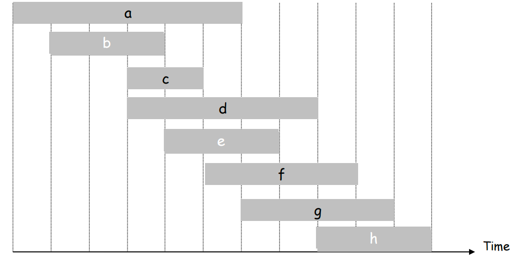
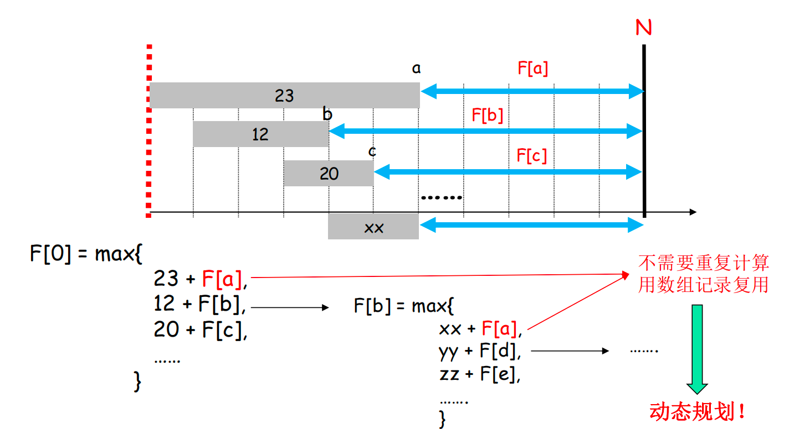
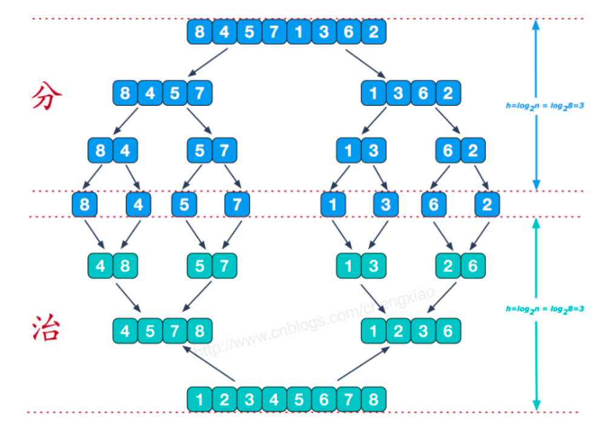
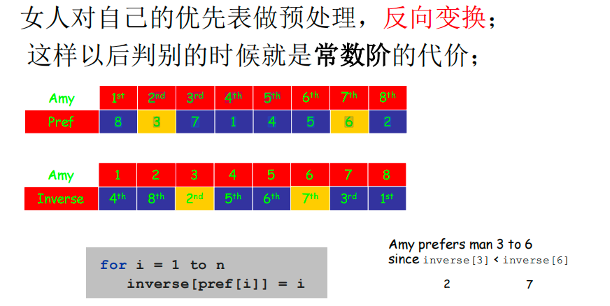

# ch1引言

## 递归子问题

三步走：

- 按规模定义：按照规模来定义原问题
- 拆解子问题：构造小规模的子问题与原问题的递归关系
- 分析与优化

------ 贪心 -------分治--------动态规划

## 贪心

定义：存在一个局部最优判断规则来构造问题的最优解

内核：数学上可以高度优化/简化的递归子文问题

## 1.2.1区间调度问题

- 问题描述：

你有某种资源（报告厅，超级计算机，电子显微镜），许多人需要在某个时间段使用这个资源。一个**需求**是从时刻s开始，到时刻f结束。假设每个时刻至多一个人使用这个资源。一个调度员接收了一系列的需求，他需要做出决定：目的是使得**被接收的需求数目最大**。



策略：选择结束时间最早的

## 动态规划

定义：通过把事情**分解为一系列子问题**，然后对越来越大的子问题建立正确的解，从而隐含的探查所有可行解的空间。

内核：可记录子问题状态对应结果**并复用**的递归子问题

## 1.2.2带权区间调度

假设调度员对第i个需求做出安排，可以挣到钱数$v_i>0$,目标是找一个总价值最大的相容的区间子集。

递归子问题：



策略：进行递归找到最优解

## 分治

分治策略定义：

- 把一个问题分解成几个部分

- 递归解决规模比较小的类似问题

- 把子问题的解合成完整的解

内核：分而治之

## 排序算法

冒泡排序和归并排序的比较

其中归并就是一个很好的分治思想的应用




# 引言

## 问题一：稳定匹配

### 问题描述

考虑n个男人的集合： $M = \{m_1, m_2, \ldots, m_n\}$
以及n个女人的集合： $W = \{w_1, w_2, \ldots, w_n\}$。

令$M\times W $表示所有可能的形如$( m,w)$的有序对的集合，其中 $m \in M, w \in W$。一个<font color="red">匹配</font>S是来自$M\times W$的有序对的集合，并且有如下性质：<u>每个M的成员和每个W的成员至多出现在S的一个有序对中</u>。

- 完美匹配$S'$是具有如下性质的匹配：M的每个成员和W的每个成员恰好出现在$S’$​的一个队里。

​		换句话说，在一个完美匹配中：

1. **每个男人都与一个女人配对。**
2. **每个女人都与一个男人配对。**
3. **没有男人或女人被剩下（即未被匹配）。**
4. **每个人都只与一个人配对。**

- 优先的概念: 每个男人$m \in M$ 对所有的女人排名，如果$m$给$w$的排名高于$w’$ ,称$ m$偏爱$w$超过$w’$​.于是每个男人对女人有一个排名->**优先表**；类似的每个女人也有一个优先表。

- 不稳定因素

给定一个完美匹配S，在S中存在两个对(m,w)和(m',w')，如果m更偏爱w'而不爱w，而且w'更偏爱m而不爱m'.
称(m,w')是一个相对于S的**不稳定因素**：(m,w')不属于S，但是m和w'双方都偏爱另一方而不爱他们在S中的伴侣。

- 稳定匹配： 不存在不稳定的因素

### 邀请-拒绝算法. [Gale-Shapley 1962]

- 伪代码

```
Initialize each person to be free.
while (some man is free and hasn't proposed to every woman) {
 	Choose such a man m
 	w = 1st woman on m's list to whom m has not yet proposed
 	if (w is free)
 	assign m and w to be engaged
 	else if (w prefers m to m')
 	assign m and w to be engaged, and m' to be free
 	else
 	w rejects m
}
```

命题：如果男人m在算法执行的某点是自由的，那么存在一个他还没有发出过邀请的女人。（反证：优先表）

命题：算法终止时，G-S算法返回的集合S是一个完美匹配。（反证）

命题：考虑G-S算法的一次执行，它返回一个集合S, 那么S是一个稳定匹配。

命题：w从接受第一次邀请开始保持约会状态，与她约会的一系列伴侣(依照w的优先表)越来越好。

命题：m提出邀请的一系列女人(按照m的优先表)变得越来越差。

**命题**：G-S算法在至多$n^2$​次While循环的迭代后终止。

### 代码实现

女人先对优先表做预处理：



命题：G-S算法所有的执行会得到同样的匹配，

如果存在一个**稳定匹配**包含了(m,w)对，我们就说女人w是男人m的<font color="red">有效伴侣</font>。如果w是m的有效伴侣，且没有别的在m的排名中比w更高的女人是他的有效伴侣，那么w就是m的<font color="red">最佳有效伴侣</font>，记为best(m)。

类似的，如果存在一个稳定匹配包含了(m,w)对，我们就说男人m是女人w的<font color="red">有效伴侣</font>。如果w是m的有效伴侣，且没有别的在w排名中比m更低的男人是她的有效伴侣，那么m就是w的<font color="red">最差有效伴侣</font>，记为worst(w)。

### 扩展

**问题的定义：**

假设有一组 `n` 个人（这里 `n` 必须是偶数，如果考虑严格的两人一房），每个人都对其他 `n-1` 个人有一个偏好排序。目标是将这 `n` 个人两两配对组成 `n/2` 对室友，形成一个**稳定**的匹配。

一个匹配是**不稳定**的，如果存在两个人 `A` 和 `B`，他们不是彼此的室友，但他们都更偏爱对方胜过自己当前的室友（或者如果他们是单身，他们更偏爱对方胜过单身）。如果 `A` 和 `B` 都更喜欢彼此而不是他们当前的室友，他们就会倾向于离开当前的配对，和对方成为室友，从而破坏当前的匹配。

一个匹配是**稳定**的，如果没有这样的不稳定对存在。

**与稳定婚姻问题的关键区别：**

1. **单组个体 vs. 两组不同个体：** 稳定婚姻问题涉及两组不同的个体（例如，男人和女人），并且匹配只在这两组之间进行。而稳定室友问题只有一组个体，每个人都可以与组内的任何其他人配对。
2. 解的存在性：
   - 在稳定婚姻问题中，使用Gale-Shapley算法总是可以找到一个稳定的匹配。
   - **然而，在稳定室友问题中，并不总是存在稳定的匹配。** 可能出现一些偏好组合，使得无论如何配对，总会存在不稳定因素。这种情况被称为存在“奇数环”或“不稳定的循环”。

**核心概念：**

- **偏好列表 (Preference List)：** 每个人对所有其他潜在室友的排名。
- **不稳定对 (Blocking Pair / Unstable Pair)：** 两个不是室友的人，他们都更喜欢对方胜过当前的室友。
- **稳定匹配 (Stable Matching)：** 不存在任何不稳定对的匹配。

**寻找稳定室友匹配的算法：**

寻找稳定室友匹配的算法比Gale-Shapley算法要复杂得多，主要是因为解不一定存在。

- Irving's Algorithm (1985)：

   Robert Irving 提出了一个两阶段的算法来解决这个问题。

  1. **阶段一 (Phase 1)：** 类似于Gale-Shapley算法的提议和拒绝过程。每个人向他们偏好列表中的人“提议”，如果被提议者当前没有更优的提议者，则暂时接受。这个阶段会消除一些不可能的配对，并可能直接找到一个稳定匹配。
  2. **阶段二 (Phase 2)：** 如果阶段一结束后仍有未匹配的人，或者形成的匹配还不一定是稳定的（可能存在循环拒绝），则进入阶段二。阶段二涉及识别和消除所谓的“旋转 (rotations)” 或 “不稳定的循环 (unstable cycles)”。如果在这个过程中所有的参与者都能被稳定匹配，那么算法就能找到一个解。如果算法在某个点确定无法消除所有不稳定性（例如，找到了一个无法解决的奇数环），它会报告不存在稳定匹配。

**总结：**

- 稳定室友问题是将一组人两两配对，使得没有两个人会同时更愿意离开现有配对而与对方成为室友。
- 与稳定婚姻问题不同，稳定室友问题的解**不一定存在**。
- Irving的算法可以用来尝试找到一个稳定匹配，或者确定不存在这样的匹配。


## 问题二：区间调度问题（贪心）

## 问题三：带权区间调度（动态规划）

## 问题四：二分匹配问题 (Bipartite Matching Problem) 👯‍♂️

简单来说，二分匹配问题试图在一种特殊的图中找到最大数量的独立边。

---
### 核心概念

#### 1. 二分图 (Bipartite Graph) 📊
首先，你需要理解什么是**二分图**。一个图 $G=(V, E)$ 如果可以被划分为两个互不相交的顶点集合 $U$ 和 $V$（即 $U \cap V = \emptyset$ 且 $U \cup V$ 等于图的总顶点集），使得图中的每一条边 $(u,v)$ 都连接 $U$ 中的一个顶点 $u$ 和 $V$ 中的一个顶点 $v$，那么这个图就是一个二分图。

你可以想象成有两组不同的东西，边只能在这两组之间连接，组内的元素之间不能有连接。例如，一组是求职者，另一组是工作岗位，边表示某个求职者适合某个工作岗位。

#### 2. 匹配 (Matching) 🔗
在图论中，一个**匹配** $M$ 是图 $G$ 的一个边的子集，其中 $M$ 中没有任何两条边共享同一个顶点。也就是说，每个顶点最多只被匹配中的一条边所连接。

#### 3. 二分匹配 (Bipartite Matching)
顾名思义，二分匹配就是在二分图中寻找一个匹配。

---
### 问题目标 🎯

二分匹配问题通常指的是**最大二分匹配问题 (Maximum Bipartite Matching Problem)**。其目标是：

**在一个给定的二分图中，找到一个包含边数最多的匹配。**

也就是说，我们要尝试连接尽可能多的对，使得每个顶点最多只参与一个连接。

---
### 常见算法 ⚙️

有多种算法可以解决最大二分匹配问题：

1.  **增广路径算法 (Augmenting Path Algorithm)**：
    * 这是最基础和核心的思路。一条关于当前匹配 $M$ 的**增广路径**是一条在图中交替出现属于 $M$ 和不属于 $M$ 的边的路径，并且路径的起点和终点都是未匹配的顶点。
    * 如果找到一条增广路径，我们可以通过翻转路径上边的匹配状态（即未匹配边变为匹配边，匹配边变为未匹配边）来使匹配中的边数增加1。
    * **匈牙利算法 (Hungarian Algorithm)**（常用于权重二分图的完美匹配，但其思想基础与增广路径相关）和基于**深度优先搜索 (DFS)** 或 **广度优先搜索 (BFS)** 的增广路径搜索是常见方法。例如，Ford-Fulkerson方法解决最大流问题可以用来解决二分匹配，因为二分匹配可以转化为一个最大流问题。

2.  **Hopcroft-Karp 算法**：
    * 这是一个更高效的算法，它在每次迭代中同时寻找多条最短的增广路径。其时间复杂度为 $O(E\sqrt{V})$，其中 $E$ 是边数，$V$ 是顶点数。

---
## 问题五：独立集问题 (Independent Set Problem)

---
### 什么是独立集？ 🧍🧍

在一个无向图 $G=(V,E)$ 中，**独立集 (Independent Set)** 是顶点集 $V$ 的一个子集 $S$，其中 $S$ 中的任意两个顶点在图 $G$ 中都没有边相连。换句话说，如果你选出了一些顶点构成一个独立集，那么这些顶点之间是“相互独立”或“互不相邻”的。

一个**最大独立集 (Maximum Independent Set)** 是指在一个图中包含顶点数量最多的独立集。

---
### 独立集问题 🤔

**独立集问题**通常指的是以下两个相关的问题：

1.  **最大独立集问题 (Maximum Independent Set Problem)**：
    * 给定一个图 $G$，找到一个最大独立集。这是一个**优化问题**。

2.  **独立集决策问题 (Independent Set Decision Problem)**：
    * 给定一个图 $G$ 和一个整数 $k$，判断图 $G$ 中是否存在一个大小至少为 $k$ 的独立集。这是一个**决策问题**。

---
### 计算复杂度 🤯

独立集问题是计算机科学中一个著名的**NP完全 (NP-Complete)** 问题（对于决策版本）或**NP困难 (NP-Hard)** 问题（对于优化版本）。

这意味着：

* **没有已知的多项式时间算法**可以精确地解决任意图上的最大独立集问题 (除非P=NP，这被广泛认为是不太可能的)。
* 对于较大的图，找到最大独立集通常需要指数级的时间，计算上非常具有挑战性。

尽管如此，对于一些特殊类型的图（例如二分图、树等），最大独立集问题可以在多项式时间内解决。

---
### 与其他图问题的关系 🔗

独立集问题与其他几个经典的图问题密切相关：

* **顶点覆盖问题 (Vertex Cover Problem)**：一个图的顶点覆盖是顶点的一个子集，使得图中的每一条边都至少与该子集中的一个顶点相邻。一个图的最大独立集的大小加上其最小顶点覆盖的大小等于图的总顶点数。即，$\alpha(G) + \tau(G) = |V|$，其中 $\alpha(G)$ 是最大独立集的大小，$\tau(G)$ 是最小顶点覆盖的大小。
* **团问题 (Clique Problem)**：一个图的团是顶点的一个子集，使得该子集中的任意两个不同顶点都通过一条边相连。图 $G$ 中的一个独立集等价于其补图 $\bar{G}$（边存在当且仅当原图中不存在）中的一个团。因此，找到 $G$ 的最大独立集等价于找到 $\bar{G}$ 的最大团。

---
### 应用场景 🌐

独立集问题在许多领域都有应用，例如：

* **网络设计**：选择一组互不干扰的通信节点。
* **调度问题**：选择一组互不冲突的任务或事件。
* **生物信息学**：例如，在蛋白质相互作用网络中寻找不相互作用的蛋白质。
* **编码理论**：构造具有特定性质的码。

总而言之，独立集问题是一个核心的图论问题，它要求找到图中一组互不相邻的最大顶点集合，并且因其计算难度而闻名。


