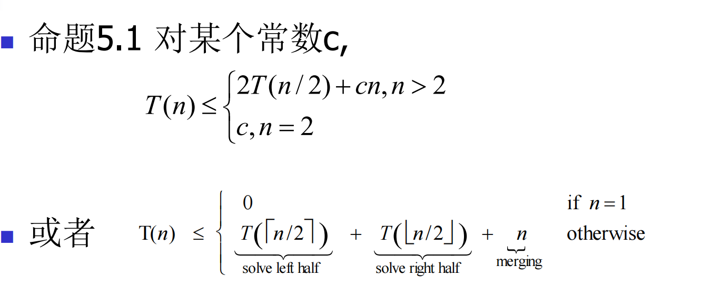

# ch5分治策略

### 什么是分治算法？

在理解主定理之前，我们先回顾一下分治算法。分治算法通常遵循以下三个步骤：

1. **分解（Divide）**：将原问题分解成若干个规模较小、相互独立、与原问题形式相同的子问题。
2. **解决（Conquer）**：递归地解决这些子问题。如果子问题规模足够小，则直接求解。
3. **合并（Combine）**：将子问题的解合并成原问题的解。

许多经典算法，如归并排序、快速排序、二分查找、Strassen矩阵乘法等，都采用了分治策略。

## Master Theorem

### Master Theorem 的形式

主定理适用于形如以下递推关系式：

$$ T(n)=aT(n/b)+f(n)$$

其中：

- n 是问题的规模。
- a≥1 是子问题的数量。
- b>1 是每个子问题规模相对于原问题规模的缩小因子（即原问题被分成大小为 n/b 的子问题）。
- f(n) 是分解问题和合并子问题结果所花费的时间（非递归部分的工作量）。f(n) 必须是渐近正函数（即对于足够大的 n， f(n)>0）。

### Master Theorem 的三种情况

主定理通过比较$ f(n)$ 和$ n ^{\log_b a}$ 的大小关系，给出了 T(n) 的三种渐近解：

**情况 1：子问题的工作量占主导** 如果$ f(n)=O(n^{ \log_b a−ϵ})$，其中$ ϵ>0 $是一个常数。 这意味着$ f(n) $比 $n^{\log_b a}$ 小一个多项式因子。在这种情况下，递归树的叶子节点（子问题）的总工作量占主导地位。 则 $T(n)=Θ(n^{\log_b a})$。

**情况 2：各层工作量大致相等** 如果 $f(n)=Θ(n^{ \log_b a} \log^k n)$，其中 $k≥0 $是一个常数。 这意味着 $f(n) $与$ n \log_b a$ 在一个对数因子以内是渐近相等的。在这种情况下，递归树的每一层的工作量大致相等。 则 $T(n)=Θ(n^{ \log_b a} \log^{k +1 }+n)$。 通常，我们更常用 $f(n)=Θ(n \log_b a)$ （即 k=0 的情况），此时$ T(n)=Θ(n^{\log_b a} \log n)$。

**情况 3：合并/分解工作量占主导** 如果 $f(n)=Ω(n^{ \log_ba+ϵ})$，其中 $ϵ>0 $是一个常数， **并且**满足**正则条件（Regularity Condition）**：对于某个常数 $c<1$ 和所有足够大的$ n$，有 $af(n/b)≤cf(n)$。 这意味着 $f(n) $比 $n^ {\log_ba}$ 大一个多项式因子。在这种情况下，非递归部分的开销 $f(n) $占主导地位。 则 $T(n)=Θ(f(n)$)。

**正则条件的含义**： 正则条件是为了确保 $f(n) $在递归的后续层级不会增长得过快，以至于违反了 $f(n)$ 是主导项的假设。简单来说，它保证了每次递归调用的非递归工作量不会比上一次递归的非递归工作量增长得太快。

## 归并排序

#### 递推关系：

- 命题：如果$T(n)$满足如下关系，且n是2的整数次幂，那么$T(n) = n \log_2 n$.
- 

使用主公式，显然成立！

定理5.4 任何满足5.3并具有$q>2$的函数T(.)是 $O(n \log_2q)$有界的。

定理5.5 任何满足5.3式并具有q=1的函数T(.) ($T(n) \le T(n/2)+O(n)$)是$O(n)$有界的。

## 5.3计数逆序

