# Ch4 贪心算法

直观上说，一个算法是贪心的，则此算法是通过一些小的步骤来建立一个解，在每一步根据**局部情况选择**一个决定使得某些主要的指标能得到优化。

==**存在一个局部判断规则**可以用来构造问题的**最优解**。==

本章逐渐介绍两个基本的方法来证明一个贪心算法对一个问题能够提供一个最优解。

✓ **贪心算法领先**的概念：每一步都比其他的算法好，从而证明产生了一个最优解。

✓ **交换论证**：考虑对这个问题的任何可能解，逐渐把它转换成由贪心算法找到的解，而且不影响解的质量。从而证明了贪心法找到了一个至少与其它解一样好的解。

## 4.1 区间调度：贪心算法领先

### 规则：

我们应该接受**最早结束**的需求，即f(i)尽可能小的需求i为第一个需求。这样的好处是**资源尽可能早被释放**，以便于安排下面的需求。

### 伪代码

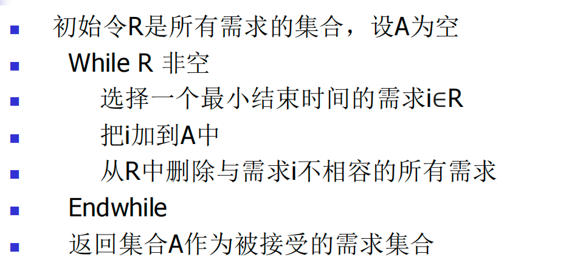


### 证明

贪心算法领先的思路来**严格说明**：需要证明这个解是最优的，为了便于比较，令O**是一个最优的区间集合**。证明的主要思想是贪心算法生成的集合A “领先”于集合O.

命题：由上面贪心规则返回的集合A中的区间都是相容的。

目标是为了证明|A|=|O|。

好的，我们可以使用“贪心领先”（Greedy Stays Ahead）的思路来证明区间调度问题的贪心算法（最早结束时间优先）的正确性。

### 区间调度问题

**问题描述：** 给定 n 个活动（或区间），每个活动 i 都有一个开始时间 sᵢ 和一个结束时间 fᵢ。目标是选出最大数量的互不重叠（兼容）的活动。

### 贪心算法：最早结束时间优先 (Earliest Finish Time First - EFT)

1. **排序：** 将所有区间（活动）按照它们的**结束时间**进行非递减排序。

2. **选择：** 初始化一个空集合 `S` 作为选中的活动。

3. 迭代：

    遍历排序后的区间：

   - 对于第一个区间，直接将其选入 `S`。
   - 对于后续的每个区间 `j`，如果它的开始时间 `sⱼ` 大于或等于集合 `S` 中最后一个选入活动的结束时间，则将区间 `j` 加入 `S`。

4. **结果：** 集合 `S` 即为选出的最大兼容活动集。

------

### "贪心领先" 证明思路

我们将证明，贪心算法在每一步所做的选择都“不差于”任何最优解中的对应选择。具体来说，贪心算法选择的第 `i` 个活动的结束时间，总是不晚于任何最优解中第 `i` 个活动的结束时间。

#### 引理：贪心选择的活动结束时间领先

设 `G = {g₁, g₂, ..., gₖ}` 是贪心算法选出的 `k` 个活动，按结束时间排序（这自然是算法处理的顺序）。 设 `O = {o₁, o₂, ..., oₘ}` 是任意一个最优解选出的 `m` 个活动，也按结束时间排序。

我们要证明：对于所有 `1 ≤ i ≤ min(k, m)`，都有 `f(gᵢ) ≤ f(oᵢ)`，其中 `f(x)` 表示活动 `x` 的结束时间。

**证明 (通过数学归纳法)：**

- **基础情况 (i=1)：**
  - 贪心算法选择的第一个活动 `g₁` 是所有活动中**结束时间最早**的那个（或者之一，如果有多个结束时间相同的）。
  - `o₁` 是最优解 `O` 中的第一个活动（按结束时间排序）。
  - 根据贪心算法的选择规则，`f(g₁) ≤ f(o₁)`。因为如果 `f(o₁) < f(g₁)`，贪心算法一定会选择 `o₁` (或具有相同最早结束时间的另一个活动) 作为第一个活动，而不是 `g₁`。
  - 因此，基础情况成立。
- **归纳步骤：**
  - 假设对于某个 `j < min(k,m)`，`f(gⱼ) ≤ f(oⱼ)` 成立（归纳假设）。
  - 我们需要证明 `f(gⱼ₊₁) ≤ f(oⱼ₊₁)`。
  - `gⱼ₊₁` 是贪心算法在选择了 `gⱼ` 之后选择的下一个活动。这意味着 `gⱼ₊₁` 是所有与 `gⱼ` 兼容（即开始时间 `s(gⱼ₊₁) ≥ f(gⱼ)`）的活动中，结束时间最早的那个。
  - `oⱼ₊₁` 是最优解 `O` 中在 `oⱼ` 之后的下一个活动。因此，`oⱼ₊₁` 必须与 `oⱼ` 兼容，即 `s(oⱼ₊₁) ≥ f(oⱼ)`。
  - 根据归纳假设，我们有 `f(gⱼ) ≤ f(oⱼ)`。
  - 结合以上两点，我们得到 `s(oⱼ₊₁) ≥ f(oⱼ) ≥ f(gⱼ)`。
  - 这表明活动 `oⱼ₊₁` 与贪心算法选择的活动 `gⱼ` 是兼容的。因此，`oⱼ₊₁` 是贪心算法在选择 `gⱼ` 之后的一个**候选活动**。
  - 贪心算法在选择 `gⱼ₊₁` 时，会从所有与 `gⱼ` 兼容的活动中选择结束时间最早的那个。既然 `oⱼ₊₁` 是这些候选活动之一，那么贪心算法选出的 `gⱼ₊₁` 的结束时间必然不会晚于 `oⱼ₊₁` 的结束时间，即 `f(gⱼ₊₁) ≤ f(oⱼ₊₁)`。
  - 因此，归纳步骤成立。

**引理证毕。** 这个引理表明，贪心算法的每一步选择都使其在“结束时间”上保持领先或持平于任何最优解。

------

#### 最优性证明 (通过反证法)

现在我们用这个引理来证明贪心算法产生的解是最优的。

假设贪心算法得到的解 `G` (包含 `k` 个活动) 不是最优的。这意味着存在一个最优解 `O` (包含 `m` 个活动)，使得 `m > k`。

1. 根据引理，对于所有 `1 ≤ i ≤ k`，我们有 `f(gᵢ) ≤ f(oᵢ)`。
2. 考虑最优解 `O` 中的第 `k+1` 个活动 `oₖ₊₁` (因为假设 `m > k`，所以这个活动存在)。
   - 由于 `oₖ₊₁` 是最优解中继 `oₖ` 之后的活动，它必须与 `oₖ` 兼容，即 `s(oₖ₊₁) ≥ f(oₖ)`。
   - 根据引理，我们知道 `f(gₖ) ≤ f(oₖ)`。
   - 所以，`s(oₖ₊₁) ≥ f(oₖ) ≥ f(gₖ)`。
3. 上述不等式 `s(oₖ₊₁) ≥ f(gₖ)` 表明，活动 `oₖ₊₁` 与贪心算法选出的第 `k` 个活动 `gₖ` 是兼容的。
4. 这意味着，在贪心算法选择了 `gₖ` 之后，活动 `oₖ₊₁` 是一个可供选择的候选活动。
   - 如果贪心算法在选择了 `gₖ` 之后就停止了 (即贪心解的大小为 `k`)，那就意味着在所有与 `gₖ` 兼容的活动中，它找不到可以再选择的活动了。
   - 但是，我们已经证明了 `oₖ₊₁` 是与 `gₖ` 兼容的。
   - 这就产生了一个矛盾：贪心算法本应该能够选择 `oₖ₊₁` (或者其他某个结束时间更早且与 `gₖ` 兼容的活动)，从而得到一个大小至少为 `k+1` 的解。这与贪心算法得到解的大小为 `k` 相矛盾。
5. 因此，最初的假设 `m > k` 是错误的。所以必然有 `m ≤ k`。
6. 又因为 `O` 是一个最优解，而 `G` 是贪心算法产生的一个可行解，所以可行解的大小不可能超过最优解的大小，即 `k ≤ m`。
7. 结合 `m ≤ k` 和 `k ≤ m`，我们得出 `k = m`。

### 时间复杂度

该算法主要包含以下几个步骤：

1. **排序 (Sorting)：**
   - 算法的第一步是将所有 `n` 个区间（活动）按照它们的结束时间进行非递减排序。
   - 使用标准的比较排序算法（如快速排序、归并排序或堆排序），这一步的时间复杂度是 O(nlogn)，其中 `n` 是区间的数量。
2. **选择和迭代 (Selection and Iteration)：**
   - 初始化一个空集合 `S` 用于存放选中的活动。这需要 O(1) 时间。
   - 将排序后的第一个区间加入 `S`。这需要 O(1) 时间。同时，记录下这个区间的结束时间，作为“上一个选中活动的结束时间”（`last_finish_time`）。
   - 然后，算法需要遍历剩余的 `n-1` 个已排序的区间（或者从第二个区间开始到最后一个区间）。在最坏的情况下，它会检查所有 `n` 个区间。
   - 对于每个被检查的区间 `j`，算法会比较其开始时间 `sⱼ` 与 `last_finish_time`。这是一个 O(1) 的操作。
   - 如果 `sⱼ ≥ last_finish_time`，则将区间 `j` 加入 `S`，并更新 `last_finish_time` 为 `fⱼ`。这也是一个 O(1) 的操作。
   - 这个迭代过程总共会执行 `n` 次（或 `n-1` 次）比较和可能的添加操作。因此，整个迭代和选择阶段的时间复杂度是 O(n)。
3. **总时间复杂度：**
   - 算法的总时间复杂度由这些步骤中耗时最长的部分决定。
   - 排序步骤的时间复杂度是 O(nlogn)。
   - 迭代和选择步骤的时间复杂度是 O(n)。
   - 因此，总的时间复杂度是 O(nlogn)+O(n)=O(nlogn)。

## 加权区间调度

每个需求会有一个不同的权值，比如每个需求所获得的钱数，目标是极大化我们的收入。这导致了==加权的区间调度==问题。

**问题定义：**

给定一组具有开始时间 $s_j$、结束时间 $f_j $和权重 $v_j $的任务或活动（区间）。目标是选择一个互不重叠的任务子集，使得这些任务的总权重最大化。

**核心思想：**

这个问题通常使用**动态规划 (Dynamic Programming)** 来解决，其主要步骤如下：

1. **排序任务：** 首先，将所有任务按照它们的**结束时间**升序排序。这样做的好处是，在考虑是否选择一个任务时，我们可以更容易地找到与它不冲突的先前任务。

2. **定义 p(j) 函数：** 对于排序后的每个任务$ j$，定义 $p(j)$ 为在任务 j **之前**结束且与任务 j **不重叠**的所有任务中，结束时间最晚的那个任务的索引。如果不存在这样的任务，则 $p(j) $可以设为$ 0$（或者一个表示没有兼容任务的值）。这个 $p(j) $可以通过对排序后的任务进行二分查找来高效地计算。

3. **定义动态规划数组：** 创建一个 $DP$ 数组，例如 $M[j]$，表示从任务 $1$ 到任务4 中，所能获得的最大总权重。

4. **建立递推关系：**

   - **基准情况：** $M[0]=0$ (没有任务时，总权重为 0)。

   - 对于任务 j：

      考虑两种情况：

     - **不选择任务 j：** 那么最大权重就是 $M[j−1]$ (考虑前 j−1 个任务的最大权重)。
     - **选择任务 j：** 如果选择任务 $j$，那么就不能选择任何与任务 j 重叠的任务。因此，我们只能从与任务 j 兼容的、且在 p(j) 之前结束的任务中选择。这种情况下，最大权重就是 $v_j+M[p(j)]$ (任务 $j $的权重加上从前 $p(j) $个任务中获得的最大权重)。

   综合这两种情况，递推关系为： $M[j]=max(v_j+M[p(j)],M[j−1])$

5. **自底向上计算：** 循环遍历任务，从 $j=1 $到 n，根据递推关系计算 $M[j]$。

6. **结果：** 最终，$M[n]$ 将包含所有任务的最大总权重。如果需要找到实际选择的任务集合，可以通过回溯$ DP$ 数组来完成。

**时间复杂度：**

- **排序任务：** $O(nlogn)$
- **计算 p(j)：** 使用二分查找，每个任务需要 $O(logn)$，总共 $O(nlogn)$。
- **计算 DP 数组：** 线性遍历 n 个任务，每个任务的计算是 O(1)，总共 O(n)。

因此，总的时间复杂度是 $O(nlogn)$。


## 区间划分 (Interval Partitioning)

### 问题描述

给定一组任务，每个任务 j 都有一个开始时间 $s_j$ 和一个结束时间 $f_j$。我们的目标是将**所有**任务分配到**最少数量的资源**上（例如：教室、会议室、CPU 核心），使得每个资源在任何时候都只处理一个任务。

### 与加权的区间调度的区别

- **加权的区间调度 (Weighted Interval Scheduling):** 目标是**最大化所选任务的总权重**，允许不调度某些任务。它通常用动态规划解决。
- **区间划分 (Interval Partitioning):** 目标是**使用最少数量的资源来调度所有任务**。所有任务都必须被调度。它通常用贪婪算法解决。

### 解决思路 (贪婪算法)

这个问题可以使用一个非常高效的**贪婪算法**来解决，其核心思想是==优先使用最早空闲的资源==：

1. **按开始时间排序：** 将所有任务按照它们的**开始时间**升序排序。
2. **维护资源空闲时间：** 使用一个**最小堆 (Min-Priority Queue)** 来存储当前正在使用的每个资源的“下一个可用时间”（即当前正在该资源上执行的任务的结束时间）。堆顶元素代表最早空闲的资源。
3. **分配逻辑：** 遍历排序后的任务：
   - 如果堆顶资源的空闲时间 ≤ 当前任务的开始时间，说明该资源可以被使用。将堆顶元素移除，并将当前任务的结束时间加入堆中。
   - 如果所有现有资源都忙碌（堆为空，或者堆顶资源的空闲时间 > 当前任务的开始时间），则需要分配一个新的资源，并将当前任务的结束时间加入堆中。
   - 在任何时刻，堆中元素的数量就是当前正在使用的资源数量。算法记录这个数量的最大值。

### 伪代码

```c++
Sort intervals by starting time so that s1  s2  ...  sn.
d <- 0
for j = 1 to n {
    if (lecture j is compatible with some classroom k)
        schedule lecture j in classroom k
    else
        allocate a new classroom d + 1
        schedule lecture j in classroom d + 1
        d <- d + 1
}
```

定义：一个区间集合的==深度==是通过时间线上任何一点的最大区间数。

命题： 在任何区间划分的实例中，资源数必须至少是区间集合的深度。

命题：如果我们采用上面的贪心算法，每个区间将被分配一个标签，且没有两个重叠的区间接受同样的标签。

命题：上面贪心算法使用与区间集合深度等量的资源为每个区间安排一个资源，这就是所需资源的最优数量。

### 关键性质

这个贪婪算法是**最优的**。所需的最小资源数量恰好等于所有任务集合的**深度**，即在任何时间点上，最多同时重叠的区间数量。

### 时间复杂度

该算法的时间复杂度为 $O(NlogN)$，主要耗费在任务排序和堆操作上。

## 4.2 最小延迟调度：一个交换论证

问题：我们有单一资源和一组使用资源的$n$个需求，每个需求需要一个时间区间。假定需求$i$更加灵活,不是开始时间与结束时间，需求$i$有一个截至时间$d_i$,要求一个长度为$t_i$的连续的时间区间。目标是需要尽可能多的满足需求。

“最小延迟调度”是单机调度问题中的一个重要分支，其目标是**最小化任务集合中的最大延迟时间**。

### 问题定义

给定 $n$ 个任务（或工件），每个任务 $j$ 有：
* **处理时间 $p_j$ (processing time):** 完成该任务所需的时间。
* **截止日期 $d_j$ (due date):** 任务应该完成的时间。

所有任务都必须在一个单机上按顺序处理，机器在任何时候只能处理一个任务，且任务一旦开始就不能中断。

**延迟 (Lateness) 的定义：**
对于任务 $j$，如果它在时间 $C_j$ 完成，$C_j$ 是任务 $j$ 的完成时间。那么任务 $j$ 的延迟 $L_j$ 定义为：
$$L_j = C_j - d_j$$
如果 $L_j > 0$，表示任务延迟了。如果 $L_j \le 0$，表示任务按时或提前完成了。

**最大延迟 (Maximum Lateness) 的定义：**
$$L_{\max} = \max_{j} \{L_j\}$$

**最小延迟调度的目标就是找到一个任务的调度顺序，使得 $L_{\max}$ 达到最小。**

### 解决思路 (贪婪算法：最早截止日期优先 Earliest Due Date - EDD)

最小延迟调度问题有一个非常著名且有效且最优的贪婪算法，称为==**最早截止日期优先 (Earliest Due Date, EDD)** 调度规则==。

**EDD 规则：**
将所有任务按照它们的**截止日期 $d_j$ 升序排序**，然后按照这个顺序依次执行任务。

**算法步骤：**

1.  将所有任务按照它们的截止日期 $d_j$ 从小到大排序。如果两个任务的截止日期相同，它们的相对顺序不影响最大延迟。
2.  按照排序后的顺序依次处理每个任务，任务之间没有空闲时间。

### 交换论证

交换论证的基本思想是：假设存在一个最优解，它与我们的贪婪算法所产生的解不完全相同。然后，我们证明可以通过一系列局部**交换 (Swap)** 操作，将这个假定的最优解逐步转换成贪婪算法的解，并且在每次交换后，解的质量（例如，目标函数值）**不会变差**。如果最终能将任何最优解转换成贪婪算法的解，且过程中解的质量没有下降，那么就证明了贪婪算法产生的解也是最优的。

### 为什么 EDD 算法是最佳的？

EDD 算法被证明是最小化最大延迟的最优算法。其证明通常采用**交换论证 (Exchange Argument)**：

假设存在一个最优调度，它不遵循 EDD 规则。那么在这个最优调度中，必然存在相邻的两个任务 $i$ 和 $j$，它们不遵循 EDD 规则，即任务 $i$ 在任务 $j$ 之前执行，但 $d_i > d_j$（任务 $i$ 的截止日期晚于任务 $j$ 的截止日期）。

通过交换这两个任务 $i$ 和 $j$ 的执行顺序，可以证明：
1.  **最大延迟不会增加。**
2.  新调度仍然保持了其他任务的相对顺序，并且更接近 EDD 顺序。

通过一系列这样的交换，最终可以将任何最优调度转换成 EDD 调度，而最大延迟不会增加，从而证明 EDD 调度是最小化最大延迟的最优调度。

### 时间复杂度

* **排序任务：** $O(N \log N)$
* **计算完成时间和延迟：** $O(N)$

因此，总的时间复杂度是 $O(N \log N)$。

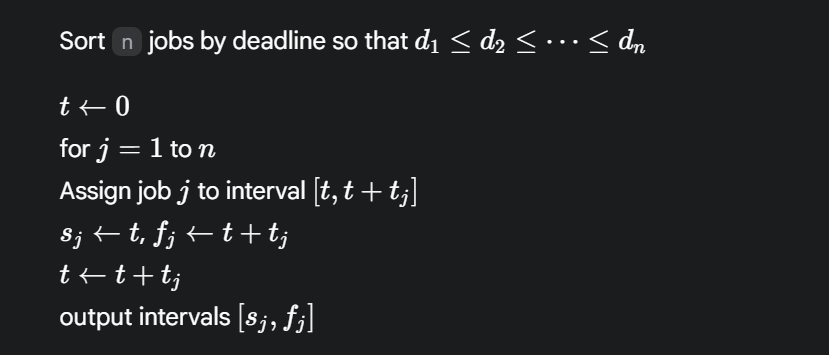

命题 : 存在一个**没有空闲时间**的最优调度.

命题：**所有没有逆序也没有空闲时间的调度有相同的最大延迟。**

命题：如果调度中存在**一个**相邻的逆序任务i,j，那么交换以后，所得到的新调度方案不会增加最大延迟。

## 4.3 最优高速缓存：一个更复杂的交换论证

### 最远将来（Farthest-in-future ）

“超高速缓存的最远将来算法”（Optimal Replacement Policy），也称为“最优替换策略”或“Belady's Optimal Replacement Algorithm”或“MIN”，是缓存替换算法中的一种理想化策略。

**核心思想：**

该算法的核心思想是，在缓存需要替换数据块时，它会**替换掉在未来最远的时间内才会被再次访问到的数据块**。换句话说，它“预知”了未来的访问模式，从而能够做出最明智的替换决策，以达到最低的缓存未命中率。

**为什么是“最远将来”？**

因为如果一个数据块在未来的访问中很长时间都不会被用到，那么将它从缓存中移除，就能为即将被访问的数据块腾出空间，从而避免了不必要的缓存未命中。反之，如果替换了一个很快就会被再次访问的数据块，那么很快就需要将其重新加载到缓存中，这会带来额外的开销。

**优点：**

- **理论最优性：** 在所有缓存替换算法中，最远将来算法能够实现最低的缓存未命中率。
- **衡量标准：** 尽管它无法在实际系统中实现，但它作为其他缓存替换算法的“理想参考”，可以用来评估它们的性能。通过将实际算法的命中率与最远将来算法的命中率进行比较，可以了解实际算法的优化空间。

**缺点（无法实现的原因）：**

- **无法预知未来：** 最远将来算法需要知道未来的所有内存访问序列，而这在实际运行的计算机系统中是不可能实现的。程序执行的路径和数据访问模式是动态变化的，无法提前预测。
- **实现复杂性：** 即使能够预知未来，实现这样的算法也极其复杂，需要大量的计算和存储资源来跟踪和预测未来的访问。

简化调度：如果在第i步有对d的需求，而且d不在超高速缓存中，那么考虑在第i步只放入项d的调度，这种调度被称为简化调度。

能够把非简化调度转化成简化调度，而且高速缓存交换的次数不会增加。

### 扩展LRU

LRU 是 **Least Recently Used** 的缩写，中文全称为“**最近最少使用原则**”或“**最近最少使用算法**”。

它是一种常用的**缓存淘汰策略（Cache Replacement Policy）**，主要用于解决缓存空间有限的问题。当缓存空间已满，但又有新的数据需要写入时，LRU 算法会根据“最近最少使用”的原则，选择性地淘汰（移除）缓存中的数据，以便为新数据腾出空间。

**核心思想：**

LRU 算法基于一个重要的经验性假设：**如果一个数据在最近一段时间内没有被使用过，那么它在未来被使用的可能性也较低。反之，如果一个数据最近被频繁使用，那么它在未来很可能还会被再次使用。**

因此，当需要淘汰数据时，LRU 会选择那些**距离当前时间点被访问时间最久远**的数据进行淘汰。

**工作原理：**

为了实现 LRU 算法，通常需要维护一个数据的访问顺序，最常见的方法是结合使用**哈希表（Hash Map）和双向链表（Doubly Linked List）**：

1. **哈希表（Hash Map）：** 用于快速查找数据在缓存中是否存在，并存储数据对应的链表节点。键是数据的 ID，值是链表节点的引用。

2. 双向链表（Doubly Linked List）：

    用于维护数据的访问顺序。

   - 链表的头部（Head）代表最近被访问的数据。
   - 链表的尾部（Tail）代表最久没有被访问的数据。

**具体操作：**

- 访问数据（Get操作）：
  - 如果数据在缓存中存在：将该数据对应的节点从当前位置移除，然后移动到链表的头部。
  - 如果数据在缓存中不存在：这是缓存未命中（Cache Miss）。
- 添加数据（Put操作）：
  - 如果缓存空间未满：将新数据添加到链表头部，并在哈希表中记录其位置。
  - 如果缓存空间已满：
    1. 从链表尾部移除最久未访问的数据（同时从哈希表中删除）。
    2. 将新数据添加到链表头部（同时在哈希表中记录）。

**优点：**

- **较高的缓存命中率：** 在许多实际应用场景中，LRU 能够有效地保留“热点”数据，从而提高缓存的命中率。
- **实现相对简单：** 使用哈希表和双向链表可以有效地实现 LRU 逻辑。

**缺点：**

- **需要维护额外的数据结构：** 相比一些简单的算法（如 FIFO），LRU 需要额外的内存来维护双向链表和哈希表，增加了空间的开销。
- **“颠簸”问题：** 如果缓存大小不足以容纳工作集（频繁访问的数据集合），即使是最近访问的数据也可能很快被淘汰，导致缓存命中率下降，出现“颠簸”现象。
- **无法处理一次性大批量数据访问：** 如果某个数据被大量访问了一次，然后就再也不需要了，LRU 仍然会将其保留在缓存中较长时间，占用了宝贵的缓存空间。

## 4.4 一个图的最短路径

### 1. Dijkstar算法

##### **核心思想**

Dijkstra 算法的核心思想是：**从起始节点开始，逐步“扩展”已知的最短路径集合，直到覆盖所有节点。** 它每次都选择当前已发现但尚未确定最短路径的节点中，距离起始节点最近的那个节点，并用它来更新其邻居节点的距离。

可以将其想象成一个在图上扩散的“波纹”，从起始点开始，波纹不断向外扩展，每次都选取离起始点最近的“未被触及”的节点，并以它为中心继续扩散。

##### **算法步骤**

1. **初始化：**
   - 创建一个距离数组 `dist`，用于存储从起始节点到每个节点的当前最短距离。将起始节点的距离设为 0，其他所有节点的距离设为无穷大（表示暂时不可达）。
   - 创建一个已访问节点集合 `visited`，初始为空。
   - 通常会使用一个**优先队列（Priority Queue）**来存储待处理的节点，并根据它们的当前距离进行排序，确保每次都能高效地取出距离最小的节点。
2. **迭代过程：**
   - 只要优先队列不为空，就重复以下步骤：
     - 从优先队列中取出距离最小的节点 `u`。
     - 如果 `u` 已经被访问过，则跳过（因为已经找到了它的最短路径）。
     - 将 `u` 添加到 `visited` 集合中，表示其最短路径已确定。
     - 松弛操作（Relaxation）：遍历 u的所有邻居节点 v：
       - 计算从起始节点到 `v` 经过 `u` 的距离：`dist[u] + weight(u, v)` (其中 `weight(u, v)` 是 `u` 到 `v` 边的权重)。
       - 如果这个新计算出的距离小于 `dist[v]` (当前已知的从起始节点到 `v` 的最短距离)，则更新 `dist[v]`，并将 `v` 及其新的距离添加到优先队列中。
3. **终止条件：**
   - 当优先队列为空时，算法终止。此时，`dist` 数组中存储的就是从起始节点到所有其他节点的最短路径。
   - 如果只想找到到特定目标节点的最短路径，可以在目标节点被添加到 `visited` 集合时就终止算法。

##### **适用条件**

- **加权图（Weighted Graph）：** 边上带有权重，表示经过这条边的“代价”（如距离、时间、费用等）。
- **非负权重：** **Dijkstra 算法的一个重要限制是图中不能有负权边。** 如果存在负权边，它可能会给出错误的答案。对于包含负权边的图，需要使用 Bellman-Ford 算法或 SPFA 算法。
- **有向图或无向图：** 都可以应用。对于无向图，可以将其视为每条边都有两个方向的有向图。

##### **优点**

- **正确性：** 对于==边权非负==的图，Dijkstra 算法总能找到单源最短路径。
- **效率相对较高：** 对于大多数实际应用场景，它的性能表现良好。

##### **缺点和局限性**

- **==不能处理负权边==：** 这是其最大的局限性。如果图中存在负权边，`Dijkstra` 算法可能无法找到正确的答案。
- 效率：
  - **朴素实现（不使用优先队列）**：时间复杂度为 $O(V^2)$，其中 V 是节点数。
  - **使用二叉堆优化的优先队列：** 时间复杂度为 $O(ElogV)$，其中 E 是边数。这在稀疏图中（$E$ 远小于 $V^2$）表现更好。
  - **使用斐波那契堆优化的优先队列：** 理论上时间复杂度可达 $O(E+VlogV)$，但实际编程实现复杂，常数因子较大，不一定总是比二叉堆快。
- **只能解决单源最短路径问题：** 如果需要找到所有节点对之间的最短路径$All-Pairs Shortest Path$，通常会使用 $Floyd-Warshall $算法。（可以维护一个pre数组来统计节点的前一个节点的信息）

##### 伪代码：

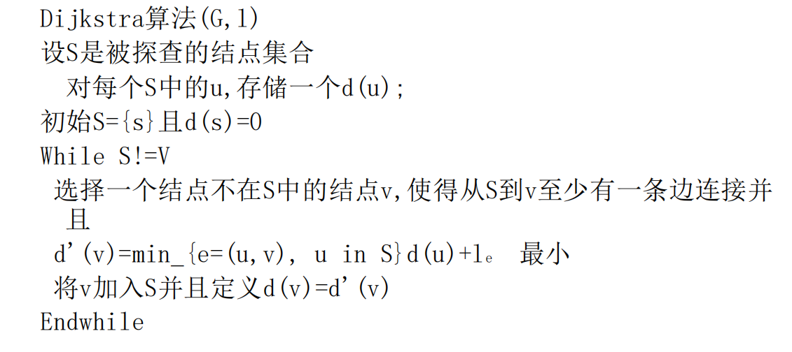

##### 分析算法

定理：算法执行中任意一点的集合$S$,对每个$S$中的$u$,路径$P_u$是最短的$s-u$路径。

### Dijkstra 算法正确性证明

我们要证明的是：在 Dijkstra 算法的执行过程中，一旦一个节点 $u$ 被添加到集合 $S$ 中（即从优先队列中取出），那么此时从源节点 $s$ 到 $u$ 的路径 $P_u$ 就是 $s-u$ 的**最短路径**。

**证明方法：** 采用**归纳法**。

---

#### 基础情况 (Base Case)

当算法开始时，集合 $S$ 只包含源节点 $s$。此时，$P_s$ 是从 $s$ 到 $s$ 的路径，长度为 0，这显然是最短路径。因此，基础情况成立。

---

#### 归纳假设 (Inductive Hypothesis)

假设当算法执行到某个阶段，已经有 $k$ 个节点被添加到集合 $S$ 中，并且对于 $S$ 中的**所有**节点 $v$，路径 $P_v$ （即算法计算出的 $s-v$ 路径）都是 $s-v$ 的最短路径。

---

#### 归纳步骤 (Inductive Step)

现在，算法将从优先队列中选择下一个距离最小的节点 $u$ 加入到 $S$ 中。我们必须证明，当 $u$ 被加入 $S$ 时，它当前的路径 $P_u$ 确实是 $s-u$ 的最短路径。

**反证法假设：** 假设事实并非如此，即存在一条从 $s$ 到 $u$ 的**更短路径** $P'_{su}$，其长度 $d(s, u)$ 小于 $P_u$ ($dist[u]$)。

这条更短路径 $P'_{su}$ 必然会离开集合 $S$（因为如果 $P'_{su}$ 完全在 $S$ 中，那么 $u$ 早就应该被选入 $S$ 了，或者 $dist[u]$ 早就被更新为更小的值了）。

设 $x$ 是 $P'_{su}$ 上**第一个不在** $S$ 中的节点，而 $w$ 是 $P'_{su}$ 上紧邻 $x$ 且**在** $S$ 中的节点。

**路径示意图：**

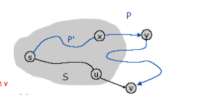
$$
s \xrightarrow{\text{ 最短路径在 } S \text{ 中}} w \xrightarrow{\text{ 边}} x \xrightarrow{\text{ 路径}} u
$$
(注意：路径 $s \to w$ 的所有节点都在 $S$ 中)

因为 $w$ 在 $S$ 中，根据归纳假设，从 $s$ 到 $w$ 的路径 $P_{sw}$ 是最短路径。
因此，$dist[w]$ (Dijkstra 算法计算的距离) 就等于 $d(s, w)$ (实际的最短距离)。

由于 $P'_{su}$ 是从 $s$ 到 $u$ 的一条更短路径，所以：
$$ d(s, u) < dist[u] \quad (*)$$

同时，从 $s$ 到 $x$ 的最短路径长度 $d(s, x)$ 必然满足：
$$ d(s, x) \le d(s, w) + weight(w, x) $$

根据Dijkstra算法的特性我们可以知道

$$dist[u]\leq d(s,w) + weight(w,x) \leq d(s,u) $$

然而，这与我们最初的**反证法假设** $(*)$ ($d(s, u) < dist[u]$) 产生了矛盾。

---

#### 结论

通过数学归纳法，我们证明了 Dijkstra 算法在执行过程中，一旦一个节点 $u$ 被添加到集合 $S$ 中，那么此时从源节点 $s$ 到 $u$ 的路径 $P_u$ 就是 $s-u$ 的最短路径。这正是 Dijkstra 算法能够正确找到最短路径的关键所在。

## 4.5 最小生成树问题

**凯莱公式指出：** 对于一个有 n 个**已标记（labeled）**顶点的完全图 $K_n$，它一共存在 $n^{n−2}$ 种不同的生成树。

#### **Kruskal算法（克鲁斯卡尔算法）：**

- **思想：** 按照边的权重从小到大进行排序，然后依次考虑每条边。如果添加这条边不会形成环，就将其加入到最小生成树中，直到包含了V-1条边。
- 步骤：
  1. 将图中的所有边按照权重从小到大排序。
  2. 初始化一个空的MST，并为每个顶点创建一个独立的集合（使用并查集数据结构）。
  3. 依次遍历排序后的边：
     - 对于当前边(u, v)，如果u和v不在同一个集合中（即加入这条边不会形成环），则将这条边加入到MST中，并将u和v所在的集合合并。
     - 如果MST中已经包含V-1条边，则停止。
- **特点：** 适合稀疏图（边数远小于顶点数平方的图）。时间复杂度通常为O(ElogE)，其中ElogE主要是排序的开销，并查集操作的开销相对较小。

#### **Prim算法（普里姆算法）：**

- **思想：** 从一个起始顶点开始，逐步“生长”出一棵最小生成树。它维护一个已加入MST的顶点集合，每次选择连接已加入集合和未加入集合的边中权重最小的那条边，并将其对应的未加入集合的顶点加入到集合中。
- 步骤：
  1. 初始化一个空的MST，并选择一个任意顶点作为起始点加入MST。
  2. 重复V-1次（V为顶点数量）：
     - 从所有连接MST内顶点和MST外顶点的边中，选择权重最小的那条边。
     - 将这条边及其连接的MST外的顶点加入到MST中。
- **特点：** 适合稠密图（边数接近顶点数平方的图）。通常使用优先队列来实现，时间复杂度为O(ElogV)或O(E+VlogV)（使用斐波那契堆）。

- 成功执行了 1 项查询

####  **反向删除算法 (Reverse-Delete algorithm)**

该算法的思想与 Prim 和 Kruskal 算法（它们是“增长”算法）相反，它是一种“收缩”算法。

**算法步骤描述如下：**

1. **初始化：** 将图 G=(V,E) 的所有边都视为初始集合 T=E。这意味着我们从一个包含所有边的图开始。
2. **排序：** 将所有的边按照它们的权重（费用）进行**递减**排序，即从最昂贵的边到最便宜的边。
3. **迭代删除：** 依次遍历排序后的每条边 e (从最贵的边开始)。
   - 对于当前边 e，尝试将其从集合 T 中删除。
   - **连通性检查：** 在删除边 e 之前，检查如果删除它，是否会破坏当前图的连通性。也就是说，如果删除 e 会导致图变得不连通（即图分裂成两个或多个不相交的连通分量），那么就不能删除这条边 e。
   - 保留或删除：
     - 如果删除边 e **不会**破坏图的连通性，则从 T 中删除这条边。
     - 如果删除边 e **会**破坏图的连通性，则保留这条边 e 在 T 中（因为它是保持连通性所必需的）。
4. **终止条件：** 重复步骤3，直到不能再删除任何边而又不破坏图的连通性为止。最终留在集合 T 中的边就是最小生成树的边。

**算法正确性原理：**

这个算法的正确性基于最小生成树的**环性质（Cycle Property）**：在一个图的任意环中，权重最大的边不可能属于任何最小生成树。反向删除算法正是利用这一点：它从最重的边开始，如果这条边不是保持图连通性所必需的，那么它一定在某个环上且是该环上最重的边，因此可以安全地删除它。通过不断删除非必要的重边，最终剩下的就是最小生成树。

**时间复杂度：**

反向删除算法的时间复杂度主要取决于边的排序和每次删除操作后的连通性检查。如果使用并查集来高效地维护和检查连通性，并查集的每次操作接近常数时间。但主要的瓶颈通常在于对边进行排序（O(ElogE)）以及每次删除时进行连通性检查。如果每次检查需要遍历图，则效率较低。然而，通过巧妙的连通性维护（例如并查集），该算法也可以达到O(ElogE) 或 O(ElogV) 的效率。

- 圈

- 割

  - 一个圈和一个割有偶数条相交边

  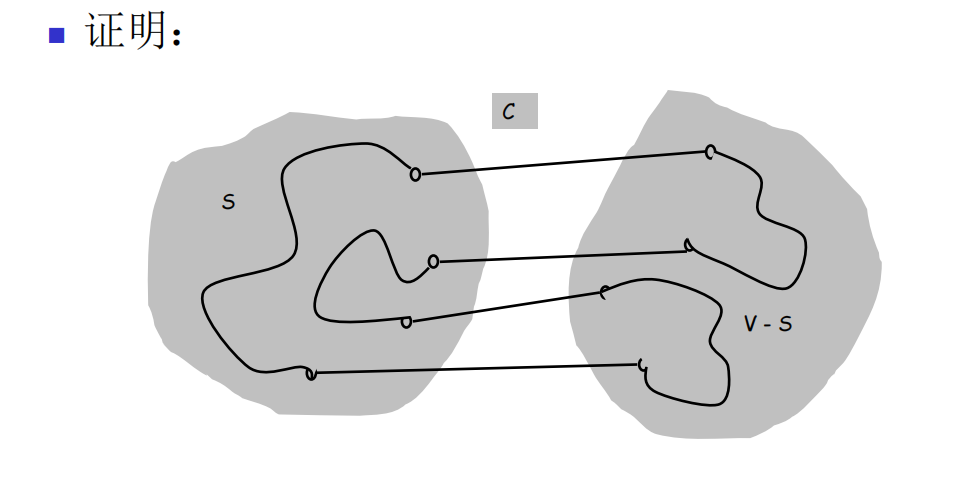

- 假设所有边的费用都是不等的。令 S 是任意节点子集，且 $S\neq ∅,V$。令边 e=(u,v) 是一端在 S 中，另一端在 V−S 中的最小费用边。那么每棵最小生成树都包含边 e。

  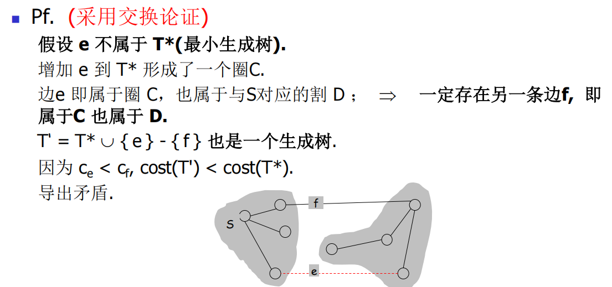

- Pf（交换论证）

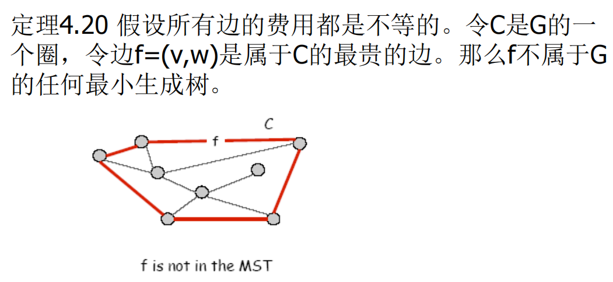

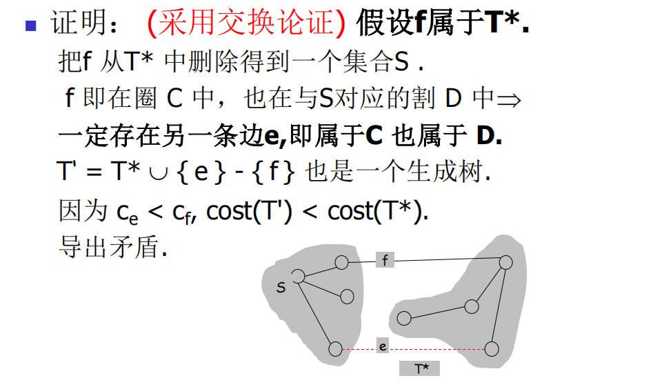

- 逆删除算法产生 G 的一棵最小生成树。

  **证明思路：**

  1. **连通性：** 算法的最终输出 (V,T) 必然是连通的。这是因为算法的规则是“如果删除一条边会破坏连通性，则不删除它”。因此，所有为了保持图连通性而保留的边构成了最终的图。
  2. **无环性（反证法）：** 假设最终算法输出的 (V,T) 包含了**一个环 C**。
     - 考虑这个环 C 上**最贵的边 e**。
     - 当逆删除算法处理边 e 时（它是从最贵的边开始处理的），由于它是环 C 上最贵的边，那么在考虑删除 e 之前，环 C 上的所有其他边（它们都比 e 便宜）都已经被处理过了（或者说它们都在 T 中）。
     - 在一个环中，移除任何一条边都不会破坏其连通性。因此，如果边 e 是环 C 上最贵的边，那么在算法处理到 e 时，移除 e **不应该破坏图的连通性**（因为环上的其他边已经连接了这些顶点）。
     - 根据逆删除算法的规则，如果删除一条边不破坏连通性，它就会被删除。
     - 这就导致了一个矛盾：如果 e 是环 C 上最贵的边，它应该被删除；但如果它最终还在 T 中，则说明它没有被删除。这个矛盾说明了初始假设“最终算法输出 (V,T) 包含一个环”是错误的。
  3. **结论：** 既然最终输出 (V,T) 是连通的且不包含环，那么它就是一棵树。结合算法的贪婪性质（总是删除最贵的且不破坏连通性的边），可以进一步证明这棵树是最小生成树（利用了环性质：环上最贵的边一定不在MST中）。

#### prim算法

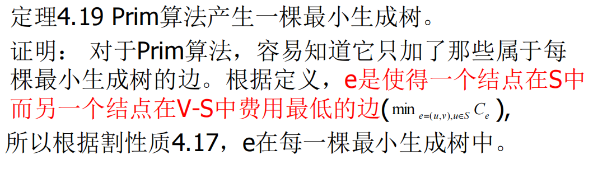

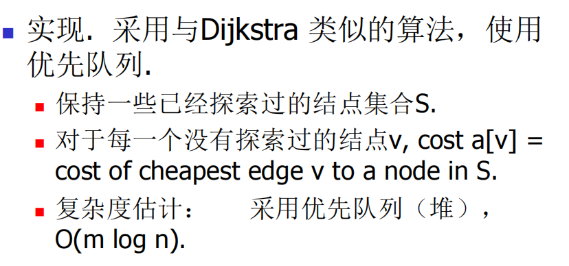

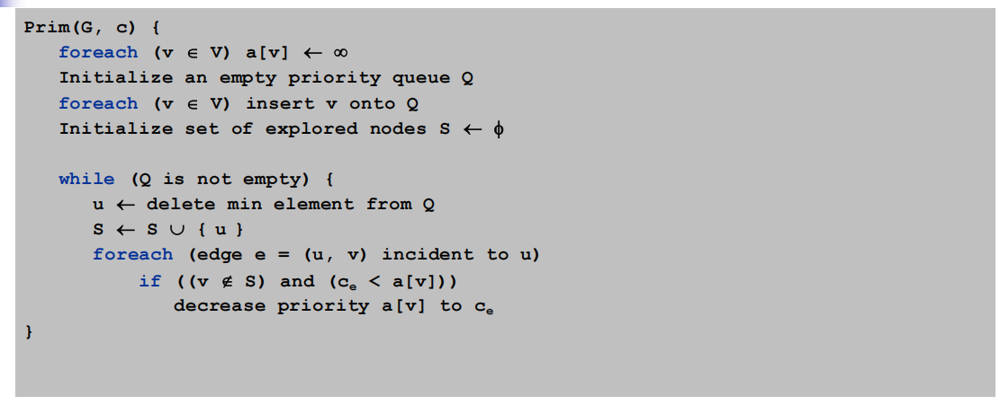


## 4.6 实现Kruskal 算法

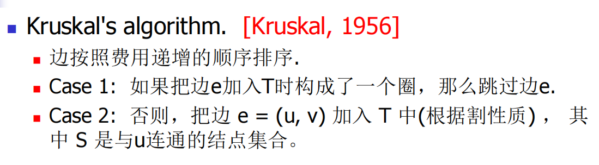


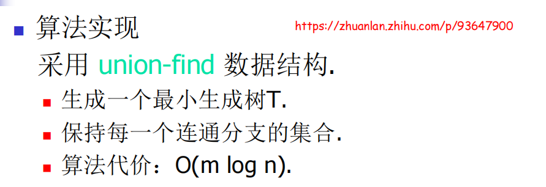

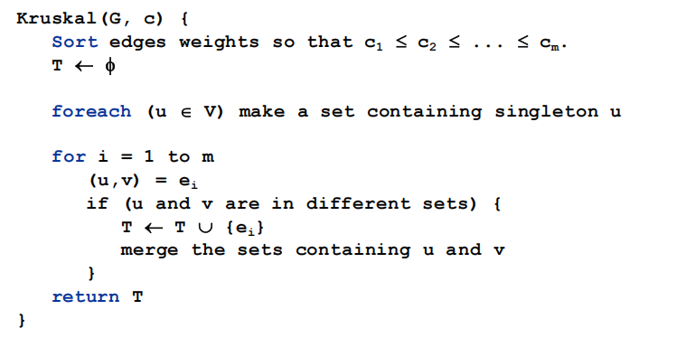

#### 并查集==============================================================================================================================================================================================


## 4.7 聚类

## 4.8 Huffman 码与数据压缩

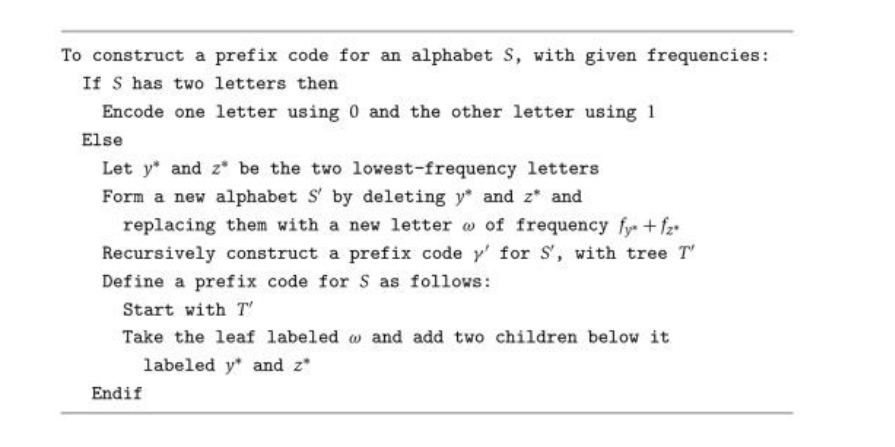

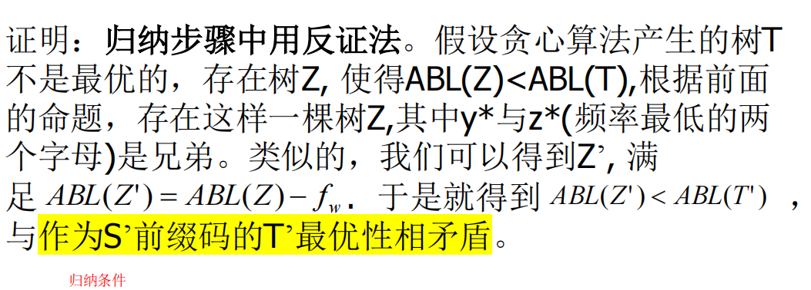