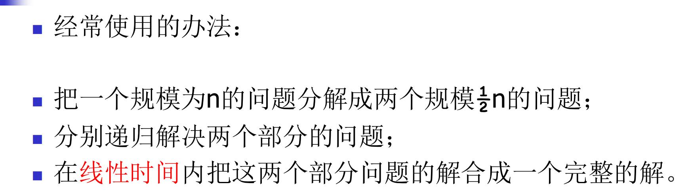
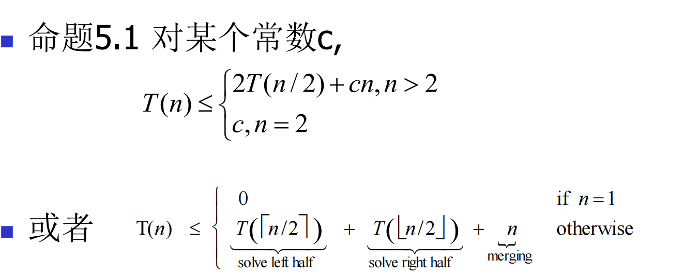
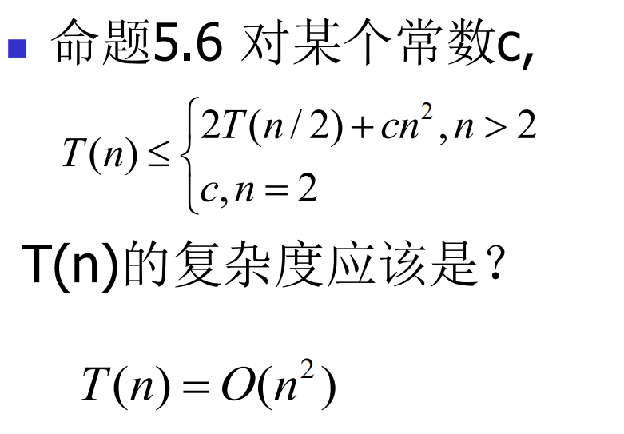

# ch5分治策略



### 什么是分治算法？

在理解主定理之前，我们先回顾一下分治算法。分治算法通常遵循以下三个步骤：

1. **分解（Divide）**：将原问题分解成若干个规模较小、相互独立、与原问题形式相同的子问题。
2. **解决（Conquer）**：递归地解决这些子问题。如果子问题规模足够小，则直接求解。
3. **合并（Combine）**：将子问题的解合并成原问题的解。

许多经典算法，如归并排序、快速排序、二分查找、Strassen矩阵乘法等，都采用了分治策略。

## Master Theorem

### Master Theorem 的形式

主定理适用于形如以下递推关系式：

$$ T(n)=aT(n/b)+f(n)$$

其中：

- n 是问题的规模。
- a≥1 是子问题的数量。
- b>1 是每个子问题规模相对于原问题规模的缩小因子（即原问题被分成大小为 n/b 的子问题）。
- f(n) 是分解问题和合并子问题结果所花费的时间（非递归部分的工作量）。f(n) 必须是渐近正函数（即对于足够大的 n， f(n)>0）。

### Master Theorem 的三种情况

主定理通过比较$ f(n)$ 和$ n ^{\log_b a}$ 的大小关系，给出了 T(n) 的三种渐近解：

**情况 1：子问题的工作量占主导** 如果$ f(n)=O(n^{ \log_b a−ϵ})$，其中$ ϵ>0 $是一个常数。 这意味着$ f(n) $比 $n^{\log_b a}$ 小一个多项式因子。在这种情况下，递归树的叶子节点（子问题）的总工作量占主导地位。 则 $T(n)=Θ(n^{\log_b a})$。

**情况 2：各层工作量大致相等** 如果 $f(n)=Θ(n^{ \log_b a} \log^k n)$，其中 $k≥0 $是一个常数。 这意味着 $f(n) $与$ n \log_b a$ 在一个对数因子以内是渐近相等的。在这种情况下，递归树的每一层的工作量大致相等。 则 $T(n)=Θ(n^{ \log_b a} \log^{k +1 }+n)$。 通常，我们更常用 $f(n)=Θ(n \log_b a)$ （即 k=0 的情况），此时$ T(n)=Θ(n^{\log_b a} \log n)$。

**情况 3：合并/分解工作量占主导** 如果 $f(n)=Ω(n^{ \log_ba+ϵ})$，其中 $ϵ>0 $是一个常数， **并且**满足**正则条件（Regularity Condition）**：对于某个常数 $c<1$ 和所有足够大的$ n$，有 $af(n/b)≤cf(n)$。 这意味着 $f(n) $比 $n^ {\log_ba}$ 大一个多项式因子。在这种情况下，非递归部分的开销 $f(n) $占主导地位。 则 $T(n)=Θ(f(n)$)。

**正则条件的含义**： 正则条件是为了确保 $f(n) $在递归的后续层级不会增长得过快，以至于违反了 $f(n)$ 是主导项的假设。简单来说，它保证了每次递归调用的非递归工作量不会比上一次递归的非递归工作量增长得太快。

## 归并排序

#### 递推关系：



- 命题：如果$T(n)$满足如下关系，且n是2的整数次幂，那么$T(n) = n \log_2 n$.
- 


使用主公式，显然成立！

定理5.4 任何满足5.3并具有$q>2$的函数T(.)是 $O(n \log_2q)$有界的。

定理5.5 任何满足5.3式并具有q=1的函数T(.) ($T(n) \le T(n/2)+O(n)$)是$O(n)$有界的。



## 5.3计数逆序

### 1. 什么是逆序对？

在一个序列（或数组）中，如果存在一对元素 ($A_i$,$A_j$)，满足以下两个条件：

1. $i <  j$ (即 $A_i$ 在 $A_j$ 的前面)
2. $A_i > A_j $ (即 $A_i$ 的值大于$ A_j$ 的值)

那么，我们就称这对元素 $(A_i,A_j)$ 构成一个**逆序对**。

### 2. 为什么需要计算逆序对？

逆序对的数量是衡量一个序列“无序程度”的指标。

- 如果一个序列完全有序（升序），则逆序对的数量为 0。
- 如果一个序列完全逆序（降序），则逆序对的数量最大，为 $\frac{ N(N−1)}{2}$，其中 $N$ 是序列的长度。

它在算法分析、数据结构、以及某些特定的应用场景中（如幻灯片中提到的协同过滤的相似度衡量）都有其意义。

### 3. 求解逆序对数量的方法

计算逆序对数量的方法有很多，以下介绍几种常见且高效的方法。

#### 3.1 暴力解法 (Brute Force)

**思路：** 遍历所有可能的元素对 $(A_i,A_j)$，如果满足$ i<j$ 且$ A_i > A_j$，则计数器加一。

**步骤：**

1. 初始化计数器 `count = 0`。
2. 使用两重循环：外层循环 `i` 从 0 到 `N-2`，内层循环 `j` 从 `i+1` 到 `N-1`。
3. 在内层循环中，如果 `A[i] > A[j]`，则 `count++`。

**C++ 示例代码：**

```c++
long long countInversions_BruteForce(std::vector<int>& arr) {
    long long count = 0;
    int n = arr.size();
    for (int i = 0; i < n; ++i) {
        for (int j = i + 1; j < n; ++j) {
            if (arr[i] > arr[j]) {
                count++;
            }
        }
    }
    return count;
}
```

**时间复杂度：**$ O(N^2)$。当 $N $较大时，效率低下。

#### 3.2 归并排序法 (Merge Sort)

这是计算逆序对最经典且最高效的方法之一。它利用了归并排序的分治思想。

**核心思想：** 在归并排序的合并（Merge）过程中，当我们将两个已排序的子数组合并成一个大的有序数组时，可以顺便计算逆序对。

**步骤：**

1. **分 (Divide)：** 将数组递归地分成两半，直到每个子数组只包含一个元素（一个元素的数组没有逆序对）。
2. **治 (Conquer)：** 递归地对左右子数组进行归并排序，并计算它们各自的逆序对数量。
3. **合 (Combine)：** 在合并两个已排序的子数组时，计算跨越两个子数组的逆序对数量。

**如何计算跨越的逆序对：** 假设我们正在合并左子数组 `L` 和右子数组 `R`，它们都是有序的。 设置两个指针 `p1` 指向 `L` 的开头，`p2` 指向 `R` 的开头。 当从 `L` 和 `R` 中选择元素放入最终的合并数组时：

- 如果 `L[p1] <= R[p2]`：将 `L[p1]` 放入合并数组，`p1++`。此时不产生逆序对。
- 如果 `L[p1] > R[p2]`：将 `R[p2]` 放入合并数组，`p2++`。此时，`R[p2]` 比 `L[p1]` 小。由于 `L` 数组是有序的，那么从 `L[p1]` 到 `L` 数组末尾的所有元素 (`L[p1], L[p1+1], ..., L[mid]`) 都比 `R[p2]` 大。因此，这 `(mid - p1 + 1)` 个元素都与 `R[p2]` 构成逆序对。我们将这个数量加到总逆序对计数中。

**示例代码：**

```c++
long long mergeAndCount(std::vector<int>& arr, int left, int mid, int right, std::vector<int>& temp) {
    long long inversions = 0;
    int i = left;      // 左子数组起始指针
    int j = mid + 1;   // 右子数组起始指针
    int k = left;      // 临时数组起始指针

    while (i <= mid && j <= right) {
        if (arr[i] <= arr[j]) {
            temp[k++] = arr[i++];
        } else {
            // 发现逆序对！
            // arr[i] > arr[j]，并且 arr[i] 及其后面在左子数组中的所有元素
            // (arr[i], arr[i+1], ..., arr[mid]) 都比 arr[j] 大
            inversions += (mid - i + 1);
            temp[k++] = arr[j++];
        }
    }

    // 将剩余元素拷贝到临时数组
    while (i <= mid) {
        temp[k++] = arr[i++];
    }
    while (j <= right) {
        temp[k++] = arr[j++];
    }

    // 将临时数组中的数据拷贝回原数组
    for (int idx = left; idx <= right; ++idx) {
        arr[idx] = temp[idx];
    }

    return inversions;
}

long long mergeSortAndCount(std::vector<int>& arr, int left, int right, std::vector<int>& temp) {
    long long inversions = 0;
    if (left < right) {
        int mid = left + (right - left) / 2;
        // 递归计算左半部分的逆序对
        inversions += mergeSortAndCount(arr, left, mid, temp);
        // 递归计算右半部分的逆序对
        inversions += mergeSortAndCount(arr, mid + 1, right, temp);
        // 计算跨越左右半部分的逆序对，并合并
        inversions += mergeAndCount(arr, left, mid, right, temp);
    }
    return inversions;
}

long long countInversions_MergeSort(std::vector<int>& arr) {
    int n = arr.size();
    if (n <= 1) return 0;
    std::vector<int> temp(n); // 辅助数组
    return mergeSortAndCount(arr, 0, n - 1, temp);
}
```

**时间复杂度：** $O( N \log N)$。与归并排序本身的时间复杂度相同，是最高效的方法之一。 

**空间复杂度：** $O(N)$​，需要一个额外的临时数组。


定理：`Sort-and-Count`算法正确对输入表排序并且计数逆序个数；它对具有n个元素的表运行在$O(n \log n)$时间。

## 5.4最临近点对

“最邻近点对”（Closest Pair of Points）是计算几何中的一个经典问题。它要求在给定一组二维平面上的点中，找出其中距离最近的两个点。

**问题定义：**

给定 N 个点 P={p1,p2,…,pN}，其中每个点 pi 都有坐标 (xi,yi)。我们需要找到一对点 (pa,pb) 使得它们之间的欧几里得距离 d(pa,pb) 是所有点对中最小的。

### 求解方式

#### 2. 分治法 (Divide and Conquer)

这是解决最邻近点对问题的经典且高效的算法，时间复杂度为 $O(N\log N)$。

**核心思想：** 分治法将问题分解为更小的子问题，递归地解决这些子问题，然后将子问题的解合并得到原问题的解。

**步骤概述：**

1. **预处理：**
   - 将所有点按 $x$ 坐标排序得到 $P_x$。
   - 将所有点按 $y$ 坐标排序得到 $P_y$。
   - 这一步的时间复杂度为 $O(N \log N)$。
2. **分 (Divide)：**
   - 将点集 P 从中间分成两半，得到左半部分 $P_L$ 和右半部分 $P_R$。分割线通常取所有点 $x$ 坐标的中位数 $x_m$。
   - $P_L$ 包含所有 $x \leq x_m$ 的点，$P_R$ 包含所有 $x>x_m$ 的点。
   - 根据 $P_x$ 和 $P_y$，可以快速生成 $P_L$ 和$ P_R$ 对应的按 $x$ 和 $y$ 排序的子点集。
3. **治 (Conquer)：**
   - 递归地在 $P_L$ 中找出最邻近点对的距离 $d_L$。
   - 递归地在 $P_R$ 中找出最邻近点对的距离 $d_R$。
   - 设当前找到的最小距离为 $d=min(d_L,d_R)$。
4. **合 (Combine)：**
   - 这是最关键的一步。现在我们需要考虑跨越分割线（即一个点在 $P_L$ 中，另一个点在$ P_R$ 中）的最邻近点对。
   - 创建一个“带状区域” (strip)：所有 $x$ 坐标在$ [x_m−d,x_m+d]$ 范围内的点都属于这个带状区域。因为如果存在跨越分割线的点对距离小于 d，那么这两个点必然都在这个宽度为 2d 的带状区域内。
   - 将这个带状区域内的所有点按 y 坐标排序得到 $P_{strip}$。
   - 遍历 $P_{strip}$ 中的每个点 $p_i$。对于每个 $p_i$，我们只需要检查它后面（按$ y$ 坐标排序）的、且$ y$ 坐标差不超过$ d$ 的点。**一个重要的优化是，在一个正方形区域内，点不能太密集，通常每个点最多只需要检查其后大约 7 个点（或一个常数个点）**。这是因为如果两个点之间的距离小于 $d$，且它们的 $y$ 坐标差小于$ d$，它们必须位于一个 $d×2d$（或更小的）矩形区域内。在这个矩形区域内，若所有点相互距离都至少为 $d$，则最多只能容纳常数个点（例如 $6-8$个点）。

**C++ 伪代码（简化）：**

```c++
struct Point {
    int x, y;
};

// 辅助函数：计算两点距离的平方
double distSq(Point p1, Point p2) {
    return (double)(p1.x - p2.x) * (p1.x - p2.x) + (double)(p1.y - p2.y) * (p1.y - p2.y);
}

// 核心分治函数
double closestPairRecursive(std::vector<Point>& Px, std::vector<Point>& Py) {
    int n = Px.size();
    if (n <= 3) { // 少量点时，使用暴力法
        double minDist = std::numeric_limits<double>::max();
        for (int i = 0; i < n; ++i) {
            for (int j = i + 1; j < n; ++j) {
                minDist = std::min(minDist, distSq(Px[i], Px[j]));
            }
        }
        return minDist;
    }

    int mid = n / 2;
    Point midPoint = Px[mid]; // 中间点

    // 分割 Py 为 Ly 和 Ry
    std::vector<Point> Ly, Ry;
    for (const auto& p : Py) {
        if (p.x <= midPoint.x) {
            Ly.push_back(p);
        } else {
            Ry.push_back(p);
        }
    }

    // 递归调用
    double d1 = closestPairRecursive(std::vector<Point>(Px.begin(), Px.begin() + mid), Ly);
    double d2 = closestPairRecursive(std::vector<Point>(Px.begin() + mid, Px.end()), Ry);
    double d = std::min(d1, d2); // 左右两边找到的最小距离

    // 组合阶段：处理跨越分割线的点
    std::vector<Point> strip;
    for (const auto& p : Py) {
        if (std::abs(p.x - midPoint.x) * std::abs(p.x - midPoint.x) < d) { // 注意这里是距离的平方
            strip.push_back(p);
        }
    }

    // 遍历 strip 中的点，检查其附近的点
    // strip 已经是按 y 坐标排序的
    for (int i = 0; i < strip.size(); ++i) {
        // 只需检查其后 7 个点 (或常数个点)，因为超出这个范围，距离不会小于 d
        for (int j = i + 1; j < strip.size() && (strip[j].y - strip[i].y) * (strip[j].y - strip[i].y) < d; ++j) {
            d = std::min(d, distSq(strip[i], strip[j]));
        }
    }

    return d;
}

// 主函数
double findClosestPair(std::vector<Point>& points) {
    std::sort(points.begin(), points.end(), [](const Point& a, const Point& b) {
        return a.x < b.x; // 按 x 坐标排序
    });

    std::vector<Point> Px = points; // 复制一份按 x 排序的
    std::vector<Point> Py = points;
    std::sort(Py.begin(), Py.end(), [](const Point& a, const Point& b) {
        return a.y < b.y; // 复制一份按 y 排序的
    });

    return std::sqrt(closestPairRecursive(Px, Py)); // 返回实际距离
}
```

**时间复杂度分析：**

- 预处理排序：$O(NlogN)$

- 递归关系：

  $T(N)=2T(N/2)+O(N)$。

  - $2T(N/2) $是递归解决左右子问题。
  - $O(N)$ 是合并阶段：构建 `strip` 需要 $O(N)$（因为 `Py` 已经是按 `y` 排序的），遍历 `strip` 并检查相邻点的部分，由于每个点最多检查常数个点，这部分也是 O(N)。 根据主定理，此递归关系解为 $O(NlogN)$。

**空间复杂度：** $O(N)$，用于存储递归过程中的子数组和带状区域。

## 5.5整数乘法

