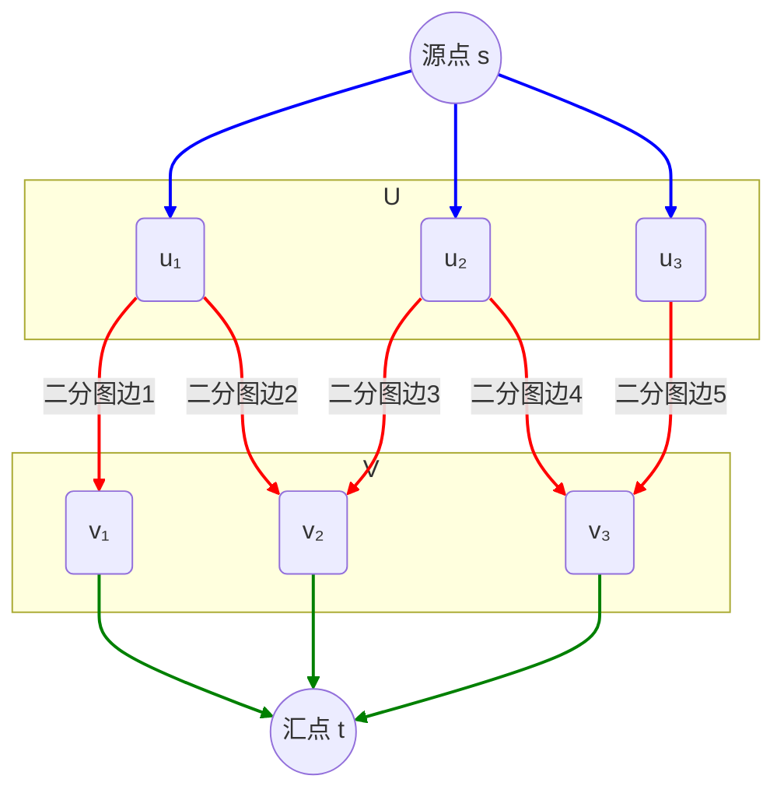

# ch7网络流

- 二部图
- 匹配：图$G = (V,E)$，中的一个匹配是边的集合 $M \subseteq E$，并且每个节点之多出现在M中的一条边上。

- 确定二部图中最大匹配的大小

## 7.1最大流问题

### 核心概念

理解最大流问题需要掌握以下几个核心概念：


- **容量网络 (Capacity Network)**: 这是一个有向图 $G=(V,E)$，其中 V 是顶点集合，E 是有向边集合。
  - 每个边$ (u,v)∈E$ 都有一个非负的**容量 (capacity)** $c(u,v)$，表示通过该边的最大流量。
  - 有一个指定的**源点 (source)** $s\in V$，流量从这里流出。
  - 有一个指定的**汇点 (sink)** $t∈V$，流量在这里汇入。
- **流 (Flow)**: 一个流是一个函数 $f:V×V→R$，满足以下条件：
  1. **容量限制 (Capacity Constraint)**: 对于所有的边 $(u,v)∈E$，流 $f(u,v)$ 不能超过其容量，即 $0≤f(u,v)≤c(u,v)$。如果$ (u,v)$ 不是一条边，则 $f(u,v)=0$。
  2. **流量守恒 (Flow Conservation)**: 对于所有非源点和非汇点的中间节点 
  3. $u∈V -\{s,t\}$，流入该节点的总流量等于流出该节点的总流量。即： $∑_{v∈V}f(v,u)=∑_{v∈V}f(u,v)$
- **流的值 (Value of Flow)**: 从源点 s 流出的总净流量 (或流入汇点 t 的总净流量)。 $∣f∣=∑_{v∈V}f(s,v)−∑_{v∈V}f(v,s)$ 目标就是找到一个使得 $∣f∣ $最大的流 $f$。

------

### Ford-Fulkerson 算法

Ford-Fulkerson 算法是解决**最大流问题**的一类经典算法的总称，或者说是一个**算法框架 (framework)**。该算法的核心思想是**迭代地寻找从源点到汇点的增广路径 (augmenting path)，并沿着这些路径增加流量，直到网络中不再存在任何增广路径为止**。

---
#### 核心概念：残差网络与增广路径

理解 Ford-Fulkerson 算法的关键在于理解以下两个概念：

1.  **残差网络 (Residual Network / Residual Graph, $G_f$)**:
    * 给定一个流网络 $G=(V, E)$ 和一个流 $f$，残差网络 $G_f$ 表示在当前流 $f$ 下，网络中**还可以调整的流量空间**。
    * $G_f$ 的顶点集与 $G$ 相同。
    * 对于原网络中的每条边 $(u, v) \in E$：
        * **前向边 (Forward Edge)**: 如果 $f(u, v) < c(u, v)$（即该边的流量未达到容量上限），则在 $G_f$ 中有一条从 $u$到 $v$ 的边，其**残差容量 (residual capacity)** 为 $c_f(u, v) = c(u, v) - f(u, v)$。这表示我们还可以从 $u$ 到 $v$ 推送 $c_f(u, v)$ 单位的额外流量。
        * **反向边 (Backward Edge)**: 如果 $f(u, v) > 0$（即该边上有流量），则在 $G_f$ 中有一条从 $v$ 到 $u$ 的边，其残差容量为 $c_f(v, u) = f(u, v)$。这表示我们可以将已经从 $u$ 推送到 $v$ 的流量“退回”一部分，相当于减少了 $u$ 到 $v$ 的流量，从而允许这些流量从其他路径流向 $u$。反向边的引入是 Ford-Fulkerson 算法能够修正先前流分配并找到最优解的关键。

2.  **增广路径 (Augmenting Path)**:
    * 增广路径是**残差网络 $G_f$ 中从源点 $s$ 到汇点 $t$ 的一条简单路径**。
    * 这条路径上的每一条边 $(u,v)$ 都具有严格大于 0 的残差容量 $c_f(u,v)$。
    * **增广路径的瓶颈容量 (bottleneck capacity)** 是该路径上所有边的残差容量中的最小值，记为 $c_f(p) = \min \{c_f(u, v) | (u, v) \text{ is in path } p\}$。这个值表示我们可以沿着这条路径从 $s$ 到 $t$ 增加多少流量。

---
### 算法基本步骤

Ford-Fulkerson 算法的通用步骤如下：


1.  **初始化 (Initialization)**:
    * 将网络中所有边的初始流 $f(u, v)$ 设为 0。
    * 此时，残差网络 $G_f$ 与原网络 $G$ 结构类似，前向边的残差容量等于原容量 $c(u,v)$，反向边的残差容量为 0 (因为初始流量为0)。

2.  **迭代寻找增广路径 (Iterative Augmentation)**:
    * **While** 在残差网络 $G_f$ 中存在一条从源点 $s$ 到汇点 $t$ 的增广路径 $p$:
        * a. **寻找路径 (Find Path)**: 找到这样一条增广路径 $p$。寻找方法可以是深度优先搜索 (DFS)、广度优先搜索 (BFS) 或其他任何图搜索算法。
        * b. **计算瓶颈容量 (Calculate Bottleneck)**: 计算路径 $p$ 的瓶颈容量 $c_f(p)$。
        * c. **增广流量 (Augment Flow)**:
            * 对于路径 $p$ 上的每一条**前向边** $(u, v)$ (即原网络中也存在的边)，将流 $f(u, v)$ 增加 $c_f(p)$。
            * 对于路径 $p$ 上的每一条**反向边** $(v, u)$ (对应原网络中的边 $(u,v)$)，将流 $f(u, v)$ 减少 $c_f(p)$。
        * d. **更新残差网络 (Update Residual Network)**: 根据新的流 $f$ 更新残差网络 $G_f$ 中的残差容量。

3.  **终止 (Termination)**:
    * 当残差网络 $G_f$ 中不再存在从 $s$ 到 $t$ 的增广路径时，算法终止。
    * 此时，网络中的总流量 $|f| = \sum_{v \in V} f(s, v) - \sum_{v \in V} f(v, s)$ 就是最大流。

---
### 算法的正确性与终止性

* **正确性**: Ford-Fulkerson 算法的正确性基于**最大流最小割定理**。当算法终止时，源点 $s$ 和汇点 $t$ 在残差网络 $G_f$ 中不再连通。这意味着我们可以找到一个 $(s, t)$ 割 $(S, T)$，其中 $S$ 是 $G_f$ 中从 $s$ 可达的所有顶点，而 $T$ 是其余顶点 ($t \in T$)。此时，穿过这个割的正向边的流量都达到了容量上限，反向边的流量都为0。因此，当前流的值等于这个割的容量。由于任何流的值都不可能超过任何割的容量，所以当流值等于某个割的容量时，这个流就是最大流，这个割就是最小割。
* **终止性**:
    * 如果所有边的容量都是**整数**，那么每次增广至少会使总流量增加 1（因为瓶颈容量至少为1）。由于最大流的值有一个上限（例如，所有从源点出发的边的容量之和），所以算法必然会在有限步内终止。
    * 如果边的容量是**有理数**，可以通过将所有容量乘以它们的最小公分母转换为整数容量，因此算法也会终止。
    * 如果边的容量是**无理数**，Ford-Fulkerson 算法可能**不会终止**，或者会收敛到一个并非最大流的值。这就是为什么具体的增广路径选择策略（如 Edmonds-Karp 中的 BFS）很重要。

---
### 增广路径的选择与复杂度

Ford-Fulkerson 本身是一个通用框架，其复杂度取决于如何选择增广路径：

* **任意选择 (例如使用 DFS)**:
    * 如果路径选择不当（例如，每次都选择瓶颈容量很小的路径），算法的迭代次数可能会非常多。
    * 对于整数容量，最坏情况下的时间复杂度可能是 $O(f^* \cdot E)$，其中 $f^*$ 是最大流的值，$E$ 是边数。如果 $f^*$ 非常大，这个复杂度会很高。

* **Edmonds-Karp 算法**:
    * 这是 Ford-Fulkerson 的一个具体实现，它**总是选择边数最少的增广路径** (通过 **广度优先搜索 BFS** 来寻找)。
    * Edmonds-Karp 算法保证了算法的终止性，即使对于无理数容量（尽管通常只讨论有理数/整数容量）。
    * 其时间复杂度为 $O(V E^2)$，其中 $V$ 是顶点数，$E$ 是边数。这个复杂度与流的大小无关，这是它的一大优点。

---
### 优缺点

**优点**:

* **原理相对简单直观**: 增广路径的思想容易理解。
* **通用性**: 作为一个框架，可以根据具体问题选择不同的增广路径搜索策略。
* **整数容量下的保证**: 对于整数容量，保证找到最优解并终止。

**缺点**:

* **依赖路径选择**: 如果增广路径选择不当（在通用框架下），效率可能很低，甚至对无理数容量可能不终止。
* **复杂度可能较高**: 通用 Ford-Fulkerson 的复杂度依赖于最大流的值。即使是 Edmonds-Karp 的 $O(VE^2)$，在某些稠密图或大规模图上也可能不够快，有更高效的算法如 Dinic 算法或 Push-Relabel 算法。

- 

### 代码

```c++
#include <iostream>
#include <vector>
#include <queue>
#include <limits>
using namespace std;

class FordFulkerson {
private:
    int vertices;
    vector<vector<int>> residualGraph;  // 残量图
    vector<vector<int>> capacity;       // 容量图
    vector<vector<int>> flow;           // 流量图

    /**
     * @brief 使用BFS寻找增广路径
     * @param source 源点
     * @param sink 汇点
     * @param parent 用于存储路径的父节点数组
     * @return 如果找到增广路径返回true，否则返回false
     */
    bool bfs(int source, int sink, vector<int>& parent) {
        vector<bool> visited(vertices, false);
        queue<int> q;
        q.push(source);
        visited[source] = true;
        parent[source] = -1;

        while (!q.empty()) {
            int u = q.front();
            q.pop();

            for (int v = 0; v < vertices; v++) {
                if (!visited[v] && residualGraph[u][v] > 0) {
                    q.push(v);
                    parent[v] = u;
                    visited[v] = true;
                }
            }
        }

        return visited[sink];
    }

public:
    FordFulkerson(int v) : vertices(v) {
        // 初始化图
        residualGraph = vector<vector<int>>(v, vector<int>(v, 0));
        capacity = vector<vector<int>>(v, vector<int>(v, 0));
        flow = vector<vector<int>>(v, vector<int>(v, 0));
    }

    /**
     * @brief 添加一条边到图中
     * @param from 起点
     * @param to 终点
     * @param capacity 边的容量
     */
    void addEdge(int from, int to, int cap) {
        capacity[from][to] = cap;
        residualGraph[from][to] = cap;
    }

    /**
     * @brief 计算从源点到汇点的最大流
     * @param source 源点
     * @param sink 汇点
     * @return 最大流的值
     */
    int maxFlow(int source, int sink) {
        int max_flow = 0;
        vector<int> parent(vertices);

        // 当存在增广路径时继续
        while (bfs(source, sink, parent)) {
            // 找到增广路径上的最小残量
            int path_flow = numeric_limits<int>::max();
            for (int v = sink; v != source; v = parent[v]) {
                int u = parent[v];
                path_flow = min(path_flow, residualGraph[u][v]);
            }

            // 更新残量图和流量图
            for (int v = sink; v != source; v = parent[v]) {
                int u = parent[v];
                residualGraph[u][v] -= path_flow;
                residualGraph[v][u] += path_flow;
                flow[u][v] += path_flow;
                flow[v][u] -= path_flow;
            }

            max_flow += path_flow;
        }

        return max_flow;
    }

    /**
     * @brief 获取边的流量
     * @param from 起点
     * @param to 终点
     * @return 边的流量
     */
    int getFlow(int from, int to) {
        return flow[from][to];
    }

    /**
     * @brief 打印网络中的流量分布
     */
    void printFlow() {
        cout << "网络中的流量分布：" << endl;
        for (int i = 0; i < vertices; i++) {
            for (int j = 0; j < vertices; j++) {
                if (capacity[i][j] > 0) {
                    cout << "边 " << i << " -> " << j
                         << " 的流量: " << flow[i][j]
                         << "/" << capacity[i][j] << endl;
                }
            }
        }
    }
};
```

### 时间复杂度


## 7.2最大流最小割定理 (Max-Flow Min-Cut Theorem)

这是网络流理论中一个非常核心和优美的定理。

- **割 (Cut)**: 一个$ (s,t)$ 割是将图的顶点集$ V$ 划分为两个不相交的子集 $S$ 和$ T$（其中 $s∈S$ 且 $t∈T$）。
- **割的容量 (Capacity of a Cut)**: 从 S 中的顶点指向 T 中的顶点的所有边的容量之和。 $c(S,T)=∑_{u∈S,v∈T,(u,v)∈E}c(u,v)$
- **定理内容**: 在任何网络中，从源点 $s$ 到汇点 $t$ 的最大流的值等于其$ (s,t)$ 最小割的容量。 $\max∣f∣=\min c(S,T)$​ 这个定理不仅给出了最大流的值，也提供了一种验证最大流是否达到最优的方法（即找到一个容量等于当前流值的割）.


## 7.3选择好的增广路径


这里的核心选择方式是：

1. **引入伸缩因子 Δ (Delta)**:
   - 算法开始时，会选择一个初始的 Δ 值，通常是大于等于网络中最大边容量 C 的最小的2的幂。
   - 这个 Δ 作为当前阶段寻找增广路径的**最小容量阈值**。
2. **构建 Δ-残差网络 Gf(Δ)**:
   - 在每一轮（对应一个 Δ 值），算法只在所谓的 "Δ-残差网络" Gf(Δ) 中寻找增广路径。
   - 这个 Gf(Δ) 与普通的残差网络 Gf 的区别在于：**它只包含那些残差容量至少为 Δ 的边**。也就是说，只有当一条边 (u,v) 在普通残差网络中的残差容量 cf(u,v)≥Δ 时，这条边才存在于 Gf(Δ) 中。
3. **在 Δ-残差网络中寻找增广路径**:
   - 在内层 `while` 循环中，算法在 Gf(Δ) 中寻找任意增广路径 P。这意味着选出的增广路径 P，其瓶颈容量必然 ≥Δ。
   - 找到路径 P 后，就用这条路径去增广流量 f。
4. **减小 Δ**:
   - 当在当前的 Gf(Δ) 中再也找不到增广路径（即所有能推至少 Δ 流量的路径都被用尽了）时，算法会将 Δ 的值减半 (Δ←Δ/2)。
   - 然后进入下一阶段，在新（更小）的 Δ 值下，重新构建 Gf(Δ) 并继续寻找增广路径。这个过程会引入之前因为残差容量小于旧 Δ 但大于等于新 Δ 而未被考虑的边。
5. **终止**:
   - 当 Δ<1 时（对于整数容量），算法终止。

**总结这种选择方式的特点：**

- **阶段性选择 (Phased Selection)**: 算法分阶段进行，每个阶段有一个主要的流量增广尺度 Δ。
- **高容量优先 (High-Capacity Priority)**: 在早期阶段（Δ 较大时），算法优先寻找能够承载大量流量的路径。这有助于快速逼近最大流。
- **逐步精细化 (Gradual Refinement)**: 随着 Δ 的减小，算法逐渐考虑容量较小的路径，对剩余的流量进行更精细的调整。

这种基于容量伸缩的策略，其优点在于能够有效减少寻找增广路径的迭代次数，尤其是在边容量差异很大的网络中。它通常能带来比朴素的 Ford-Fulkerson 或 Edmonds-Karp 更好的性能。这个伪代码描述的是一种典型的容量伸缩最大流算法的框架。

## 7.5二分匹配问题

是的，可以使用流网络来高效地解决二分匹配问题，特别是求解**最大二分匹配**。

核心思想是将二分图转换成一个特定的流网络，然后通过计算该网络的最大流来找到最大匹配数。最大流的值就等于最大匹配中边的数量。

---
### 构造流网络

假设有一个二分图 $G = (U \cup V, E)$，其中 $U$ 和 $V$ 是两个独立的顶点集，而 $E$ 是连接 $U$ 中顶点和 $V$ 中顶点的边集。我们可以按如下方式构造一个流网络 $G' = (V', E')$：

1.  **创建源点和汇点**:
    * 创建一个源点 $s$ 和一个汇点 $t$。

2.  **添加从源点到 U 的边**:
    * 对于 $U$ 中的每一个顶点 $u_i \in U$，从源点 $s$ 向 $u_i$ 添加一条有向边 $(s, u_i)$。
    * 这些边的**容量 (capacity)** 都设置为 **1**。这确保了 $U$ 中的每个顶点最多只能匹配一次（即从源点流出的流量最多为1到每个 $u_i$）。

3.  **添加从 U 到 V 的边 (对应二分图中的边)**:
    * 对于原二分图 $G$ 中的每一条边 $(u_i, v_j) \in E$（其中 $u_i \in U, v_j \in V$），在流网络 $G'$ 中从 $u_i$ 向 $v_j$ 添加一条有向边 $(u_i, v_j)$。
    * 这些边的**容量**可以设置为 **1**（或者任何大于等于1的数，如无穷大，但设为1更直观地对应匹配）。容量为1确保了原二分图中的每条边最多被用于一次匹配。

4.  **添加从 V 到汇点的边**:
    * 对于 $V$ 中的每一个顶点 $v_j \in V$，从 $v_j$ 向汇点 $t$ 添加一条有向边 $(v_j, t)$。
    * 这些边的**容量**都设置为 **1**。这确保了 $V$ 中的每个顶点最多只能匹配一次（即流入汇点的流量最多为1从每个 $v_j$）。

**图示:**



### 求解最大匹配

构造完上述流网络后：

- 使用任何标准的最大流算法（例如 Ford-Fulkerson 算法或其变种 Edmonds-Karp 算法，或者更高效的 Dinic 算法）计算从源点 $s$ 到汇点 $t$ 的最大流。
- 由于所有边的容量都是整数，最大流的值也将是整数。
- **这个最大流的值就等于二分图 $G$ 中最大匹配的边数。**

------

### 原理：为什么这样可行？

1. **流量与匹配的对应**:
   - 如果一条边 $(u_i, v_j)$ 在最大匹配中，那么在流网络中会有一单位的流从 $s \to u_i \to v_j \to t$。
   - 反过来，如果流网络中有一条路径 $s \to u_i \to v_j \to t$ 承载了一单位的流量，那么边 $(u_i, v_j)$ 可以被视为匹配中的一条边。
2. **容量限制保证了匹配的性质**:
   - **$s \to u_i$ 容量为1**: 确保 $U$ 中的每个顶点 $u_i$ 最多流出一单位流量，意味着 $u_i$ 最多与 $V$ 中的一个顶点匹配。
   - **$v_j \to t$ 容量为1**: 确保 $V$ 中的每个顶点 $v_j$ 最多接受一单位流量，意味着 $v_j$ 最多与 $U$ 中的一个顶点匹配。
   - **$u_i \to v_j$ 容量为1**: 确保如果 $u_i$ 和 $v_j$ 匹配，这条路径只承载一单位流，对应二分图中的一条匹配边。
3. **整数流定理 (Integrality Theorem)**:
   - 如果一个流网络中所有边的容量都是整数，那么必然存在一个最大流，其中每条边上的流量也都是整数。
   - 在这个构造中，所有容量都是1。因此，最大流将由若干条从 $s$ 到 $t$ 的路径组成，每条路径承载1单位流量，且这些路径上的中间边 $(u_i, v_j)$ 都是不同的（因为流量守恒和容量限制）。每一条这样的路径就对应了匹配中的一条边。

因此，通过求解这个特殊构造的流网络的最大流，我们可以有效地找到二分图的最大匹配数。这个方法不仅给出了最大匹配的大小，还可以通过查看哪些 $U \to V$ 的边上有流量来确定具体的匹配边。

