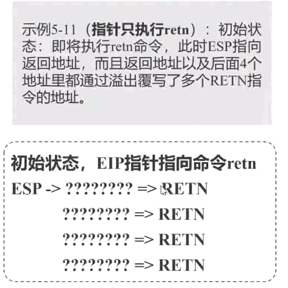
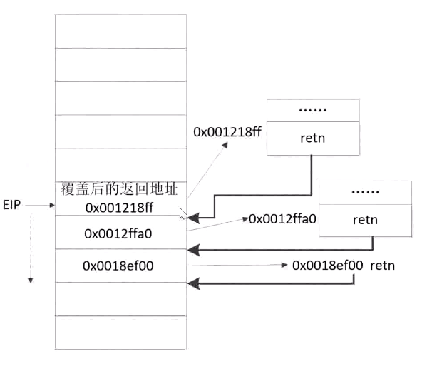

# <center>软件安全期末复习</center>

<center>网络空间安全学院 &ensp;信息安全 &ensp;  陆皓喆 &ensp;  2211044</center>

[TOC]


# 第一章 基本概念

## 病毒和木马 

​	病毒、蠕虫和木马三者都对电脑有一定的危害，但是三者有其不同之处。

### 病毒

​	指编制或者在计算机程序中插入的破坏计算机功能或者破坏数据，影响计算机使用并且能够自我复制的一组计算机指令或者程序代码

​	往往具有很强的**感染性、潜伏性、破坏性、特定的触发性**

​	病毒必须满足两个条件，**自我执行**（它通常将自己的代码置于另一个程序的执行路径中）、**自我复制**（它可能用受病毒感染的文件副本替换其他可执行文件）

### 蠕虫

​	利用网络进行复制和传播，是自身包含的程序，通过网络连接，能够将自身功能拷贝到其他计算机中

​	普通病毒需要传播驻留文件（受感染的）来进行复制，但是蠕虫**不需要驻留文件就可以在系统之间进行复制**，蠕虫病毒的传染目标是互联网所有的计算机

### 木马

​	是表面上有用的软件、实际目的却是危害计算机安全并导致严重破坏的计算机程序，具有非**授权性、隐蔽性**，是一种**远程控制**的黑客工具

​	木马**不具有传染性**，不能像病毒那样复制自身，是将自身伪装起来，让用户下载执行，主要目的是窃取用户相关的信息或者隐蔽性控制，就是说**病毒是破坏你的信息，木马窥视你**


## 软件漏洞

分清楚**软件缺陷&软件漏洞**：

​	软件缺陷是，导致程序不能运行；软件漏洞不是bug，而是一个安全上的漏洞

**电脑肉鸡：**

​	就是说，自己的电脑被别人远程控制了，攻击者通过寻找漏洞来主动控制电脑，植入木马

**漏洞分类：**

- $0day$漏洞：还处于未公开状态的漏洞。这类漏洞只在攻击者个人或者小范围黑客团体内使用，网络用户和厂商都不知情，因此没有任何防范手段，危害非常大，
- $1day$漏洞：补丁发布在1天内的漏洞，通常指发布补丁时间不长的漏洞，仍然存在一定的危害
- 已公开漏洞：厂商已经发布了补丁和修补方法，危害比较小

**漏洞产业链：**

​	上游（技术开发部门，编写恶意软件）、中游（执行产业部门，实现病毒的传播，网络攻击）、下游（销赃产业部门，贩卖木马、病毒等）


## 漏洞库

国内外有许多的漏洞库，都是公开的

- $CVE$：**通用漏洞列表**，实现了安全漏洞命名机制的规范化和标准化，为每个漏洞确定了唯一的名称和标准化的描述
- $NVD$：**美国国家漏洞数据库**，同时收录三个漏洞数据库的信息，$CVE$漏洞公告、$US-CERT$漏洞公告、$US-CERT$安全警告
- $CNNVD$：**中国国家信息安全漏洞库**，是国内的数据库
- $CNVD$：**国家信息安全漏洞共享平台**
- 其他漏洞库，如$EDB$漏洞库等


## 渗透测试

​	渗透测试是通过模拟恶意黑客的攻击方法，来评估计算机网络系统安全的一种评估方法。渗透测试是指渗透人员在不同的位置（比如从内网、从外网等位置）利用各种手段对某个特定网络进行测试，以期发现和挖掘系统中存在的漏洞，然后输出渗透测试报告，并提交给网络所有者。

​	渗透测试是一个渐进的过程，不影响业务系统的正常运行。


**渗透测试方法**

- 黑箱测试：对系统一无所知的状态下，进行测试
- 白盒测试：测试者可以通过正常渠道向被测单位取得各种资料
- 隐秘测试：接受渗透测试的单位网络管理部门会收到通知，在某些时段进行测试。因此能够监测网络中出现的变化


------

# 第二章 堆栈基础

## 内存区域

- 代码区：通常是指用来存放程序执行代码的一块内存区域。这个区域存储着被装入执行的二进制机器代码，处理器会到这个区域取指并执行。
- 静态数据区：通常是指用来存放程序运行时的全局变量、静态变量等的内存区域。通常，静态数据区包括初始化数据区（$Data Segment$）和未初始化数据区（$BSS Segment$）两部分。未初始化数据区$BSS$区存放的是未初始化的全局变量和静态变量，特点是可读写，在程序执行之前$BSS$段会自动清0。
- 堆区：用于动态地分配进程内存。进程可以在堆区动态地请求一定大小的内存，并在用完之后归还给堆区。动态分配和回收是堆区的特点。
- 栈区：用于支持进程的执行，动态地存储函数之间的调用关系、局部变量等，以保证被调用函数在返回时恢复到母函数中继续执行。

​	不同的操作系统有不同的内存组织形式


## 堆区和栈区

### 堆区

​	是一种程序运行时动态分配的内存，不能预先确定，需要在使用的时候用专有的函数进行申请，比如说$malloc$函数，$new$函数等。

​	堆是一种**向高地址扩展**的数据结构，堆的大小**受限于计算机的虚拟内存**

​	堆一般由程序员来分配，速度较慢，容易产生内存碎片，使用比较方便


### 栈区

​	主要存储函数运行时的局部变量、数组等，不需要额外申请，系统会自动为变量预留内存空间，栈的释放也是函数调用结束后回收

​	栈是一种**向低地址扩展**的数据结构，**先入后出**，默认大小是$2M$，如果申请空间超过栈的剩余空间，就会发生栈溢出

​	栈一般分配的速度较快，程序员无法控制


### 堆的结构

​	堆的内存主要分为：**堆块和堆表**

​	堆块是堆的基本组织单位，包括**块首和块身**

- 块首是用来标识这个堆块自身的信息，例如块大小、空闲还是占用等；
- 块身紧随其后，是最终分配给用户使用的数据区

​	**堆表一般位于整个堆区的开始位置，用于索引堆区中所有堆块的重要信息**，包括堆块的位置、堆块的大小、空闲还是占用等


#### 堆块

​	堆块有两种状态：**占有态和空闲态**

​	空闲态的堆块会被链入空链表中，由系统管理；而占有态的堆块会返回一个由程序员定义的句柄，通常是一个堆块指针，来完成对堆块内存的读、写和释放操作，由程序员管理


​	对于**空闲态**堆块而言，块首额外存储了两个4字节的指针：**$Flink$指针和$Blink$指针**，用于链接系统中的其他**空闲堆块**。其中，**Flink前向指针存储了前一个空闲块的地址，Blink后向指针存储了后一个空闲块的地址**

​	指向堆块的指针，指向的是块身的首地址，就是说，我们的地址指针不会指向块首的堆块信息，而是直接指向块身的数据区

​	堆块的大小包括块首在内，如果申请32字节，实际会分配**40字节，8字节的块首+32字节的块身**。堆块的**单位是8字节**，不足8字节按8字节分配。


#### 堆表

​	占有态的堆块被使用它的程序索引，而**堆表只索引所有空闲态的堆块**。其中，最重要的堆表有两种：空闲双向链表freelist（简称空表）和快速单向链表lookaside（简称快表）

​	空表包含**空表索引**(Freelist array)和**空闲链块**两个部分。空表索引也叫空表表头，是一个大小为128的指针数组，该数组的每一项包括两个指针，用于标识一条空表

​	空表索引的**第二项(free[1])标识了堆中所有大小为8字节的空闲堆块**。之后每个索引项指示的空闲堆块递增8字节。把空闲堆块按照大小的不同链入不同的空表，可以方便堆管理系统高效检索指定大小的空闲堆块。空表索引的第一项free[0]所标识的空表相对比较特殊，这条双向链表链入了**所有大于等于1024字节小于512KB的堆块**，升序排列。这个空表通常又称为**零号空表**。


### 堆块的分配与释放

#### 堆块分配

​	依据既定的查找空闲堆块的策略，找到合适的空闲堆块之后，将其状态**修改为占用态**、把它从堆表中“卸下”、返回一个指向堆块块身的指针给程序使用。
​	普通空表分配时首先寻找**最优的空闲块**分配，若失败，一个稍大些的块会被用于分配。这种次优分配发生时，会先**从大块中按请求的大小精确地“割”出一块进行分配**，然后给剩下的部分**重新标注块首，链入空表**。也就是说，空表分配存在找零钱的情况。
​	零号空表中按照大小升序链着大小不同的空闲块，故在分配时先从free[0]反向查找最后一个块（即最大块），看能否满足要求，如果满足要求，再正向搜索最小能满足要求的空闲堆块进行分配。

#### 堆块释放

​	堆块的释放操作包括将堆块状态由占用态改为空闲态、链入相应的堆表。所有释放的堆块都链入**相应的表尾**

#### 堆块合并

​	堆块的分配和释放操作可能引发堆块合并，即当堆管理系统发现**两个空闲堆块相邻**时，就会进行**堆块合并**操作。

​	堆块的合并包括几个动作：**将堆块从空表中卸下、合并堆块、修改合并后的块首、链接入新的链表**（合并的时候还有一种操作叫内存紧缩）


## 函数调用

​	借助系统栈来完成函数状态的保存和恢复

​	调用函数，如何跳转到main函数的位置呢？我们利用系统栈来完成这个调用，当函数被调用时，系统就会给这个函数开辟一个新的栈帧，并将其压入栈中，每一个栈帧都对应了一个没有运行完的函数，在栈中保存了该函数的**返回地址和局部变量**，其实栈帧就是一个函数执行的环境，包括了函数的参数、函数的局部变量、函数执行完之后的返回地址等，当函数返回时，系统栈会弹出该函数所对应的栈帧


**函数调用步骤：**

- 参数入栈：将参数从右向左依次压入系统栈中
- 返回地址入栈：将当前代码区调用指令的下一条指令地址压入栈中，供函数返回时继续执行
- 代码区跳转：处理器从当前代码区跳转到被调用函数的入口处
- 栈帧调整：保存当前栈帧状态值，已备后面恢复本栈帧时使用；将当前栈帧切换到新栈帧


## 常见寄存器

​	寄存器是有限存贮容量的高速存贮部件，它们可用来暂存指令、数据和地址

​	每一个函数独占自己的栈帧空间。当前正在运行的函数的栈帧总是在栈顶

- ESP：**栈指针寄存器**（extended stack pointer），其内存放着一个指针，该指针永远指向系统栈最上面一个栈帧的栈顶
- EBP：**基址指针寄存器**（extended base pointer），其内存放着一个指针，该指针永远指向系统栈最上面一个栈帧的底部


**栈帧中的重要信息：**

- 局部变量：为函数局部变量开辟内存空间
- 栈帧状态值：保存前栈帧的顶部和底部（实际上只保存前栈帧的底部，前栈帧的顶部可以通过堆栈平衡计算得到），用于在本帧被弹出后恢复出上一个栈帧
- 函数返回地址：保存当前函数调用前的“断点”信息，也就是函数调用前的指令位置，以便在函数返回时能够恢复到函数被调用前的代码区中继续执行指令


另外一个寄存器：EIP

​	**指令寄存器**（extended instruction pointer），其内存放着一个指针，该指针永远指向下一条等待执行的指令地址。可以说**如果控制了**EIP寄存器的内容，就控制了进程——我们让EIP指向哪里，CPU就会去执行哪里的指令


**栈帧调整：**

- 保存当前栈帧状态值，已备后面恢复本栈帧时使用（EBP入栈）
- 将当前栈帧切换到新栈帧（将ESP值赋值EBP，更新栈帧底部）


## 主要寄存器

- 数据寄存器：**EAX,EBX,ECX,EDX**
  - 上面四个都是32位的，然后还有四个16位的寄存器，AX,BX,CX,DX，都是存储了低16位的数据
  - 这四个16位寄存器又可分割成8个独立的8位寄存器(AX：AH-AL、BX：BH-BL、CX：CH-CL、DX：DH-DL)，每个寄存器都有自己的名称，可独立存取
  - EAX：累加器，用于乘除、输入输出等操作，还可以存储函数的返回值
  - EBX：基地址寄存器，用于访问存储器
  - ECX：计数寄存器，一般在循环中控制循环次数
  - EDX：数据寄存器

- 两个变址寄存器ESI和EDI，两个指针寄存器ESP和EBP
  - 变址寄存器
    - 32位CPU有2个32位通用寄存器ESI和EDI。其低16位对应先前CPU中的SI和DI，对低16位数据的存取，不影响高16位的数据
    - ESI通常在内存操作指令中作为“源地址指针”使用，而EDI通常在内存操作指令中作为“目的地址指针”使用
  - 指针寄存器
    - 用于存放堆栈内存储单元的偏移量，用它们可实现多种存储器操作数的寻址方式，不可以分割为8位寄存器
    - EBP为基指针(Base Pointer)寄存器，通过它减去一定的偏移值，来访问栈中的元素
    - ESP为堆栈指针(Stack Pointer)寄存器，它始终指向栈顶
- 6个段寄存器：ES、CS、SS、DS、FS和GS
  - CS:代码段寄存器，其值为代码段的段值
  - DS:数据段寄存器，其值为数据段的段值
  - ES:附加段寄存器，其值为附加数据段的段值
  - SS:堆栈段寄存器，其值为堆栈段的段值
  - FS:附加段寄存器，其值为附加数据段的段值
  - GS:附加段寄存器，其值为附加数据段的段值
- 指令指针寄存器EIP，标志寄存器EFlags
  - 指令指针寄存器
    - 存放下次将要执行的指令在代码段的偏移量。在计算机工作的时候，CPU会从IP中获得关于指令的相关内存地址，然后按照正确的方式取出指令，并将指令放置到原来的指令寄存器中
  - 标志寄存器
    - **Z-Flag**(零标志)：它可以设成0或者1
    - **O-Flag**(溢出标志)：反映有符号数加减运算是否溢出。如果运算结果超过了有符号数的表示范围，则OF置1，否则置0。例如：EAX的值为7FFFFFFFF，如果你此时再给EAX加1，OF寄存器就会被设置成1，因为此时EAX寄存器的最高有效位改变了
    - **C-Flag**(进位标志)：用于反映运算是否产生进位或借位。如果运算结果的最高位产生一个进位或借位，则CF置1，否则置0。例，假如某寄存器值为FFFFFFFF，再加上1就会产生进位


------

# 第二章 基础知识

## 汇编——寻址方式

两种寻址方式：顺序寻址方式，跳跃寻址方式

### 操作数寻址

```assembly
MOV 目的操作数, 源操作数
```

将源地址传到目标地址

**操作数寻址分类：**

1.**立即寻址**：指令的地址字段给出的不是操作数的地址，而是操作数本身，这种寻址方式称为立即寻址

```assembly
MOV CL, 05H 
```

表示将05H传到CL寄存器中

2.**直接寻址**：在指令中直接给出操作数的有效地址

```assembly
MOV AL,[3100H]
```

表示将地址为[3100H]中的数据存储到AL中

默认的存储在数据段寄存器DS中，如果在前面标明了寄存器，那么就存到对应的寄存器中去

```assembly
MOV AL, ES:[3100H]
```

这个代码的意思就是将ES寄存器中地址为[3100H]的数据存储到AL寄存器中

3.**间接寻址**：指令地址字段中的形式地址不是操作数的真正地址，而是操作数地址的指示器，或者说此形式地址单元的内容才是操作数的有效地址

```assembly
MOV [BX], 12H
```

这个代码表示，将12H这个数存储到DS:BX寄存器中

4.**相对寻址**：操作数的有效地址是一个基址寄存器（BX, BP）或变址寄存器（SI, DI）的值加上指令中给定的偏移量之和

```assembly
MOV AX, [DI + 1234H]
```

相对寻址就是在间接寻址的基础上增加了偏移量

5.**基址变址寻址**：将基址寄存器的内容，加上变址寄存器的内容而形成操作数的有效地址

```assembly
MOV EAX, [EBX+ESI]
```

或者也可以写成`MOV EAX, [BX][SI]` 或`MOV EAX, [SI][BX]`

6.**相对基址变址寻址**：在基址变址寻址上加上偏移量即可

```assembly
MOV EAX, [EBX+ESI+1000H]
```

也可以写成`MOV EAX, 1000H [BX][SI]`


## 汇编——主要指令

​	指令一般有**两个操作符、一个操作符、三个操作符**

**数据传送指令集：**

- MOV：把源操作数送给目的操作数，其语法为: MOV 目的操作数,源操作数
- XCHG: 交换两个操作数的数据
- PUSH,POP: 把操作数压入或取出堆栈 
- PUSHF,POPF,PUSHA,POPA: 堆栈指令群 
- LEA,LDS,LES: 取地址至寄存器 
  - LEA：将有效地址传送到指定的寄存器
  - `lea eax, dword ptr [4*ecx+ebx]` ，源数是地址  `[4*ecx+ebx]` 里的数值，`dword ptr`是说，地址中的数值是一个dword型的数据

**位运算指令集：**

- AND,OR,XOR,NOT,TEST: 执行BIT与BIT之间的逻辑运算
- SHR,SHL,SAR,SAL: 移位指令
- ROR,ROL,RCR,RCL: 循环移位指令

**算数运算指令：**

- ADD,ADC：加法指令
- SUB,SBB：减法指令
- INC,DEC：把OP的值加一或者减一
- NEG：将OP的符号反相，取二进制补码
- MUL,IMUL：乘法指令
- DIV,IDIV：除法指令

**程序流程指令集：**

- CMP:比较两个操作数的大小关系
- JMP:跳转到指定的地址
- LOOP:循环指令
- CALL,RET:子程序调用，返回指令（RET指令的功能是从一个代码区域中退出到调用CALL的指令处）
- INT,IRET:中断调用，返回指令
- REP,REPE,REPNE:重复前缀指令集

**条件转移命令：**

JXX：当特定条件成立，就跳转到指定地址执行

- Z:为0则转移
- G:大于则转移
- L:小于则转移
- E:等于则转移
- N:取相反条件

**字符串操作指令集：**

- 字符串传送指令：MOVSB,MOVSW,MOVSD
- 字符串比较指令：CMPSB,CMPSW,CMPSD
- 字符串搜索指令：SCASB,SCASW
- 字符串载入或存贮指令：LODSB,LODSW,STOSB,STOSW


## 汇编——函数调用示例

一个简单的函数

```c++
#include <iostream>
int add(int x,int y)
{
	int z=0;
	z=x+y;
	return z;
}
void main()
{
	int n=0;
	n=add(1,3);
	printf("%d\n",n);
}
```

查看汇编代码

```assembly
Void main()
{ ******************
             int n=0;
004114OE   mov         dword ptr [n],0
             n=add(1,3);
00411415   push         3
00411417   push         1
00411419   call            add(411096h)
0041141E   add           esp,8
00411421   mov          dwod ptr [n],eax
      printf(“%d\n,n”);
******************
}
```

我们对其进行分析

​	int n=0这一句没啥好说的，就是赋值，给n赋值0

​	下面执行函数块add，我们在执行call之前，还需要进行参数的入栈，将3和1都push到栈里面，我们得到栈区状态为：


​	我们在调用函数时需要使用`00411419 call add(411096h)`

​	主要功能是，向栈中压入当前指令在内存中的位置，保存返回地址；跳转到调用函数的入口地址，就是函数的入口处，此时栈区的状态：


下面分析add函数的汇编代码

```assembly
Int  add (int  x,int  y)
{
004113A0    push          ebp
004113A1    mov           ebp,esp
004113A3    sub            esp, 0CCh
004113A9    push          ebx
004113AA    push          esi
004113AB    push          edi
004113AC    lea             edi,[ebp-0CCh]
004113B2    mov           ecx,33h
004113B7    mov           eax,0CCCCCCCCh
004113BC    rep stos    dword ptr  es:[edi]
         int z=0;
004113BE    mov           dword ptr [z],0
         z=x+y;
004113C5    mov           eax,dword ptr [x]
004113C8    add            eax,dword ptr [y]
004113CB    mov          dword ptr [z],eax
        return z;
004113CE    mov          eax,dword ptr[z]
}
```

首先是**栈帧的切换**

```assembly
004113A0    push          ebp
004113A1    mov           ebp,esp
004113A3    sub           esp, 0CCh
```

​	这三句，首先将EBP的值入栈，将ESP赋值给EBP，然后再将ESP的值抬高0CCh，完成了栈帧的切换，保存了主函数栈帧的EBP的值，也通过改变两个寄存器的位置为add函数分配了栈帧空间


然后是**函数状态的保存**

```assembly
004113A9    push          ebx
004113AA    push          esi
004113AB    push          edi
004113AC    lea           edi,[ebp-0CCh]
```

​	这几句代码，用于保存`ebx，esi，edi`寄存器的位置，将ebp寄存器抬升0CCh来装入EDI

​	然后是栈帧的切换，后面的就是将33个4字节的位置都初始化为`0CCCCCCCCh`

​	然后我们就可以执行函数体了，完成1+3的加法，并将结果存储在eax寄存器中


​	执行完加法后，我们需要恢复栈帧的状态到main函数，后面几句实现了恢复的过程：首先恢复`edi，esi，ebx`寄存器的值，然后`mov esp,ebp` 这一句是恢复了esp寄存器的值，后面一句恢复了ebp寄存器的值，最后ret表示根据返回地址来恢复EIP寄存器的值，相当于`pop EIP`


------

# 第三章 调试分析工具

## PE文件格式

一般有可执行文件（exe&dll）

PE文件格式将可执行文件分成了若干个数据节，不同类型的资源被放在不同的节中

一般来说，有以下的数据节：

- rsrc：存放**程序的资源**，如图标、菜单等
- text：存放着**二进制的机器代码**
- idata：可执行文件所使用的动态链接库**等外来函数与文件的信息**, 即输入表
- data：初始化的数据块

**加壳**

​	全称应该是可执行程序资源压缩，是保护文件的常用手段。 加壳过的程序可以直接运行，但是不能查看源代码。要经过脱壳才可以查看源代码。

​	加壳可以很好的防止对程序的非法修改和静态反编译

加壳工具：压缩壳和加密壳

- 压缩壳的特点是减小软件体积大小，加密保护不是重点
- 加密壳种类比较多，不同的壳侧重点不同，一些壳单纯保护程序，另一些壳提供额外的功能，如提供注册机制、使用次数、时间限制等


## 虚拟内存

​	用户在用户模式运行；操作系统在内核模式运行，在内核模式可以访问所有的内存和硬件，使用所有的处理器指令。

**物理内存&虚拟内存**

​	一般用户模式下，看到的都是虚拟内存，程序进行虚地址到实地址的转换的过程我们称为**程序的再定位**

​	在运行PE文件时，操作系统会自动加载该文件到内存，并为其映射出4GB的虚拟存储空间，然后继续运行，这就形成了所谓的进程空间，在这个空间中定位的地址称为**虚拟内存地址（Virtual Address，VA）**。

​	我们在PE文件中看到的指令是相对于磁盘文件而言的，文件偏移的话，我们还需要知道这条指令在内存中所处的位置，就是虚拟内存地址；在调试的时候看到虚拟内存的话，我们也需要找回该指令的机器码

**几个重要概念**

- 相对虚拟地址：内存地址相对于映射基址的偏移量
- 文件偏移地址：数据在PE文件中的地址叫文件偏移地址，这是文件在磁盘上存放时相对于文件开头的偏移
- 装载基址：PE装入内存时的基地址。默认情况下，EXE文件在内存中的基地址是0x00400000，DLL文件是0x10000000
- 虚拟内存地址：PE文件中的指令被装入内存后的地址


​	PE文件的数据节的大小永远是0x200的整数倍；内存中的节总是0x1000的整数倍

​	我们可以使用Lord PE来查看内存地址和数据在PE文件中的地址


## 调试分析工具

- OllyDbg——动态调试
- IDA PRO——逆向分析


## 软件破解示例

给一个简单的密码程序

```c++
#include <iostream>
using namespace std;
#define password "12345678"
bool verifyPwd(char * pwd)
{
	int flag;
	flag=strcmp(password, pwd);
	return flag==0;
}
void main()
{
	bool bFlag;
	char pwd[1024];
	printf("please input your password:\n");
	while (1)
	{
		scanf("%s",pwd);
		bFlag=verifyPwd(pwd);
		if (bFlag)
		{
			printf("passed\n");
			break;
		}else{
			printf("wrong password, please input again:\n");
		}
	}
}
```

我们需要破解debug模式下的exe程序

我们可以利用逻辑条件的修改、或者直接将判定密码的语句给置空就可以了


------

# 第四章 软件漏洞

## 溢出漏洞基本概念

​	漏洞也称为**脆弱性（Vulnerability）**

​	**缓冲区溢出漏洞：**就是说，往系统中写入了超容量的数据，导致多余的数据将相邻的内存空间给覆盖了，导致了溢出

​	我们可以利用这个覆盖来完成缓冲区溢出攻击，就是去覆盖掉相邻内存空间的一些重要数据

​	为什么会产生缓冲区溢出？就是因为我们对自己程序的边界都没有进行检查，这样就会引发一系列的问题

​	缓冲区溢出通常包括**栈溢出、堆溢出、异常处理SEH结构溢出、单字节溢出**等


## 栈溢出漏洞

​	被调用的子函数中写入数据的长度，大于栈帧的基址到esp之间预留的保存局部变量的空间时，就会发生栈的溢出。要写入数据的填充方向是**从低地址向高地址增长**，多余的数据就会越过栈帧的基址，覆盖基址以上的地址空间

```c++
void why_here(void)
{    printf("why u r here?!\n"); 
      exit(0); 
}
void f()
{     int buff[1];
       buff[2] = (int)why_here;
} 
int main(int argc, char * argv[])
{      f();
        return 0;
}
```

​	在函数f中，所声明的数组buff长度为1，但是由于没有对访问下标的值的校验，程序中对数组外的内存进行了读写。
​	我们观察一下函数f的局部变量buff的内存示意。Buff是静态数组，buff的值就是数组在内存的首地址。而inf buff[1]意味着开辟了一个四字节的整数数组的空间。如图所示（动画）。
​	函数的栈区中，局部变量区域存的是数组元素buff[0]的值。而Buff[2]则指向了返回地址。而Buff[2]赋值为why_here，意味着返回地址被写入了4字节的函数why_here的地址。这样，在函数f执行完毕恢复到主函数main继续运行时，因为返回地址被改写成了why_here函数的地址，而覆盖了原来的主函数main的下一条指令的地址，因此，发生了执行跳转。


应该怎么修改呢？

​	我们可以将数组改为指针，这样就不会出现数组溢出的情况了

```c++
*(p+2)或者p[2]= (int)why_here;
```

​	溢出之后，我们可以通过修改返回地址来使程序失效，或者转向执行恶意程序；也可以覆盖临近的变量，来达到更改程序的执行流程


## 堆溢出漏洞

堆溢出后，数据可以覆盖堆区的不同堆块的数据，带来安全威胁

​	比如说，申请了两个堆，中间的内存距离是72字节，那么如果在第一个堆的输入中输入超过72字节，这样就会发生堆溢出，多出来的那些内容就被填充到了第二个堆块中

​	堆溢出的危害远远大于栈溢出，堆溢出可以在程序内存的任意位置写入数据


## Dword Shoot攻击

从链表上卸载（unlink）一个节点的时候会发生如下操作：

```c++
node—>blink—>flink = node—>flink ;
node—>flink—>blink = node—>blink ;
```


​	如果我们通过堆溢出覆写了一个空闲堆块的块首的前向指针flink和后向指针blink，我们可以精心构造一个地址和一个数据，当这个空闲堆块从链表里卸下的时候，就获得一次向内存构造的任意地址写入一个任意数据的机会。


​	注意，***前向指针写数据，后向指针写地址***

​	**具体操作可见[实验部分Lab3](E:\学学学\本科\大二下\软件安全\软件安全_实验_2211044_陆皓喆\Lab3)**


## 其他溢出漏洞

### SEH结构溢出

​	为了保证系统在遇到错误时不至于崩溃，仍能够健壮稳定地继续运行下去，Windows会对运行在其中的程序提供一次补救的机会来处理错误，这种机制就是异常处理机制。
​	异常处理结构体SEH是Windows异常处理机制所采用的重要数据结构:

- SHE结构体存放在栈中，栈中的多个SEH通过链表指针在栈内由栈顶向栈底串成单向链表;
- 位于链表最顶端的SEH通过线程环境块（TEB，Thread Environment Block）0字节偏移处的指针标识;
- 每个SEH包含两个DWORD指针：SEH链表指针和异常处理函数句柄，共8个字节。


​	SEH结构用作异常处理，主要包括如下三个方面： 

- 当线程初始化时，会自动向栈中安装一个SEH，作为线程默认的异常处理。如果程序源代码中使用了`_try{}_except{}`或者Assert宏等异常处理机制，编译器将最终通过向当前函数栈帧中安装一个SEH来实现异常处理。
- 当异常发生时，操作系统会**中断程序**，并首先从TEB的0字节偏移处取出距离栈顶最近的SEH，使用异常处理函数句柄所指向的代码来处理异常。当最近的异常处理函数运行失败时，将顺着SEH链表依次尝试其他的异常处理函数。
- 如果程序安装的所有异常处理函数都不能处理这个异常，系统会调用默认的系统处理程序，通常显示一个对话框，你可以选择关闭或者最后将其附加到调试器上的调试按钮。如果没有调试器能被附加于其上或者调试器也处理不了，系统就调用ExitProcess终结程序。 

**SHE攻击：**指通过栈溢出或者其他漏洞，使用精心构造的数据覆盖SEH链表的入口地址、异常处理函数句柄或链表指针等，实现程序执行流程的控制


### 单字节溢出

就是程序的缓冲区只能溢出一个字节

```c++
void single_func(char *src){
char buf[256];
int i;
for(i = 0;i <= 256;i++)
         buf[i] = src[i];	        
}
```

使用条件：它溢出的一个字节必须与栈帧指针紧挨，就是要求必须是**函数中首个变量**，一般这种情况很难出现


## 格式化字符串漏洞

​	printf()函数的一般形式为：printf(“format”, 输出表列)， format的结构为：`%[标志][输出最小宽度][.精度][长度]类型`

常见的有以下几种：

- ％d整型输出
- ％ld长整型输出
- ％o以八进制数形式输出整数
- ％x以十六进制数形式输出整数
- ％u以十进制数输出unsigned型数据(无符号数)
- ％c用来输出一个字符
- ％s用来输出一个字符串
- ％f用来输出实数，以小数形式输出


​	格式化函数允许可变参数，根据传入的格式化字符串获知可变参数的个数和类型，并依据格式化符号进行参数的输出，如果调用这些函数时，给出了格式化符号串，但没有提供实际对应参数时，这些函数会将格式化字符串**后面的多个栈中的内容**取出作为参数，并根据格式化符号将其输出

举个例子，下面的程序：

```c++
void formatstring_func1(char *buf)
{
     char mark[] = “ABCD”;
     printf(buf);
}
```

​	调用时如果传入”%x%x…%x”，则printf会**打印出堆栈中的内容**，不断增加%x的个数会逐渐显示堆栈中高地址的数据，从而导致堆栈中的数据泄漏。


对比debug模式和release模式的栈帧结构的不同：


​	我们还可以实现数据的写入，利用%n来写入数据，将格式化函数输出字符串的长度，写入函数参数指定的位置

​	还可以利用%n格式化符号和自定义打印字符串宽度，写入某内存地址任意数据


## 整数溢出漏洞

分为以下三类：

- **存储溢出：**存储溢出是使用另外的数据类型来存储整型数造成的。例如，把一个大的变量放入一个小变量的存储区域，最终是只能保留小变量能够存储的位，其他的位都无法存储，以至于造成安全隐患
- **运算溢出：**运算溢出是对整型变量进行运算时没有考虑到其边界范围，造成运算后的数值范围超出了其存储空间
- **符号溢出：**整型数可分为有符号整型数和无符号整型数两种。在开发过程中，一般长度变量使用无符号整型数，然而如果程序员忽略了符号，在进行安全检查判断的时候就可能出现问题

举个例子：

```c++
char* integer_overflow(int* data,
unsigned int len){
	unsigned int size = len + 1;
	char *buffer = (char*)malloc(size);
	if(!buffer)       
                    return NULL;
	memcpy(buffer, data, len);
	buffer[len]=’\’;
      return buffer;
}
```

​	该函数将用户输入的数据拷贝到新的缓冲区，并在最后写入结尾符0。如果攻击者将0xFFFFFFFF作为参数传入len，当计算size时会发生整数溢出，malloc会分配大小为0的内存块（将得到有效地址），后面执行memcpy时会发生堆溢出


## 攻击C++虚函数

- 多态是面向对象的一个重要特性，在C++中，这个特性主要靠对虚函数的动态调用来实现。
- C++类的成员函数声明时，若使用关键字virtual进行修饰，则被称为虚函数。
- 虚函数的入口地址被统一保存在虚表（Vtable）中。
- 对象在使用虚函数时，先通过虚表指针找到虚表，然后从虚表中取出最终的函数入口地址进行调用


C++虚函数和类在内存中的位置关系如图所示：

- **虚表指针保存在对象的内存空间中，紧接着虚表指针的是其他成员变量**；
- **虚函数入口地址被统一存在虚表中**

​	一般来说，使用虚函数，需要通过调用虚表指针找到虚表，再从虚表中取出最终的入口地址进行调用，如果修改虚表里存储的虚函数指针被修改，就会发动虚函数攻击


## 其他类型漏洞

### 注入类漏洞

- 二进制代码注入
- 脚本注入

#### **SQL注入**

​	SQL注入是将Web页面的原URL、表单域或数据包输入的参数，修改拼接成SQL语句，传递给Web服务器，进而传给数据库服务器以执行数据库命令

#### 操作系统命令注入

​	操作系统命令注入攻击（OS Command Injection）是指通过Web应用，执行非法的操作系统命令达到攻击的目的。大多数Web服务器都能够使用内置的API与服务器的操作系统进行几乎任何必需的交互，比如PHP中的system、exec和ASP中的wscript类函数

#### Web脚本语言注入

​	常用的ASP/PHP/JSP等web脚本解释语言支持动态执行在运行时生成的代码这种特点，可以帮助开发者根据各种数据和条件动态修改程序代码，这对于开发人员来说是有利的，但这也隐藏着巨大的风险。这种类型的漏洞主要来自两个方面：

- 合并了用户提交数据的代码的动态执行。攻击者通过提交精心设计输入，使得合并用户提交数据后的代码蕴含设定的非正常业务逻辑来实施特定攻击。
- 根据用户提交的数据指定的代码文件的动态包含。多数脚本语言都支持使用包含文件（include file），这种功能允许开发者把可重复使用的代码插入到单个文件中，在需要的时候再将它们包含到相关代码文件中。如果攻击者能修改这个文件中的代码，就让受此攻击的应用执行攻击者的代码。

#### SOAP注入

​	如果用户提交的数据中包含这些字符，并被直接插入到SOAP消息中，攻击者就能够破坏消息的结构，进而破坏应用程序的逻辑或造成其他不利影响


### 权限类漏洞

- **水平越权**：相同级别（权限）的用户或者同一角色的不同用户之间，可以越权访问、修改或者删除的非法操作。水平权限漏洞一般出现在一个用户对象关联多个其他对象（个人资料、修改密码，订单信息，等）、并且要实现对关联对象的CURD的时候
- **垂直越权**
  - 向上越权：**是指一个低权限用户或者根本没权限也可以做高权限用户相同的事情**
  - 向下越权：**是一个高级别用户可以访问一个低级别的用户信息**


------

# 第五章 漏洞利用

## 漏洞利用概念

​	漏洞利用（exploit）是指针对已有的漏洞，根据漏洞的类型和特点而采取相应的技术方案，进行尝试性或实质性的攻击，有漏洞不一定就有Exploit（利用），但是有Exploit就肯定有漏洞

​	漏洞利用的手段是利用shellcode来植入进程，造成漏洞的利用；漏洞利用的核心就是利用程序漏洞去劫持进程的控制权，实现控制流劫持，以便执行植入的shellcode或者达到其它的攻击目的

Exploit的结构：

Payload：能实现特定目标的Exploit的有效载荷

shellcode：执行恶意功能的代码

​	将漏洞利用过程比作导弹发射的过程：Exploit、payload和shellcode分别是导弹发射装置、导弹和弹头。Exploit是导弹发生装置，针对目标发射导弹（payload）；导弹到达目标之后，释放实际危害的弹头（类似shellcode）爆炸；导弹除了弹头之外的其余部分用来实现对目标进行定位追踪、对弹头引爆等功能，在漏洞利用中，对应payload的非shellcode的部分

​	**Exploit是指利用漏洞进行攻击的动作；Shellcode用来实现具体的功能；Payload除了包含shellcode之外，还需要考虑如何触发漏洞并让系统或者程序去执行shellcode**


## 覆盖临接变量示例

```c++
#include <stdio.h>
#include <windows.h>
#define REGCODE "12345678"
int verify (char * code){
	int flag;
	char buffer[44];
	flag=strcmp(REGCODE, code);
	strcpy(buffer, code);
	return flag; 
}
void main(){
	int vFlag=0;
	char regcode[1024];
	FILE *fp;
	LoadLibrary("user32.dll");
	if (!(fp=fopen("reg.txt","rw+")))   exit(0); 
	fscanf(fp,"%s", regcode);
	vFlag=verify(regcode);
	if (vFlag)   
 printf("wrong regcode!");
	else   
printf("passed!"); 
	fclose(fp);
}
```

​	verify函数的缓冲区只有44个字节，对应的栈帧如下所示


​	所以，我们利用溢出变量来覆盖临接变量，实现控制流的劫持

​	我们只需要淹没flag的状态位就可以了，输入buffer44个字节和1个字节的整数0，就可以将flag赋值为0了，这样就完成了对程序的破解


## Shellcode代码植入示例

原理图：


我们需要做的就是**利用溢出来覆盖返回地址，从而去执行植入的恶意程序**

我们在植入shellcode代码前，需要做很多工作

- 弄清输入点，搞清楚他们会被存储到哪里，哪一个输入可能会造成栈溢出
- 计算函数返回地址的距离缓冲区的偏移并淹没
- 选择指令的地址，制作出一个有攻击效果的shellcode输入字符串

注入的shellcode代码，如果是nop的话需要用90填充，不能使用00，这样的话该语句就被提前中断了


## Shellcode编写

简单的编写方法：

​	第一步，用c语言编写shellcode

```c++
#include <stdio.h>
#include <windows.h>
void main()
{
	MessageBox(NULL,NULL,NULL,0);
	return;
}
```

​	第二步，然后我们替换成对应的汇编语言代码，需要对汇编语言进行再加工，将push 0这样的语句改为xor语句

​	然后我们就可以编写汇编语言

```assembly
#include <stdio.h>
#include <windows.h>
void main(){
	LoadLibrary("user32.dll");//加载user32.dll
_asm
{
	xor ebx,ebx
	push ebx//push 0，push 0的机器代码会出现一个字节的0，因此转换为 push ebx
	push ebx
	push ebx
	push ebx
    mov eax, 77d507eah // 77d507eah是MessageBox函数在系统中的地址
	call eax
}
return;
}
```

第三步，我们需要找到地址中的机器码

```c++
#include <stdio.h>
#include <windows.h>
char ourshellcode[]="\x33\xDB\x53\x53\x53\x53\xB8\xEA\x07\xD5\x77\xFF\xD0";
void main()
{
	LoadLibrary("user32.dll");
	int *ret;
	ret=(int*)&ret+2;
	(*ret)=(int)ourshellcode;
	return;
}
```

​	这样的话，我们通过定位到ret后2个位置，相当于是该函数的返回地址，进行覆盖写入shellcode，这样就完成了shellcode代码的注入


## Shellcode编码

必要性：

- **字符集的差异。**应用程序应用平台的不同，可能的字符集会有差异，限制exploit的稳定性。
- **绕过坏字符。**针对某个应用，可能对某些“坏字符”变形或者截断而破坏exploit，比如strcpy函数对NULL字符的不可接纳性，再比如很多应用在某些处理流程中可能会限制0x0D（\r）、0x0A（\n）或者0x20（空格）字符。
- **绕过安全防护检测。**有很多安全检测工具是根据漏洞相应的exploit脚本特征做的检测，所以变形exploit在一定程度上可以“免杀”

一般的编码方法：

​	对于网页的shellcode，一般采用base64编码

​	对于二进制的机器代码的编码，我们可以采用“加壳”的手段，采用自定义编码，比如说xor加密，简单的加密等。或者说，构造一个解码程序放在shellcode开始执行的地方，完成对其的编码或者解码；当exploit成功后，shellcode顶端的代码首先执行。将shellcode原来的样子还原出来

**异或编码**

**编码程序：**是独立的。是在生成shellcode的编码阶段使用。将shellcode代码输入后，输出异或后的shellcode编码

```c++
void encoder(char* input, unsigned char key)
{
    int i = 0, len = 0;     
    len = strlen(input);
    unsigned char * output =  (unsigned char *)malloc(len + 1);    	
    for (i = 0; i<len; i++)
        output[i] = input[i] ^ key; 
    ……输出到文件中….
}
int main(){
    char sc[]=“0xAE………………………0x90”;
    encoder(sc, 0x44);
}
```

**解码程序：**是shellcode的一部分。下面的解码程序中，默认EAX在shellcode开始时对准shellcode起始位置，程序将每次将shellcode的代码异或特定key（0x44）后重新覆盖原先shellcode的代码。末尾，放一个空指令0x90作为结束符

```assembly
void main()
{
    __asm
    {
        add eax, 0x14 ;  越过decoder记录shellcode起始地址,eax记录当前shellcode开始地址
        xor ecx, ecx
    decode_loop:
        mov bl, [eax + ecx]
        xor bl, 0x44             ;用0x44作为key
        mov [eax + ecx], bl
        inc ecx
        cmp bl, 0x90             ;末尾放一个0x90作为结束符
        jne decode_loop
    }
}
```

​	那么如何获取代码当前的地址呢？

```assembly
#include <iostream>
using namespace std;
int main(int argc, char const *argv[])
{
    unsigned   int   temp;    
    __asm{
        call lable;
       lable:
        pop eax;
        mov temp,eax;
    }
    cout <<temp <<endl;
    return 0;
}
```

​	重点是call开始的三句话，首先执行lable函数，功能是将eax做pop操作，就是将eax寄存器的位置抬升了一位，然后将eax的值赋给temp并输出

​	**实际上，call指令会执行push EIP，eip的值就是下一条指令pop EAX的地址，pop EAX会将栈顶的EIP出栈，保存到EAX中**，所以EAX指向的就是pop EAX的地址，从14到了15（因为抬升了一位）

最终的shellcode如下所示

```assembly
int main(){
   __asm  {
     call lable; 
     lable: pop eax; 
        add eax, 0x15            ;越过decoder记录shellcode起始地址
        xor ecx, ecx
    decode_loop:
        mov bl, [eax + ecx]
        xor bl, 0x44             ;用0x44作为key
        mov [eax + ecx], bl
        inc ecx
        cmp bl, 0x90             ;末尾放一个0x90作为结束符
        jne decode_loop 
    } 
	return 0;
}
```

后面跟上自己的编码就可以利用shellcode了

```c++
#include <stdio.h>
#include <windows.h>
char ourshellcode[]="\xE8\x00\x00\x00\x00\x58\x83\xC0\x15\x33\xC9\x8A\x1C\x08\x80\xF3\x44\x88\x1C\x08\x41\x80\xFB\x90\x75\xF1\x77\x9f\x17\x2c\x36\x28\x20\x64\x2c\x2b\x64\x33\x2b\x2c\x2c\x21\x28\x28\xcf\x80\x17\x14\x14\x17\xfc\xae\x43\x91\x33\xbb\x94\xd4";
void main()
{
	LoadLibrary("user32.dll");
	int *ret;
	ret=(int*)&ret+2;
	(*ret)=(int)ourshellcode;
	return;
}
```


## Windows安全防护技术

### ASLR

​	**地址空间分布随机化**将系统关键地址随机化，使得攻击者无法获得需要跳转的精确地址，一般来说关键地址都存储在$DLL$上，而$GetProcAddress$​函数可以获得DLL中的函数地址


### GS Stack protection

​	这是一项缓冲区溢出的检测防护技术。选择该模式时，编译器针对函数调用和返回时添加保护和检查功能的代码，在函数被调用时，在缓冲区和函数返回地址增加一个32位的随机数`security_cookie`，在函数返回时，调用检查函数检查`security_cookie`的值是否有变化。

​	`security_cookie`在进程启动时会随机产生，并且它的原始存储地址因Windows操作系统的ASLR机制也是随机存放的，攻击者无法对`security_cookie`进行篡改，当发生栈缓冲区溢出攻击时，对返回地址或其他指针进行覆盖的同时，会覆盖`security_cookie`的值，因此在函数调用结束返回时，对`security_cookie`进行检查就会发现它的值变化了，从而发现缓冲区溢出的操作

​	GS技术能够很好的防范栈的缓冲区溢出攻击。


### DEP

​	数据执行保护DEP($data ~execute~ prevention$)技术可以限制内存堆栈区的代码为不可执行状态，从而防范溢出后代码的执行。启用DEP机制后，DEP机制将这些敏感区域设置不可执行的non-executable标志位，因此在溢出后即使跳转到恶意代码的地址，恶意代码也将无法运行，从而有效地阻止了缓冲区溢出攻击的执行。

- 软件DEP：编译器提供了一个链接标志/NXCOMPAT，可以在生成目标应用程序的时候使程序启用DEP保护
- 硬件DEP：需要CPU的支持,需要CPU在页表增加一个保护位NX(no execute)，来控制页面是否可执行


### SafeSEH

​	SEH（Structured Exception Handler）是Windows异常处理机制所采用的重要数据结构链表。程序设计者可以根据自身需要，定义程序发生各种异常时相应的处理函数，保存在SEH中。

​	SafeSEH就是一项保护SEH函数不被非法利用的技术。微软在编译器中加入了/SafeSEH选项,采用该选项编译的程序将PE文件中所有合法的SEH异常处理函数的地址解析出来制成一张SEH函数表，放在PE文件的数据块中,用于异常处理时候进行匹配检查。

​	在该PE文件被加载时，系统读出该SEH函数表的地址，使用内存中的一个随机数加密，将**加密后的SEH函数表地址、模块的基址、模块的大小、合法SEH函数**的个数等信息，放入**ntdll.dll的SEHIndex结构中**。在PE文件运行中，如果需要调用异常处理函数，系统会调用加解密函数解密从而获得SEH函数表地址，然后针对程序的每个异常处理函数检查是否在合法的SEH函数表中，如果没有则说明该函数非法，将终止异常处理。接着要**检查异常处理句柄是否在栈上，如果在栈上也将停止异常处理**。这两个检测可以防止在堆上伪造异常链和把shellcode放置在栈上的情况，最后还要检测异常处理函数句柄的有效性。


### SEHOP

​	结构化异常处理覆盖保护SEHOP（Structured Exception Handler Overwrite Protection）是微软针对SEH攻击提出的一种安全防护方案

​	SEHOP的核心是检测程序栈中的**所有SEH结构链表的完整性**，来判断应用程序是否受到了SEH攻击

SEHOP针对下列条件进行检测，包括：

1. SEH结构都必须在栈上，最后一个SEH结构也必须在栈上；
2. 所有的SEH结构都必须是4字节对齐的；
3. **SEH结构中异常处理函数的句柄handle（即处理函数地址）必须不在栈上**；
4. 最后一个SEH结构的handle必须是ntdll!FinalExceptionHandler函数F等


## 地址定位技术

### 静态shellcode地址的利用技术

​	如果存在溢出漏洞的程序，是一个操作系统每次启动都要加载的程序，操作系统启动时为其分配的内存地址一般是固定的，则函数调用时分配的栈帧地址也是固定的

​	这种情况下，溢出后写入栈帧的shellcode代码其内存地址也是静态不变的，所以可以直接将shellcode代码在栈帧中的**静态地址覆盖原有返回地址**。在函数返回时，通过**新的返回地址指向shellcode代码地址**，从而执行shellcode代码


### 基于跳板指令的地址定位技术

​	有些软件的漏洞存在于某些动态链接库中，它们在进程运行时被动态加载，因而在下一次被重新装载到内存中时，其**在内存中的栈帧地址是动态变化**的，则**植入的shellcode代码在内存中的起始地址也是变化**的。此外，如果在使用ASLR技术的操作系统中，地址会因为引入的随机数每次发生变化，此时，需要让覆盖返回地址后新写入的返回地址能够自动定位到shellcode的起始地址

为了解决这个问题，可以利用esp寄存器的特性实现：

- 在函数调用结束后，被调用函数的栈帧被释放，esp寄存器中的栈顶指针指向返回地址**在内存高地址方向的相邻位置**。
- 可见，通过esp寄存器，可以**准确定位返回地址所在的位置**。 

具体定位步骤：

- 第一步，找到内存中任意一个汇编指令jmp esp，这条指令执行后可跳转到esp寄存器保存的地址，下面准备在溢出后将这条指令的地址覆盖返回地址
- 第二步，设计好缓冲区溢出漏洞利用程序中的输入数据，使缓冲区溢出后，前面的填充内容为任意数据，紧接着覆盖返回地址的是jmp esp指令的地址，再接着覆盖与返回地址相邻的高地址位置并写入shellcode代码
- 第三步，函数调用完成后函数返回，根据返回地址中指向的jmp esp指令的地址去执行jmp esp操作，即跳转到esp寄存器中保存的地址，而函数返回后esp中保存的地址是与返回地址相邻的高地址位置，在这个位置保存的是shellcode代码，则shellcode代码被执行

​	对于查找**jmp esp的指令地址**，可以在系统常用的**user32.dll等动态链接库**，或者其他被所有程序都加载的模块中查找，这些动态链接库或者模块加载的基地址始终是固定的


### 内存喷洒技术

​	有些特殊的软件漏洞，不支持或者不能实现精确定位shellcode。同时，存在漏洞的软件其加载地址动态变化，采用shellcode的静态地址覆盖方法难以实施。由于堆分配地址随机性较大，为了解决shellcode在堆中的定位以便触发，可以采用**heap spray**的方法

​	内存喷射技术的代表是**堆喷洒Heap spray**，也称为**堆喷洒技术**，是在shellcode的前面加上大量的滑板指令（slide code），组成一个非常长的注入代码段。然后向系统申请大量内存，并且反复用这个注入代码段来填充。这样就使得内存空间被大量的注入代码所占据。攻击者再结合漏洞利用技术，只要使程序跳转到堆中被填充了注入代码的任何一个地址，程序指令就会顺着滑板指令最终执行到shellcode代码

​	滑板指令（slide code）是由大量NOP(no-operation)空指令0x90填充组成的指令序列，当遇到这些NOP指令时，CPU指令指针会一个指令接一个指令的执行下去，中间不做任何具体操作，直到“滑”过最后一个滑板指令后，接着执行这些指令后面的其他指令，往往后面接着的是shellcode代码。随着一些新的攻击技术的出现，滑板指令除了利用NOP指令填充外，也逐渐开始使用更多的类NOP指令，譬如0x0C，0x0D（回车、换行）等

​	Heap Spray技术通过使用类NOP指令来进行覆盖，对shellcode地址的跳转准确性要求不高了，从而增加了缓冲区溢出攻击的成功率。然而，Heap Spray会导致被攻击进程的内存占用非常大，计算机无法正常运转，因而容易被察觉。针对Heap Spray，对于windows系统比较好的系统防范办法是开启DEP功能，即使被绕过，被利用的概率也会大大降低


## API函数自搜索技术

​	编写通用shellcode，shellcode自身就必须具备动态的自动搜索所需API函数地址的能力，即API函数自搜索技术

定位LoadLibrary函数的步骤如下：

- 第一步：定位kernel32.dll。
- 第二步：解析kernel32.dll的导出表
- 第三步：搜索定位LoadLibrary等目标函数。
- 第四步：基于找到的函数地址，完成Shellcode的编写。


## 返回导向编程

​	简称ROP，是一种新型的基于代码复用技术的攻击，它从已有的库或者可执行文件中提取指令片段，构建恶意代码

基本思想：

- 借助已存在的代码块(也叫配件，Gadget)，这些配件来自程序==已经加载的模块==；
- 在已加载的模块中找到一些==以retn结尾==的配件，把这些配件的地址布置在堆栈上, 当控制EIP并返回时候, 程序就会跳去执行这些小配件；
- 这些小配件是在别的==模块代码段, 不受DEP的影响==。

ROP技术：

1. ROP通过ROP链（retn）实现有序汇编指令的执行。
2. ROP链由一个个ROP小配件（Gadget，相当于一个小节点）组成。
3. ROP小配件由“目的执行指令+retn指令组成”。



基于RP的漏洞利用：

ROP 可以通过一些小配件构建期待的目标指令序列，但是因为它严重依赖内存中已存在的代码序列，因此，构建复杂和大规模的代码序列是非常难的。

在实际应用中，基于 ROP 编写的代码序列可以利用有限的编码完成下述目标来达到攻目的：

1. 调用相关API关闭或绕过DEP保护。相关的API包括`SetProcessDEPPlolicy`、`VirtualAlloc`、`NtSetInformationProcess`、`VirtualProtect`等，比如`VirtualProtect`函数可以将内存块的属性修改为Executable。
2. 实现地址跳转，直接转向不受DEP保护的区域里保存的shellcode执行。
3. 调用相关API将shellcode写入不受DEP保护的可执行内存。进而，配合基于ROP编写的地址跳转指令，完成漏洞利用。


## 绕过其它安全防护

### 绕过GS安全机制

​	Visual Studio在实现GS安全机制的时候，除了增加Cookie，还会对栈中变量进行重新排序，比如：将字符串缓冲区分配在栈帧的最高地址上，因此，当字符串缓冲区溢出，就不能覆盖本地变量了。
​	但是，考虑到效率问题，它仅按照函数隐患及危害程度进行选择性保护，因此有一部分函数可能没有得到有效的保护。比如：结构成员因为互操作性问题而不能重新排列，因此当它们包含缓冲区时，这个缓冲区溢出就可以将之后其它成员覆盖和控制。

​	正是因为GS安全机制存在这些缺陷，所以聪明的攻击者构造出了各种办法来绕过GS保护机制。David Litchfield在2003年提出了一个技术来绕过GS保护机制：**如果Cookie被一个不同的值覆盖了，代码会检查是否安装了安全处理例程，如果没有，系统的异常处理器就将接管它。**
​	如果黑客覆盖掉了一个异常处理结构，并在Cookie被检查前触发一个异常，这时栈中虽然仍然存在Cookie，但是还是可以被成功溢出。这个方法相当于是利用SEH进行漏洞攻击。可以说，GS安全机制最重要的一个缺陷是没有保护异常处理器，但这点上虽然有SEH保护机制作为后盾，但SEH保护机制也是可以被绕过的。

### ASLR缺陷和绕过方法

这个技术存在很多脆弱性：

1. 为了减少虚拟地址空间的碎片，操作系统把随机加载库文件的地址限制为8位，即地址空间为256，而且随机化发生在地址前两个最有意义的字节上；
2. 很多应用程序和DLL模块并没有采用/DYNAMICBASE的编译选项；
3. 很多应用程序使用相同的系统DLL文件，这些系统DLL加载后地址就确定下来了，对于本地攻击，攻击者还是很容易就能获得所需要的地址，然后进行攻击。

还有一些其他的攻击方法：**攻击未开启地址随机化的模块（作为跳板）、堆喷洒技术、部分返回地址覆盖法**等。


### SEH保护机制缺陷和绕过方法

​	当一个进程中存在一个不是/SafeSEH编译的DLL或者库文件的时候，整个SafeSEH机制就可能失效。因为/SafeSEH编译选项需要.NET的编译器支持，现在仍有大量第三方库和程序没有使用该编译器编译或者没有启动/SafeSEH选项

可行的绕过方法：

- 利用未开启SafeSEH的模块作为跳板绕过：可以在未启用SafeSEH的模块里找一些跳转指令，覆盖SEH函数指针，由于这些指令在未启用SafeSEH的模块里，因此异常触发时，可以执行到这些指令。
- 利用加载模块之外的地址进行绕过：可以利用加载模块之外的地址，包括从堆中进行绕过或者其他一些特定内存绕过。


# 第七章 漏洞挖掘基础

## 方法概述

### 漏洞挖掘方法分类

​	漏洞挖掘主要分为两种方法，一种是静态分析技术，一种是动态分析技术。


### ==符号执行==

​	符号执行：**使用符号值替代具体值，模拟程序的执行**。

​	三个关键点：**变量符号化、程序执行模拟**和**约束求解**

​	**变量符号化**是指用一个符号值表示程序中的变量，所有**与被符号化的变量相关的变量取值都会用符号值或符号值的表达式**表示。

​	**程序执行模拟**最重要的是运算语句和分支语句的模拟：

> - **对于运算语句**，由于符号执行使用符号值替代具体值，所以无法直接计算得到一个明确的结果，需要**使用符号表达式的方式表示变量的值**。
> - **对于分支语句**，每当遇到分支语句，原先的一条路径就会分裂成多条路径，符号执行会记录每条分支路径的约束条件。最终，通过采用合适的路径遍历方法，符号执行可以**收集到所有执行路径的约束条件表达式**。

​	**约束求解**主要负责**路径可达性进行判定及测试输入生成**的工作。对一条路径的约束表达式，可以采用**约束求解器**进行求解：

- 如有解，该路径是**可达**的，可以得到到达该路径的输入；
- 如无解，该路径是**不可达**的，也无法生成到达该路径的输入。

​	**符号执行的优缺点：**优点是代价小，效率高；但是我们的可能的路径会随着程序规模的增长而呈指数级增长，所以可能有时候会难以分析

​	**符号执行的用处**：广泛用于软件测试和漏洞挖掘中，通过创建高覆盖率的测试用例，通过约束求解的方法来求解是否存在满足漏洞分析的规则的值

举一个例子：

```c++
int a[10];
scanf("%d", &i);
if (i > 0) {
	if (i > 10)
		i = i % 10;
	a[i] = 1;
}

```

​	这一段，我们就可以通过符号执行的方式去挖掘漏洞，我们可以发现两个条件判定语句中，存在着对10这个元素的漏判，所以我们输入10就可以成功引发漏洞了


### 污点分析

​	通过标记程序中的数据（外部输入数据或者内部数据）为污点，**跟踪**程序处理污点数据的内部流程，进而帮助人们进行**深入的程序分析和理解**

​	在利用污点分析方法进行实际分析的过程中，需要首先确定**污点源**，即污点分析的目标来源。通常来讲，污点源表示了程序外部数据或者用户所关心的程序内部数据，是需要进行标记分析的输入数据。例如，如下图所示，X 和 Y 均是来自程序外部（X 来源于硬盘文件，而Y 来源于网络数据包），因此可以将其看成这次分析的污点源。

在确定污点源之后，需要在内存中以特殊形式进行标记。在随后的分析中，需要计算所有涉及污点的执行过程。


​	这样我们就可以发现程序的内在逻辑与漏洞了

> 污点分析**核心三要素**：
>
> - 污点源：是污点分析的目标来源（Source点），通常表示来自程序外部的不可信数据，包括硬盘文件内容、网络数据包等。
> - 传播规则：是污点分析的计算依据，通常包括污点扩散规则和清除规则，其中普通赋值语句、计算语句可使用扩散规则，而常值赋值语句则需要利用清除规则进行计算。
> - 污点检测：是污点分析的功能体现，其通常在程序执行过程中的敏感位置（Sink点）进行污点判定，而敏感位置主要包括程序跳转以及系统函数调用等。

优缺点：

​	**适用于由输入参数引发漏洞的检测**，比如SQL注入漏洞等。

​	污点分析技术具有**较高的分析准确率**，然而针对大规模代码的分析，由于**路径数量较多**，因此其**分析的性能会受到较大的影响**。


## 词法分析

​	通过对代码进行基于文本或字符标识的**匹配分析对比**，以查找符合特定特征和词法规则的**危险函数、API或简单语句组合**。就是说，将代码文本和归纳好的缺陷模式进行匹配，然后去发现漏洞。

​	**优缺点：**优点是算法较简单，性能高；缺点是只能进行表面的词法检测，在深度的检测中会出现大量漏报和误报，对于高危漏洞无法进行很好的检测

> ==**具体内容见PPT，有两个实验，需要看一下**==


## 数据流分析

​	是一种用来获取**相关数据沿着程序执行路径流动**的信息分析技术，分析对象是程序执行路径上的**数据流动或可能的取值**，分为**过程内分析**和**过程间分析**

**过程内分析只针对程序中函数内的代码进行分析，**又分为**：**

1. 流不敏感分析（flow insensitive）：按代码行号从上而下进行分析；
2. 流敏感分析（flow sensitive）：首先产生程序控制流图（Control Flow Graph，CFG），再按照CFG的拓扑排序正向或逆向分析；
3. 路径敏感分析（path sensitive）：不仅考虑到语句先后顺序，还会考虑语句可达性，即会沿实际可执行到路径进行分析。


**过程间分析则考虑函数之间的数据流，即需要跟踪分析目标数据在函数之间的传递过程。** 

1. 上下文不敏感分析：忽略调用位置和函数参数取值等函数调用的相关信息。
2. 上下文敏感分析：对不同调用位置调用的同一函数加以区分。


程序代码模型：数据流分析使用的，主要包括程序代码中间的表示，以及一些关键的数据结构。我们引入抽象语法树，其描述了程序的过程内代码的控制流结构。


三地址码。三地址码（Three address code，TAC）是一种中间语言，由一组类似于汇编语言的指令组成，每个指令具有**不多于三个的运算分量**。每个运算分量都像是一个寄存器。

常见的三地址码：

- x = y op z ：表示 y 和 z 经过 op 指示的计算将结果存入 x
- x = op y ：表示 y 经过操作 op 的计算将结果存入 x
- x = y ：表示赋值操作
- goto L ：表示无条件跳转 
- if x goto L ：表示条件跳转
- x = y[i] ：表示数组赋值操作
- x = &y 、 x = *y ：表示对地址的操作
- param x1, param x2, call p：表示过程调用 p(x1, x2)

​	控制流图，**通常是指用于描述程序过程内的控制流的有向图**。控制流由节点和有向边组成。节点可以是单条语句或程序代码段。有向边表示节点之间存在潜在的控制流路径。


上面是一些常见的控制流路径

**调用图**。调用图（Call Graph，CG）是描述程序中过程之间的调用和被调用关系的有向图，满足如下原则：对程序中的每个过程都有一个节点；对每个调用点都有一个节点；如果调用点c调用了过程p，就存在一条从c的节点到p的节点的边。

基于数据流的漏洞分析技术是通过分析软件代码中变量的取值变化和语句的执行情况，来分析数据处理逻辑和程序的控制流关系，从而分析软件代码的潜在安全缺陷。

1. 首先，进行**代码建模**，将代码构造为抽象语法树或程序控制流图；
2. 然后，**追踪获取变量的变化信息**，根据**漏洞分析规则**检测安全缺陷和漏洞。

对于逻辑复杂的程序代码，数据流复杂，所以准确率较低，误报率较高

举个例子：

```c++
int contrived(int *p, int *w, int x) {
	int *q;
	if (x) {
		kfree(w); // w free
		q = p;
	}else
		q=w;
	return *q; // p use after free
}
int contrived_caller(int *w, int x, int *p) {
	kfree(p); // p free
	[...]
	int r = contrived(p, w, x);
	[...]
	return *w; // w use after free
}
```

我们根据数据流分析来检测指针变量


因此我们发现，只有1256这一条路径是安全的，12346这一条存在着指针的漏洞。


## 模糊测试

是一种自动化或半自动化的安全漏洞检测技术，通过向目标软件输入大量的**畸形数据**并**监测目标系统的异常**来发现潜在的软件漏洞。

模糊测试属于**黑盒测试**的一种，它是一种有效的动态漏洞分析技术，黑客和安全技术人员使用该项技术已经发现了大量的未公开漏洞。

它的**缺点是畸形数据的生成具有随机性**，而随机性造成代码覆盖不充分导致了**测试数据覆盖率不高**。


分类：

> - 基于生成的模糊测试：它是指**依据特定的文件格式或者协议规范组合生成测试用例**，该方法的关键点在于既要遵守被测程序的输入数据的规范要求，又要能变异出区别于正常的数据
> - 基于变异的模糊测试：它是指**在原有合法的测试用例基础上，通过变异策略生成新的测试用例**。变异策略可以是随机变异策略、边界值变异策略、位变异策略等等，但前提条件是给定的初始测试用例是合法的输入。

步骤：

> 1. 确定测试对象和输入数据：对模糊测试来说**首要的问题是确定可能的输入数据，畸形输入数据的枚举对模糊测试至关重要**。
> 2. 生成模糊测试数据：一旦确定了输入数据，接着就可以生成模糊测试用的畸形数据。根据目标程序及输入数据格式的不同，可相应选择不同的测试数据生成算法。
> 3. 检测模糊测试数据：检测模糊测试数据的过程首先要**启动目标程序**，然后**把生成的测试数据输入到应用程序中进行处理**。 
> 4. 监测程序异常：实时监测目标程序的运行，就能追踪到引发目标程序异常的源测试数据。
> 5. 确定可利用性：还需要**进一步确定所发现的异常情况是否能被进一步利用**。


该方法的测试具有一定的随机性，不是所有的错误都能被检测出来

我们为了解决模糊测试的随机性，我们往里面引入了**基于符号执行、污点传播分析等可进行程序理解的方法，在实现程序理解的基础上，有针对性的设计测试数据的生成**，从而实现了比传统的随机模糊测试更高的效率，这种结合了程序理解和模糊测试的方法，称为智能模糊测试(smart Fuzzing)技术。

智能模糊测试的步骤：

> 1. 反汇编：智能模糊测试的前提，是对可执行代码进行输入数据、控制流、执行路径之间相关关系的分析。为此，首先对**可执行代码进行反汇编得到汇编代码**，在汇编代码的基础上才能进行上述分析。
> 2. 中间语言转换：需要**将汇编代码转换成中间语言**，由于中间语言易于理解，所以为可执行代码的分析提供了一种有效的手段。
> 3. 采用智能技术分析输入数据和执行路径的关系：通过符号执行和约束求解技术、污点传播分析、执行路径遍历等技术手段，**检测出可能产生漏洞的程序执行路径集合和输入数据集合**。
> 4. 利用分析获得的输入数据集合，对执行路径集合进行测试：采用上述智能技术获得的输入数据集合进行安全检测，使**后续的安全测试检测出安全缺陷和漏洞的机率大大增加。**


## AFL模糊测试框架

AFL是一款基于覆盖引导（Coverage-guided）的模糊测试工具，它通过记录输入样本的代码覆盖率，从而调整输入样本以提高覆盖率，增加发现漏洞的概率。

AFL工作流程：

1. 从源码编译程序时进行插桩，以记录代码覆盖率；
2. 选择一些输入文件作为初始测试集加入输入队列；
3. 将队列中的文件按策略进行“突变”；
4. 如果经过变异文件更新了覆盖范围，则保留在队列中;
5. 循环进行，期间触发了crash（异常结果）的文件会被记录下来。


# 第八章 漏洞挖掘技术

## 程序切片技术

### 概述

程序切片旨在从程序中提取满足**一定约束条件**的代码片段

- 对指定变量施加影响的代码指令
- 或者指定变量所影响的代码片段


定义：给定一个切片准则 C=(N, V)，其中**N表示程序P中的指令**，**V表示变量集**，程序P关于C的映射即为程序切片。换句话说，一个程序切片是由程序中的**一些语句和判定表达式组成的集合**。


分类：

- 前向切片，计算方向与程序相同
- 后向切片

**C=(4, z)**指的就是，从C代码的第四行开始，做前向切片，只关注我们的z变量


### 控制依赖图(CFG)

是一个过程或程序的抽象表现，代表了一个程序执行过程中会遍历到的所有路径。

一个程序的控制流图CFG可以表示为一个四元组，形如G = (V, E, s, e)，其中**V表示变量的集合，E表示表示边的集合，s表示控制流图的入口，e表示控制流图的出口**

程序中的每一条指令都映射为CFG上的一个结点，具有**控制依赖**关系的结点之间用一条边连接


比如说我们的356语句受到1的影响，那么我们就将其标在1的后面

控制依赖的来源：**程序上下文；控制指令**


### 程序依赖图(PDG)

程序依赖图（Program Dependence Graph，PDG）可以表示为一个五元组，形如**G = (V, DDE, CDE, s, e)**，其中V表示变量的集合，DDE表示数据依赖边的集合，CDE表示控制依赖边的集合，每条边连接了图中的两个结点，程序中的每一条指令都映射为PDG上的一个结点。s表示程序依赖图的入口结点，e表示程序依赖图的出口结点

- 控制依赖：表示两个基本块在程序流程上存在的依赖关系。
- 数据依赖：表示程序中引用某变量的基本块（或者语句）对定义该变量的基本块的依赖，即是一种“定义-引用”依赖关系


我们将控制依赖用粗的箭头表示，将数据依赖用细的箭头表示

举个例子：S4语句，sum的值必定受到S1的影响，所以是数据依赖；还收到S5中的i的数据依赖影响；还收到自己的控制依赖影响，因此是三个箭头


### 系统依赖图(SDG)

系统依赖图（System Dependence Graph，SDG）：可以表示为一个七元组，形如G = (V,DDE, CDE, CE, TDE, s, e)，其中V变量的集合，DDE表示数据依赖边的集合，CDE表示控制依赖边的集合，CE表示函数调用边，TDE表示参数传递造成的传递依赖边的集合，结点s表示系统依赖图的入口结点，结点e表示系统依赖图的出口结点。

SDG在PDG的基础上进行了扩充，系统依赖图中加入了对函数调用的处理


## 程序切片方法

### 定义

包含两个要素，即

- 切片目标变量（如变量z）
- 开始切片的代码位置（如z所在的代码位置：第12行）

程序P的切片准则是**二元组<n,V>**

- n是程序中一条语句的编号
- V是切片所关注的变量集合
- 该集合是P中变量的一个子集

程序切片通常包括3个步骤：**程序依赖关系提取、切片规则制定和切片生成**。

- 程序依赖关系提取主要是从程序中提取各类消息，包括控制流和数据流信息，形成程序依赖图。
- 切片规则制定主要是依据具体的程序分析需求设计切片准则。
- 切片生成则主要是依据前述的切片准则选择相应的程序切片方法，然后对第一步中提取的依赖关系进行分析处理，从而生成程序切片。


### 图可达算法

切片过程

- 输入：结点Node 
- 输出：结点集VisitedNodes 

步骤

- 步骤1：判断Node是否在结点集VisitedNodes，结果为是，则return；结果为否，则进入步骤2； 
- 步骤2：将Node添加到VisitedNodes中；
- 步骤3：在程序依赖图中遍历Node依赖的结点，得到结点集Pred； 
- 步骤4：对于每一个pred∈Pred，迭代调用PDGSlice(pred)


### 动态程序切片

动态切片需要考虑程序的特定输入，切片准则是一个三元组(N, V, I)，其中 N 是指令集合，V 是变量集合，I 是输入集合

我们输入C1=(13, a, x=1, y=1，z=0)，这样就是说明了z的值，这样我们就可以将一些没有用的代码给剪掉

**动态切片就是跟我们的未知数的取值有关，是静态切片的子集**


### 条件切片

**条件切片**的切片准则也是一个三元组，形为C = (N, V, FV)，其中 N 和 V 的含义同静态准则相同，FV是 V 中变量的逻辑约束

**静态切片和动态切片可以看做条件切片的两个特例**：当FV中的约束条件为空时，得到的切片是静态切片；当FV中的约束**固定为某一特定条件时，得到的切片是动态切片**


## 程序插桩技术 

**插桩就是在代码中插入一段我们自定义的代码**，它的目的在于通过我们插入程序中的自定义的代码，得到期望得到的信息，比如程序的控制流和数据流信息，以此来实现测试或者其他目的

分类：

- 源代码插桩
- 静态二进制插桩
- 动态二进制插桩

| **插桩粒度**              | **API**                         | **执行时机**         |
| ------------------------- | ------------------------------- | -------------------- |
| 指令级插桩（instruction） | **INS_AddInstrumentFunction**   | **执行一条新指令**   |
| 轨迹级插桩（trace）       | **TRACE_AddInstrumentFunction** | **执行一个新trace**  |
| 镜像级插桩（image）       | **IMG_AddInstrumentFunction**   | **加载新镜像时**     |
| 函数级插桩（routine）     | **RTN_AddInstrumentFunction**   | **执行一个新函数时** |

> 具体见**实验8**


## 消息Hook技术

消息Hook就是一个Windows消息的拦截机制，可以拦截单个进程的消息（线程钩子），也可以拦截所有进程的消息（系统钩子），也可以对拦截的消息进行自定义的处理： 

- 如果对于同一事件（如鼠标消息）既安装了线程钩子又安装了系统钩子，那么系统会**自动先调用线程钩子，然后调用系统钩子**。 
- 对同一事件消息可安装多个钩子处理过程，这些钩子处理过程形成了钩子链，**后加入的有优先控制权**


官方函数SetWindowsHookEx用于设置消息Hook

```c++
HHOOK SetWindowsHookEx(
	int_idHook, 		 //hook类型
	HOOKPROC lpfn, 	 //hook函数
	HINSTANCE hMod, 	 //hook函数所属DLL的Handle
	DWORD dwThreadId  //设定要Hook的线程ID，0表示“全局钩子”(Global Hook)监视所有进程
);
```


DLL注入技术是向一个正在运行的进程插入自有DLL的过程。DLL注入的目的是将代码放进另一个进程的地址空间中

在Windows中，利用SetWindowsHookEx函数创建钩子（Hooks）可以实现DLL注入。设计实验如下：

- 编制键盘消息的Hook函数—KeyHook.dll中的KeyboardProc函数
- 通过SetWindowsHookEx创建键盘消息钩子实现DLL注入（执行DLL内部代码）


DLL基本格式：

导入函数

```c++
BOOL WINAPI DllMain(HINSTANCE hinstDLL, DWORD dwReason, LPVOID lpvReserved){
	switch( dwReason )
	{
        case DLL_PROCESS_ATTACH://动态链接库加载
			g_hInstance = hinstDLL;
			break;

        case DLL_PROCESS_DETACH://动态链接库卸载
			break;	
	}
	return TRUE;
}
```

导出函数

```c++
#ifdef __cplusplus
extern "C" {
#endif
	__declspec(dllexport) void HookStart()//hook开始执行
	{
		g_hHook = SetWindowsHookEx(WH_KEYBOARD, KeyboardProc, g_hInstance, 0);
	}

	__declspec(dllexport) void HookStop()//hook停止
	{
		if( g_hHook )
		{
			UnhookWindowsHookEx(g_hHook);
			g_hHook = NULL;
		}
	}
#ifdef __cplusplus
}
#endif
```


## ==API Hook技术==

API HOOK的基本方法就是通过hook“接触”到需要修改的API函数入口点，改变它的地址指向新的自定义的函数

分类：

- IAT Hook：将输入函数地址表IAT内部的API地址更改为Hook函数地址
- 代码Hook：系统库（*.dll）映射到进程内存时，从中查找API的实际地址，并直接修改代码
- EAT Hook 


## 符号执行基本原理

### 程序执行状态

符号执行具体执行时，程序状态中通常包括：程序变量的具体值、程序指令计数和路径约束条件pc（path constraint）

**pc**是符号执行过程中对路径上条件分支走向的选择情况，根据状态中的pc变量就可以确定一次**符号执行的完整路径**。pc初始值为true

遇到条件分支就是左右分叉，运算语句就是代入未知数


### 符号传播

建立符号变量传播的关系，并且更新映射的关系——将对应**内存地址的数据**进行变化

```c++
int x;
int y, z;  
y=x*3;
z=y+5;
```

| **符号量的内存地址** | **符号值** |
| -------------------- | ---------- |
| **add_x**            | X          |
| **add_y**            | X*3        |
| **add_z**            | X*3  + 5   |


### 符号执行树

程序的所有执行路径可以表示为树，叫做执行树。符号执行过程也是对执行树进行遍历的过程

```c++
1 void foobar(int a,int b){
2  int x=1,y=0;
3  if(a != 0){
4    y = 3+x; 
5    if (b ==0)
6         x = 2*(a+b);
7   }
8  assert(x-y ！=0)
```


结合`assert`的约束`x-y!=0`就可以进行求解出触发约束的输入


### 约束求解

类似于解方程，利用我们的符号执行中得到的式子来进行计算

- SAT问题（The Satisfiability Problem，可满足性问题）
- SMT（Satisfiability Module Theories，可满足性模理论）


### 符号执行方法分类

- 静态符号执行本身不会实际执行程序，通过解析程序和符号值模拟执行，有代价小、效率高的优点，但是存在路径爆炸、误报高的情况
- 动态符号执行也称为混合符号执行，它的基本思想是：以具体的数值作为输入执行程序代码，在程序实际执行路径的基础上，用符号执行技术对路径进行分析，提取路径的约束表达式，根据路径搜索策略（深度、广度）对约束表达式进行变形，求解变形后的表达式并生成新的测试用例，不断迭代上面的过程，直到完全遍历程序的所有执行路径。
- 选择性符号执行可以对程序员感兴趣的部分进行符号执行，其它的部分使用真实值执行，在特定任务环境下可以进一步提升执行效率


## Z3约束求解器

——SMT问题的开源约束求解器，就是自动解方程组

一般使用的方法：

- Solver()：创建一个通用求解器，创建后可以添加约束条件，进行下一步的求解。
- add()：添加约束条件，通常在solver()命令之后。
- check()：通常用来判断在添加完约束条件后，来检测解的情况，有解的时候会回显sat，无解的时候会回显unsat。
- model()：在存在解的时候，该函数会将每个限制条件所对应的解集取交集，进而得出正解


## Angr应用示例

> 见实验

变量符号化——动态符号执行——获取路径约束条件——约束求解


## 污点分析基本原理

- 污点分析标记程序中的数据（外部输入数据或者内部数据）为污点，通过对带污点数据的传播分析来达到保护数据完整性和保密性的目的
- 如果信息从被标记的污点数据传播给未标记的数据,那么需要将未标记的标记为污点数据；如果被标记的污点数据传递到重要数据区域或者信息泄露点，那就意味着信息流策略被违反

污点分析可以抽象成一个三元组（sources，sinks，sanitizers）的形式：

- source即污点源，代表直接引入不受信任的数据或者机密数据到系统中；
- sink即污点汇聚点，代表直接产生安全敏感操作(违反数据完整性)或者泄露隐私数据到外界(违反数据保密性)；
- sanitizer即无害处理，代表通过数据加密或者移除危害操作等手段使数据传播不再对软件系统的信息安全产生危害。

污点分析就是分析程序中由污点源引入的数据是否能够不经**无害处理**，而直接传播到污点汇聚点。如果不能，说明系统是信息流安全的；否则，说明系统产生了隐私数据泄露或危险数据操作等安全问题


**识别污点源和污点汇聚点是污点分析的前提**

- 使用启发式的策略进行标记，例如把来自程序外部输入的数据统称为“污点”数据，保守地认为这些数据有可能包含恶意的攻击数据；
- 根据具体应用程序调用的API或者重要的数据类型，手工标记源和汇聚；
- 使用统计或机器学习技术自动地识别和标记污点源及汇聚点。


分类：**显式流分析和隐式流分析**

- 显式流分析：分析污点标记如何随程序中变量之间的数据依赖关系传播。
- 隐式流分析：分析污点标记如何随程序中变量之间的控制依赖关系传播，也就是分析污点标记如何从条件指令传播到其所控制的语句

隐式流的两个问题：

- **欠污染：**由于对隐式流污点传播处理不当导致**本应被标记的变量没有被标记的问题**称为欠污染(under-taint)问题。
- **过污染：**由于污点**标记的数量过多而导致污点变量大量扩散的问题**称为过污染(over-taint)问题。


无害处理：

- 常数赋值是最直观的无害处理的方式；
- 加密处理、程序验证等在一定程度上，可以认为是无害处理。


## 污点分析方法

### 显式流分析

**静态分析**：在不运行且不修改代码的前提下，通过分析程序变量间的**数据依赖**关系来检测数据能否从污点源传播到污点汇聚点

**动态分析**：在程序运行过程中，通过实时监控程序的污点数据在系统程序中的传播来检测数据能否从污点源传播到污点汇聚点。


### 隐式流分析

**静态隐式流分析**：**需要分析每一个分支控制条件是否需要传播污点标记**。路径敏感的数据流分析往往会产生路径爆炸问题，导致开销难以接受

**动态隐式流分析**：

- 如何确定污点控制条件下需要标记的语句的范围？动态执行轨迹并不能反映出被执行的指令之间的控制依赖关系
- 由于部分泄漏导致的漏报如何解决？指污点信息通过动态未执行部分进行传播并泄漏
- 如何选择合适的污点标记分支进行污点传播？鉴于单纯地将所有包含污点标记的分支进行传播会导致过污染的情况


# 第十章 WEB安全基础

## WEB基础

HTTP协议：超文本传输协议

统一资源标示符：URL

HTTP协议采用了**请求/响应**模型。

HTML：超文本标记语言

- Head：头 关于网页的信息
- body：主体 关于网页的具体内容

**标记一般都是成对的出现的，\<html>为我们的开头，然后\</html>就是我们的结尾**

（部分标记除外例如：\<br/>）

```html
<head></head>
```

这2个标记符分别表示头部信息的开始和结尾。**头部中包含的标记是页面的标题、序言、说明等内容，它本身不作为内容来显示，但影响网页显示的效果**。头部中最常用的标记符是标题标记符和meta标记符，其中**标题标记符用于定义网页的标题，它的内容显示在网页窗口的标题栏中**，网页标题可被浏览器用作书签和收藏清单。


JavaScript：是一种嵌入在我们的html语言中的脚本语言，可以提供动态功能

```html
<html>  
         <head>  
                <title>Javascript简单示例</title>  
         </head>  
         <body>  
                <script language="javascript">    
                     alert("第一个javascript"); 
               </script>   
         </body>  
</html>
```

有它自身的**基本数据类型，表达式和算术运算符及程序的基本程序框架**


## WEB编程环境

WEB静态语言和WEB动态语言

- WEB静态语言就是通常所见到的超文本标记语言（标准通用标记语言下的一个应用）
- WEB动态语言主要是ASP、PHP、JAVASCRIPT、JAVA、CGI等计算机脚本语言编写出来的执行灵活的互联网网页程序。


## PHP语言

PHP:

- 是一种**解释性语言**。PHP的语法和C/C++，Java，Perl，ASP，JSP有相通之处并且加上了自己的语法。
- 由于PHP是一种**面向HTML的解析语言**，所以，PHP语句被包含在PHP标记里面，PHP标记外的语句都被直接输出。包括在PHP标记中的语句被解析，在其外的语句原样输出并且接受PHP语句的控制


变量解析当遇到符号（\$）时产生，**解析器会尽可能多地取得后面的字符以组成一个合法的变量名，然后将变量值替换他们**，如果\$后面没有有效的变量名，则输出"$"**。如果想明确的变量名可以用花括号把变量名括起来**。


## HTTP会话管理

HTTP协议属于**无状态的通信协议**

当浏览器发送请求给服务器的时候，服务器响应，但是当同一个浏览器再发送请求给服务器的时候，他不知道你就是刚才那个浏览器。简单地说，就是服务器不会去记得你

**HTTP是短连接的**

为了识别不同的请求是否来自同一客户，需要引用HTTP会话机制：

**多次HTTP连接间维护用户与同一用户发出的不同请求之间关联的情况称为维护一个会话（session）。**

**Cookie与session**是与HTTP会话相关的两个内容，其中**Cookie存在在浏览器，session存储在服务器中**

**Cookies是服务器在本地机器上存储的小段文本并随每一个请求发送至同一个服务器**

- 正统的cookie分发是通过扩展HTTP协议来实现的，服务器通过在HTTP的响应头中加上一行特殊的指示以提示浏览器按照指示生成相应的cookie。
- 浏览器检查所有存储的cookie，如果某个cookie所声明的作用范围大于等于将要请求的资源所在的位置，则把该cookie附在请求资源的HTTP请求头上发送给服务器。

cookies的内容：**名字，值，过期时间，路径和域**

若不设置过期时间，则表示**这个cookie的生命期为浏览器会话期间**，关闭浏览器窗口，cookie就消失。这种生命期为浏览器会话期的cookie被称为**会话cookie**。

会话cookie一般不存储在硬盘上而是保存在内存里

- 若设置了过期时间，浏览器就会把cookie保存到硬盘上
- 存储在硬盘上的cookie可以在不同的浏览器进程间共享，比如两个IE窗口

**session id的值应该是一个既不会重复，又不容易被找到规律以仿造的字符串**


## HTTP请求

method属性指定了与服务器进行信息交互的方法为POST。

交互的四种方法：

- GET：GET一般用于获取/查询资源信息
- POST：而POST一般用于更新资源信息
- DELETE
- PUT

以?分割URL和传输数据，参数之间以&相连，如：`login.action?name=sean&password=123`

- GET请求的数据会附在URL之后
- POST把提交的数据则放置在是HTTP包的包体中

**POST的安全性要比GET的安全性高：**

- GET模式下，通过URL就可以作数据修改
- GET模式下，用户名和密码将明文出现在URL上，因为登录页面有可能被浏览器缓存、其他人查看浏览器的历史纪录，那么别人就可以拿到你的账号和密码了
- GET模式下，提交数据还可能会造成跨站请求伪造攻击 


## PHP连接数据库

表userinfo：有两个字段

- username
- pwd

数据库应用开发三步骤：

- 连接数据库

  - ```sql
    $conn=mysql_connect("localhost", "root", "123456");
    ```

- 执行SQL操作

  - ```sql
    $result=mysql_db_query("MyDB", $SQLStr, $conn);
    ```

- 关闭连接

  - ```sql
    mysql_free_result($result); mysql_close($conn); 
    ```


## Cookie实战

cookie和session的关系：

- 共性：都可以暂时保存在多个页面中使用的变量。
- 区别：cookie存放在客户端浏览器，session保存在服务器。它们之间的联系是session ID一般保存在cookie中，来实现HTTP会话管理

工作原理：

- 生成Cookie：当客户访问某网站时，PHP可以使用setcookie函数告诉浏览器生成一个cookie，并把这个cookie保存在c:\Documents and Settings\用户名\Cookies目录下。
- 使用Cookie：Cookie是HTTP标头的一部分，当客户再次访问该网站时，浏览器会自动把与该站点对应的cookie发送到服务器，服务器则把从客户端传来的cookie将自动地转化成一个PHP变量。

**setcookie格式**

- setcookie(name, value, expire, path, domain, secure)
- name 必需。规定 cookie 的名称。
- value 必需。规定 cookie 的值。
- expire 可选。规定 cookie 的有效期。


## 十大WEB安全威胁

- 注入
- 跨站脚本
- 遭破坏的身份认证和会话管理
  - 攻击者窃听了用户访问HTTP时的用户名和密码，或者是用户的会话，从而得到sessionID或用户身份信息，进而冒充用户进行HTTP访问的过程
  - 检测是否使用HTTPS的最简单方法就是使用网络嗅探工具
  - **会话劫持就是一种窃取用户SessionID后，使用该SessionID登录进入目标账户的攻击方法，此时攻击者实际上是利用了目标账户的有效Session。如果SessionID是被保存在Cookie中，则这种攻击被称为Cookie劫持。** 
  - 如果攻击者窃取了用户的Session，并一直保持一个有效的Session，攻击者就能通过此有效Session一直使用用户的账户，即成为一个永久的“后门”，**这就是会话保持攻击**
- 不安全的直接对象引用
  - **直接对象引用：是指WEB应用程序的开发人员将一些不应公开的对象引用直接暴露给用户，使得用户可以通过更改URL等操作直接引用对象。**
  - **不安全的直接对象引用：是指一个用户通过更改URL等操作可以成功访问到未被授权的内容。比如一个网站上的用户通过更改URL可以访问到其他用户的私密信息和数据等。**
- 伪造跨站请求
- 安全配置错误
  - **默认的用户名密码没有及时修改**
- 不安全的加密存储
  - Web应用系统**没有对敏感性资料进行加密**
- 没有限制的URL访问
- 传输层保护不足和未验证的重定向和转发
  - **中间人攻击**(Man-in-the-middle attack)，即MITM。HTTP连接的目标是Web服务器，如果传输层保护不足，攻击者可以担任中间人的角色，在**用户和Web服务器之间截获数据并在两者之间进行转发**，使用户和服务器之间的整个通信过程暴露在攻击者面前。


# 第十一章 WEB渗透实战

## 文件上传漏洞 

指网络攻击者上传了一个可执行的文件到服务器并执行。这里上传的文件可以是木马，病毒，恶意脚本或者WebShell等

**WebShell就是以asp、php、jsp或者cgi等网页文件形式存在的一种命令执行环境，也可以将其称之为一种网页后门**

- 攻击者在入侵了一个网站后，通常会将这些asp或php后门文件与网站服务器web目录下正常的网页文件混在一起，然后使用浏览器来访问这些后门，**得到一个命令执行环境，以达到控制网站服务器的目的**（可以上传下载或者修改文件，操作数据库，执行任意命令等）。
- WebShell后门隐蔽较性高，可以轻松穿越防火墙，访问WebShell时不会留下系统日志，只会在网站的web日志中留下一些数据提交记录，没有经验的管理员不容易发现入侵痕迹。
- 攻击者可以将WebShell隐藏在正常文件中并修改文件时间增强隐蔽性，也可以采用一些函数对WebShell进行编码或者拼接以规避检测。

原理：

- 一些文件上传功能实现代码没有严格限制用户上传的文件后缀以及文件类型，导致允许攻击者向某个可通过Web访问的目录上传任意PHP文件，并能够将这些文件传递给PHP解释器，就可以在远程服务器上执行任意PHP脚本。
- 当系统存在文件上传漏洞时攻击者可以将病毒，木马，WebShell，其他恶意脚本或者是包含了脚本的图片上传到服务器，这些文件将对攻击者后续攻击提供便利。根据具体漏洞的差异，此处上传的脚本可以是正常后缀的PHP，ASP以及JSP脚本，也可以是篡改后缀后的这几类脚本。


## 跨站脚本攻击

跨站脚本攻击与SQL注入攻击区别在于：**XSS主要影响的是Web应用程序的用户，而SQL注入则主要影响Web应用程序自身。**

启用并使用脚本并不是XSS漏洞存在的原因。只有当Web应用程序开发人员犯错误时才会变得危险

分为两类攻击方式：

- 反射式跨站脚本：也称作非持久型、参数型跨站脚本。**主要用于将恶意脚本附加到URL地址的参数中**
- 持久式跨站脚本：比反射式跨站脚本更具有威胁性，并且可能影响到Web服务器自身的安全

两者的异同：

- 存储式XSS与反射式XSS类似的地方在于，会在Web应用程序的网页中显示未经编码的攻击者脚本。
- 它们的区别在于，存储式XSS中的脚本并非来自于Web应用程序请求；相反，脚本是由Web应用程序进行存储的，并且会将其其作为内容显示给浏览用户。

**一般来说，存储式XSS的风险会高于反射式XSS。因为存储式XSS会保存在服务器上，有可能会跨页面存在。**

**从攻击过程来说，反射式XSS一般要求攻击者诱使用户点击一个包含XSS代码的URL链接；而存储式XSS则只需让用户查看一个正常的URL链接**


## SQL注入漏洞

常用的特殊字符：

```
’ ’   字符串指示器(‘string’)
;          语句终结符
||         对于Oracle、PostgreSQL而言为连接（合并）
--        注释（单行）
#         注释（单行）
/**/     注释（多行）
```

SQL注入是一种**将SQL代码插入或添加到应用（用户）的输入参数中的攻击**，之后再将这些参数传递给后台SQL服务器加以解析并执行

联系过程：

当用户通过浏览器向表单提交了用户名“bob”，密码“abc123”时，那么下面的HTTP查询将被发送给Web服务器：

```
http://xxxx.com/xxx.php?user=bob&passwd=abc123
```

当Web服务器收到这个请求时，将构建并执行一条（发送给数据库服务器的）SQL查询。在这个示例中，该SQL请求如下所示：

```sql
SELECT * FROM table WHERE user=’bob’ and password=’abc123’
```

我们可以选择把我们的后面给注释掉，只需要加上一定的特殊字符就可以了

```
http://xxxx.com/xxx.php?user=bob’--&passwd=xxxxxx
```

这样输出的SQL语句就是：

```sql
SELECT * FROM table WHERE user=’bob’--’ and password=’abc123’
```

**寻找注入点：GET请求的最好被注入**

注入方法：

- 单引号法：但是一般都会把单引号过滤掉

  - 输入

    ```
    http://localhost/test.php?id=1’
    ```

  - 输出

    ```sql
    select * from category where id=1‘
    ```

- 永真永假法：

  - **当与上一个永真式使逻辑不受影响时，页面应当与原页面相同。**
  - **而与上一个永假式时，则会影响原逻辑，页面可能出错或跳转（这与设计者的设计有关）。**


## SQLMAP

就是由python开发的一款SQL注入的工具

常见语句：

- Sqlmap -u url 找到注入点
- sqlmap -u url --dbs 列出数据库
- 或者 sqlmap -u url --current-db  显示当前数据库
- sqlmap -u url –users 列出数据库用户
- 或者sqlmap -u url --current-user 当前数据库用户
- sqlmap -u url  --tables -D   “testdb” 列出testdb数据库的表
- sqlmap -u url  --columns -T "user" -D "testdb" 列出testdb数据库user表的列
- sqlmap -u url  --dump -C “id,username,password” -T “user” -D “testdb”  列出testdb数据 库user表的id,username,password这几列的数据


## SQL盲注

**SQL盲注是不能通过直接显示的途径来获取数据库数据的方法。**在盲注中，攻击者根据其返回页面的不同来判断信息（可能是页面内容的不同，也可以是响应时间不同）。

一般情况下，盲注可分为三类：

- 基于布尔SQL盲注
- 基于时间的SQL盲注
- 基于报错的SQL盲注

常用的函数：

- Substr函数的用法：取得字符串中指定起始位置和长度的字符串，默认是从起始位置到结束的子串。
  - 语法为：substr( string, start_position, [ length ] )，比如substr('目标字符串',开始位置,长度)，再如substr('This is a test', 6, 2) 将返回 'is'。
- If函数的用法：如果满足一个条件可以赋一个需要的值。
  - 语法：IF(expr1,expr2,expr3)，其中，expr1是判断条件，expr2和expr3是符合expr1的自定义的返回结果，expr1为真则返回expr2，否则返回expr3。
- Sleep函数的用法：sleep(n)让语句停留n秒时间，然后返回0，如果执行被打断，返回1。
- Ascii函数的用法：返回字符的ASCII码值。

### 基于布尔SQL盲注

**可以利用输出的bool值来进行判断**

二分法可以节省我们的猜测次数


### 基于时间的SQL盲注

就是看输入的数字运行时有没有明显的时间延迟，如果有的话说明是正确的语句，因为花费时间去查询了


### 基于报错的SQL盲注

就是通过引起报错去猜测我们的数据


## SQL注入的防御措施

- 在服务端正式处理之前对提交数据的合法性进行检查
  - **在确认客户端的输入合法之前，服务端拒绝进行关键性的处理操作**
- 封装客户端提交信息
- 替换或删除敏感字符/字符串
  - 不一定能成功，攻击者可以输入构造的多次出现的字符串来引发攻击
- 屏蔽出错信息
  - 就是不告诉攻击者盲注的结果，这样就不好攻击了


## 文件包含漏洞

在开发web应用时，开发人员通常会将一些重复使用的代码写到单个文件中，**再通过文件包含，将这些单个文件中的代码插入到其它需要用到它们的页面中**。

- **配置文件。**用于整个web应用的配置信息，如数据库的用户名及密码，使用的数据库名，系统默认的文字编码，是否开启Debug模式等信息。右侧就是wordpress博客系统配置文件的部分内容。
- **重复使用的函数。**如连接数据库，过滤用户的输入中的危险字符等。这些函数使用的频率很高，在所有需要与数据库进行交互的地方都要用到相似的连接数据库的代码；在几乎所有涉及到获取用户输入的地方都需要对其进行过滤，以避免出现像sql注入、xss这样的安全问题。
- **重复使用的版块**。如页面的页头、页脚以及菜单文件。通过文件包含对这些文件进行引入，在某个地方需要修改时，开发人员只需要对单个文件进行更新即可，而不需要修改使用这些板块的其他文件。
- **具有相同框架的不同功能。**开发人员可以在不同的页面引入页头、页脚，也可以在定义好页头、页脚的框架中引入不同的功能。这样有新的业务需求时，开发人员只需要开发对应的功能文件，再通过文件包含引入；在有业务需要更替时，开发人员也只需要删除对应的功能文件即可。

分类：

- 本地文件包含漏洞
  - 如果被包含文件的文件名是从用户处获得的，且没有经过恰当的检测，从而包含了预想之外的文件，导致了文件泄露甚至是恶意代码注入，这就是**文件包含漏洞**。如果被包含的文件储存在服务器上，那么对于应用来说，被包含的文件就在本地，就称之为**本地文件包含漏洞**。 
    - **包含上传的合法文件**
    - **包含日志文件**
      - 先构造一条包含恶意代码的请求，这一条请求会被web服务器写入日志文件中
      - 再利用本地文件包含漏洞，将日志文件引入，使得植入的恶意代码得到执行
- 远程文件包含漏洞
  - 如果存在文件包含漏洞，且允许被包含的文件可以通过url获取，则称为远程文件包含漏洞。
    - **包含攻击者服务器上的恶意文件**
    - **通过PHP伪协议进行包含**
      - php://input可以访问请求的原始数据的只读流，也就是通过POST方式发送的内容。借助PHP伪协议，攻击者直接将想要在服务器上执行的恶意代码通过POST的方式发送给服务器就能完成攻击。

PHP带有很多内置URL风格的封装协议，可用于类似fopen()、copy()、 file_exists() 和 filesize() 的文件系统函数，可在include命令中使用。除了这些封装协议，还能注册自定义的封装协议。常见的协议有：

- file:// — 访问本地文件系统
- http:// — 访问 HTTP(s) 网址
- ftp:// — 访问 FTP(s) URLs
- php:// — 访问各个输入/输出流（I/O streams）
- zlib:// — 压缩流
- phar:// — PHP 归档

- **php://filter** 是一种元封装器，设计用于数据流打开时的筛选过滤应用。
- **phar://与zip://**可以获取压缩文件内的内容，如在hack.zip的压缩包中，有一个shell.php的文件，则可以通过phar://hack.zip/shell.php的方式访问压缩包内的文件，zip://也是类似。这两个协议不受文件后缀名的影响


## 反序列化漏洞

**序列化是指将对象、数组等数据结构转化为可以储存的格式的过程**

**要想要将内存中的变量写入磁盘中或是通过网络传输，就需要对其进行序列化操作，序列化能将一个对象转换成一个字符串。**

PHP魔术方法：PHP有一类特殊的方法，它们以__(两个下划线)开头，在特定的条件下会被调用

```
__construct()，类的构造函数，创建新的对象时会被调用
__destruct()，类的析构函数，当对象被销毁时会被调用
__call()，在对象中调用一个不可访问方法时会被调用
__callStatic()，用静态方式中调用一个不可访问方法时调用
__get()，读取一个不可访问属性的值时会被调用
__set()，给不可访问的属性赋值时会被调用
__isset()，当对不可访问属性调用isset()或empty()时调用
__unset()，当对不可访问属性调用unset()时被调用。
__sleep()，执行serialize()时，先会调用这个函数
__wakeup()，执行unserialize()时，先会调用这个函数
__toString()，类被当成字符串时的回应方法
__invoke()，调用函数的方式调用一个对象时的回应方法
__set_state()，调用var_export()导出类时，此静态方法会被调用。
__clone()，当对象复制完成时调用
__autoload()，尝试加载未定义的类
__debugInfo()，打印所需调试信息
```

PHP反序列化漏洞又叫PHP对象注入漏洞。

在一个应用中，如果传给unserialize()的参数是用户可控的，那么攻击者就可以通过**传入一个精心构造的序列化字符串**，利用PHP魔术方法来控制对象内部的变量甚至是函数。

